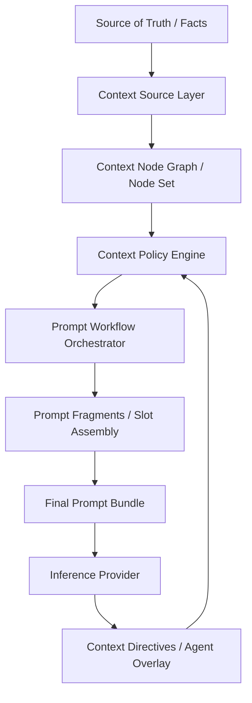

# Agent Context Module 与 Prompt Workflow Orchestrator 设计草案

## 1. 背景

当前项目已经具备一条可运行但仍偏隐式的推理上下文主线：

- `buildInferenceContext()` 会组装 `memory_context / pack_state / policy_summary / visible_variables`
- `memory/*` 已经区分 `short_term / long_term / summaries`
- `inference/processors/*` 已经存在若干 prompt 处理步骤：
  - `memory_injector`
  - `memory_summary`
  - `policy_filter`
  - `token_budget_trimmer`
- `prompt_builder.ts` 负责最终 prompt bundle 生成
- `InferenceTrace.context_snapshot` 与 `prompt_processing_trace` 已经能记录部分上下文与处理痕迹

这说明系统并不是“还没有上下文模块”，而是：

> **上下文处理能力已经存在，但仍以内嵌代码流程的形式分散在 memory、prompt processor、prompt builder 与 trace persistence 中，尚未形成一个正式的、可扩展的、可治理的模块边界。**

与此同时，后续方向已经非常明确：

- 需要允许插件介入提示词处理
- 需要允许未来做节点可视化编排
- 需要允许提示词节点位置切换、正则清洗、摘要压缩等操作
- 需要允许 Agent 对自己的下一轮上下文有一定控制力
- 但又必须保证：
  - Agent 不能直接删除系统约束
  - Agent 不能随意篡改不可变事实
  - 某些偏见、人格锚点、系统规则、世界宪制节点不可被自由重排或丢弃

因此，需要一个新的长期方向：

> **将 Agent 的 memory / context 提升为正式模块，并在其之上建立一个受策略与权限控制的 Prompt Workflow Orchestrator。**

---

## 2. 问题定义

当前实现存在以下结构性问题：

### 2.1 上下文来源已存在，但缺少统一节点模型

当前上下文材料来自：

- trace
- job
- intent
- event
- post
- pack state
- policy summary
- prompt diagnostics

但这些来源尚未被统一建模为一个正式的“上下文节点系统”。

### 2.2 Prompt 处理流程已存在，但仍是隐式线性代码

目前 `memory_summary`、`policy_filter`、`token_budget_trimmer` 等已经像“工作流节点”，但：

- 节点契约并不统一
- 缺少正式编排层
- 插件插入点不清晰
- 调试 trace 仍偏实现细节，不够抽象

### 2.3 Agent 缺少对自身上下文工作集的正式控制能力

当前 Agent 可以“被喂上下文”，但不能正式表达：

- 哪些内容希望保留到下一轮
- 哪些内容希望压缩
- 哪些内容只是短期噪音
- 哪些是自己要写下来的长期判断

这会限制“连续主体感”。

### 2.4 权限模型尚未正式覆盖“上下文操作”

现有策略主要控制“能看到什么、能做什么”，但还没有正式描述：

- 哪些节点可见
- 哪些节点可被引用
- 哪些节点可被压缩
- 哪些节点可被重排
- 哪些节点可被隐藏但不可删除
- 哪些节点属于 Agent 自有 overlay

---

## 3. 设计目标

### 3.1 核心目标

1. 将 Agent 的 memory / context 提升为一个正式模块：`Agent Context Module`
2. 将当前 prompt processor 演化为正式的 `Prompt Workflow Orchestrator`
3. 建立统一的 `ContextNode` 数据模型
4. 建立支持多来源、多阶段处理、多 slot 装配的上下文编排机制
5. 建立变量系统，使节点、模板、插件与 Agent 指令都可基于统一变量作用域运行
6. 为未来插件扩展、节点可视化、编排调试保留结构性边界
7. 允许 Agent 对“自己的上下文工作集”提出受限控制请求
8. 将上下文控制纳入正式权限模型，而不是让 Agent 直接修改 prompt

### 3.2 非目标

当前阶段**不**以以下目标为前置条件：

- 完整图形化节点编辑器
- 通用任意 DAG / 任意循环工作流引擎
- 任意插件可执行任意副作用代码
- Agent 直接编辑最终 prompt 文本
- 一次性实现最细颗粒度的全量权限矩阵
- 前端工作区的完整产品化

换言之，本设计是一个**长期架构草案**，不是要求当前阶段立即交付完整 workflow engine。

---

## 4. 设计原则

### 4.1 Source of Truth 与 Working Set 分离

必须区分：

1. **事实源**：事件、状态、规则执行、系统约束、世界宪制
2. **上下文工作集**：本轮进入 prompt 的节点集合
3. **Agent overlay**：Agent 自己创建的笔记、摘要、提醒、目标档案

原则：

> **Agent 只能受限影响 working set 与自身 overlay，不能直接篡改事实源。**

### 4.2 Agent 有上下文意志，但没有上下文主权

Agent 可以提出：

- pin
- summarize
- deprioritize
- create note
- request reorder

但这些不能直接生效，而应通过：

- policy engine
- node mutability
- placement rules
- visibility rules

进行校验与落地。

### 4.3 Prompt 不是字符串，而是节点流水线产物

最终 prompt 应被视为：

> `Context Sources -> Context Nodes -> Workflow Nodes -> Prompt Fragments -> Final Prompt`

而不是“若干 helper 函数直接拼接字符串”。

### 4.4 权限应针对“上下文操作能力”定义，而非仅针对“字段可见性”

至少要区分：

- read
- reference
- summarize
- reorder
- hide
- pin
- create_overlay
- delete_overlay

### 4.5 必须可审计、可回放、可解释

每轮上下文编排至少应能解释：

- 哪些节点进入了本轮 prompt
- 哪些节点被过滤掉
- 哪些节点被压缩
- 哪些 Agent 请求被批准/拒绝
- 最终 prompt 是如何形成的

---

## 5. 总体架构

建议采用以下分层：



### 5.1 Layer A：Context Source Layer

负责把各类事实源统一抽取为上下文节点。

来源包括但不限于：

- `InferenceTrace`
- `DecisionJob`
- `ActionIntent`
- `Event`
- `Post`
- pack state
- world state
- policy summary
- authority summary
- constitution / immutable traits
- plugin-generated nodes
- agent-owned notes

### 5.2 Layer B：Context Node Model

负责统一表达上下文材料。

### 5.3 Layer C：Context Policy Engine

负责可见性、可变性、位置控制与 Agent 请求校验。

### 5.4 Layer D：Prompt Workflow Orchestrator

负责节点编排、过滤、摘要、预算裁剪、位置装配与变量解析。

### 5.5 Layer E：Prompt Assembly

负责把节点输出转为最终 prompt fragments，并按 slot 形成 prompt bundle。

### 5.6 Layer F：Agent Context Control

负责处理 Agent 提出的上下文请求，并以 overlay / directives 的形式回流下一轮。

---

## 6. Context Node 统一模型

建议正式引入统一节点概念：`ContextNode`。

## 6.1 最小字段建议

```ts
interface ContextNode {
  id: string;
  node_type: string;
  scope: 'system' | 'pack' | 'agent' | 'plugin';
  source_kind: string;
  source_ref: Record<string, unknown> | null;
  content: {
    text: string;
    structured?: Record<string, unknown>;
    raw?: unknown;
  };
  tags: string[];
  importance: number;
  salience: number;
  visibility: ContextVisibilityPolicy;
  mutability: ContextMutabilityPolicy;
  placement_policy: ContextPlacementPolicy;
  ttl?: {
    expires_at_tick?: string | null;
    decay_hint?: 'none' | 'soft' | 'aggressive';
  };
  provenance: {
    created_by: 'system' | 'agent' | 'plugin';
    created_at_tick: string;
    parent_node_ids?: string[];
  };
}
```

## 6.2 节点类型示例

- `system_instruction`
- `pack_constitution`
- `agent_profile_anchor`
- `agent_bias_anchor`
- `recent_trace`
- `recent_event`
- `recent_post`
- `pack_state_snapshot`
- `world_state_snapshot`
- `memory_summary`
- `target_dossier`
- `self_note`
- `plugin_annotation`

## 6.3 节点分组建议

可进一步形成逻辑组：

- immutable anchors
- system rules
- world state
- recent evidence
- self reflection
- goal / target dossier
- plugin augmentation

---

## 7. Prompt Workflow Orchestrator

## 7.1 定位

`Prompt Workflow Orchestrator` 的职责不是“通用工作流平台”，而是：

> **面向 Agent 推理上下文的节点处理与 prompt 组装编排器。**

它接收：

- context nodes
- variables
- policies
- agent directives

输出：

- prompt fragments
- final bundle
- execution trace
- node selection report

## 7.2 工作流节点分类建议

### A. Source Nodes

从事实源产生节点：

- trace source
- event source
- post source
- pack state source
- overlay source

### B. Filter Nodes

筛选节点：

- visibility filter
- source filter
- tag filter
- freshness filter
- actor relevance filter

### C. Transform Nodes

变换节点：

- summarizer
- compressor
- deduplicator
- regex cleaner
- semantic normalizer

### D. Policy Nodes

施加约束：

- immutable guard
- hidden node guard
- placement guard
- agent directive validator

### E. Budget Nodes

处理 token 预算：

- token estimation
- pruning
- compaction
- fallback summarization

### F. Placement Nodes

决定 prompt slot：

- system slot
- world slot
- memory slot
- recent evidence slot
- self note slot
- output contract slot

### G. Assembly Nodes

输出 prompt fragments 与 final prompt。

## 7.3 首阶段建议仅支持线性/分段线性编排

为了控制复杂度，首阶段建议：

- 先支持线性 pipeline
- 允许分段 slot pipeline
- 不急于支持任意 DAG
- 不急于支持循环节点

即先从：

`source -> filter -> transform -> budget -> placement -> assembly`

做起。

---

## 8. 变量系统

变量系统是未来插件、模板、节点编排、位置切换的基础。

## 8.1 变量作用域建议

建议至少支持：

### 1）system scope

- runtime metadata
- safety constants
- hidden guard values

### 2）pack scope

- world-pack metadata
- pack variables
- constitution snippets

### 3）agent scope

- agent identity
- agent profile
- current target
- visible summaries

### 4）run scope

- inference id
- tick
- scheduler reason
- token budget

### 5）node scope

- upstream node outputs
- summary outputs
- cluster stats

### 6）overlay scope

- agent-owned notes
- agent directives result

## 8.2 变量解析顺序建议

建议默认解析顺序：

1. system
2. pack
3. run
4. agent
5. workflow-local temporary outputs
6. node-local outputs

并要求：

- 上层可覆盖下层仅限显式允许场景
- immutable variables 不能被 Agent 覆盖
- hidden variables 可参与处理但不必对 Agent 可见

## 8.3 变量类型建议

- scalar
- json object
- list
- template string
- resolved fragment reference

---

## 9. 权限与策略模型

这是本设计最关键的治理边界。

## 9.1 权限维度建议

应至少拆成以下维度：

### A. Read
- 可见内容
- 仅知节点存在
- 完全不可见

### B. Reference
- 可被 reasoning 显式引用
- 可隐式参与摘要但不可直接引用
- 禁止引用

### C. Transform
- 可压缩
- 可总结
- 可正则清洗
- 禁止变换

### D. Placement
- 可重排
- 可在局部区间移动
- 固定位置

### E. Lifecycle
- 可本轮隐藏
- 可影响下一轮 working set
- 不可删除
- 仅 overlay 可删除

### F. Ownership
- system-owned
- pack-owned
- plugin-owned
- agent-owned

## 9.2 节点等级建议

建议引入 4 类基础节点等级：

### 1）Hidden Mandatory
- Agent 不可见
- 不可删除
- 不可移动
- 可参与最终 prompt
- 示例：系统 guardrails、隐藏安全规则

### 2）Visible Fixed
- Agent 可见
- 不可删除
- 不可移动
- 示例：人格锚点、身份设定、世界宪制

### 3）Visible Flexible
- Agent 可见
- 可压缩/可重排/可降权
- 不可篡改原始事实
- 示例：recent events、recent traces、调查摘要

### 4）Writable Overlay
- Agent 可见
- 可创建/可修改/可删除
- 示例：self notes、target dossier、私有风险提醒

---

## 10. Agent 对上下文的控制能力

## 10.1 设计原则

Agent 不应直接编辑 prompt 文本，也不应直接移动系统节点。

Agent 应该输出一种结构化请求：`ContextDirective`。

## 10.2 建议的数据结构

```ts
interface ContextDirective {
  id: string;
  actor_id: string;
  directive_type:
    | 'pin_node'
    | 'summarize_cluster'
    | 'deprioritize_node'
    | 'hide_ephemeral_node'
    | 'create_self_note'
    | 'request_reorder';
  payload: Record<string, unknown>;
  applies_to: 'current_run' | 'next_run' | 'persistent_overlay';
  created_at_tick: string;
}
```

## 10.3 首阶段允许的安全操作

建议首阶段只开放：

- `pin_node`
- `summarize_cluster`
- `deprioritize_node`
- `create_self_note`

暂不开放：

- 删除固定节点
- 修改 hidden node
- 修改 system instruction
- 移除 constitution / bias anchors
- 重排 system slot

## 10.4 执行路径

建议采用：

1. Agent 产出 `context_directives`
2. Context Policy Engine 校验合法性
3. Orchestrator 将批准结果应用于 working set / overlay
4. 拒绝结果写入 trace

即：

> **Agent 可以提出上下文操作意图，但不能绕过 policy 直接生效。**

---

## 11. 与现有实现的映射关系

本设计并不是完全新建，而是对现有模块的结构化收口。

## 11.1 可复用现有模块

### 当前 `memory/*`
可演化为：

- context source adapters
- overlay storage adapters
- memory summarization nodes

### 当前 `inference/processors/*`
可演化为：

- workflow transform/filter/budget nodes

### 当前 `prompt_builder.ts`
可演化为：

- prompt assembly layer

### 当前 `InferenceTrace.context_snapshot`
可演化为：

- context run snapshot
- selected node set
- denied directives
- workflow diagnostics

### 当前 `prompt_processing_trace`
可演化为：

- workflow execution trace
- node-by-node processing report

## 11.2 建议的新模块边界

建议未来逐步形成：

- `context/node_model.ts`
- `context/source_registry.ts`
- `context/policy_engine.ts`
- `context/workflow/orchestrator.ts`
- `context/workflow/nodes/*`
- `context/variables/*`
- `context/directives/*`
- `context/overlay/*`

---

## 12. 推荐演进阶段

## Phase A：Agent Context Module 正式化

目标：

- 引入统一 `ContextNode`
- 收口 memory source / trace source / event source
- 建立 context snapshot 标准结构

验收：

- 当前上下文来源都能统一输出为节点
- `InferenceTrace.context_snapshot` 能记录 selected nodes

## Phase B：Prompt Workflow Orchestrator 最小版

目标：

- 将现有 prompt processors 改造成显式 workflow nodes
- 支持线性 pipeline
- 保留 slot assembly

验收：

- `memory_summary / policy_filter / token_budget_trimmer` 被统一纳入 orchestrator
- 节点执行 trace 可观察

## Phase C：变量系统与 workflow trace

目标：

- 建立 system/pack/agent/run/node 作用域
- 在 trace 中记录变量解析与节点输出

验收：

- 节点模板和 placement 支持变量引用
- trace 可解释最终 prompt 形成过程

## Phase D：Agent Overlay 与 Context Directives

目标：

- 增加 Agent 自有 notes / dossier
- 增加有限的 context directives
- 增加指令权限校验

验收：

- Agent 可写 self note
- Agent 可 pin/summary/deprioritize 部分节点
- 被拒绝操作可在 trace 中看到原因

## Phase E：细粒度权限与插件化扩展

目标：

- 扩展 read/reference/transform/placement/lifecycle 权限矩阵
- 引入插件节点注册机制
- 为未来前端可视化保留配置格式

验收：

- 插件可注册受限 node
- 权限矩阵可限制节点读写与位置控制
- 配置层足以支撑未来可视化编排

---

## 13. 风险与控制

### 风险 1：过早演化为通用工作流平台

影响：
- 与当前 Agent 循环目标脱节
- 工程复杂度迅速膨胀

控制：
- 首阶段只做 prompt context 编排
- 不追求任意 DAG
- 不追求图形化编辑器

### 风险 2：Agent 获得过高上下文控制权

影响：
- 系统规则被绕开
- 世界观稳定性下降
- 可审计性变差

控制：
- Agent 仅提出 `ContextDirective`
- 所有操作均经过 policy engine
- source of truth 不允许直接改写

### 风险 3：权限模型过早做满

影响：
- 实施成本过高
- 心智负担过大

控制：
- 先做 4 类节点等级
- 再逐步细化为多维权限矩阵

### 风险 4：调试不可解释

影响：
- 引入 workflow 后难以定位 prompt 形成原因

控制：
- 每次运行必须持久化 workflow execution trace
- 记录节点输入、输出、过滤原因、裁剪原因、拒绝原因

### 风险 5：Memory / Prompt / Policy 边界继续混杂

影响：
- 后续插件与前端可视化无法落地

控制：
- 明确拆分三层：
  - context source
  - workflow orchestrator
  - policy engine

---

## 14. 验收方向

当这个长期方向逐步落地后，应达到以下效果：

1. Agent 上下文不再只是若干临时拼接对象，而是正式节点集合
2. prompt 形成过程可被 trace、回放、解释
3. memory / policy / prompt processing 拥有清晰边界
4. 插件可以在受控节点阶段接入，而不是直接乱改 prompt
5. Agent 可以对自己的工作上下文提出有限控制请求
6. 不可变节点、偏见锚点、系统规则不会被 Agent 直接绕过
7. 未来前端节点可视化拥有稳定的后端抽象基础

---

## 15. 当前结论

这不是当前阶段立刻要完成的“工作流引擎任务”，但它已经是一个明确的长期架构方向。

当前最合理的结论是：

> **先把 Agent Context Module 正式化，再把现有 prompt processors 提升为 Prompt Workflow Orchestrator 的最小版，最后再逐步开放 Agent 对自身上下文工作集的受限控制能力。**

也就是说，推荐路线不是：

- 现在立刻做一个庞大的可视化工作流系统

而是：

- 先确立统一节点模型
- 先确立 orchestrator 边界
- 先确立变量与权限模型
- 再逐步让 Agent 介入自己的上下文管理

这条路线能兼顾：

- 当前工程复杂度控制
- 后续插件扩展
- prompt engineering 演进
- Agent 连续主体感
- 世界与系统治理边界稳定性
