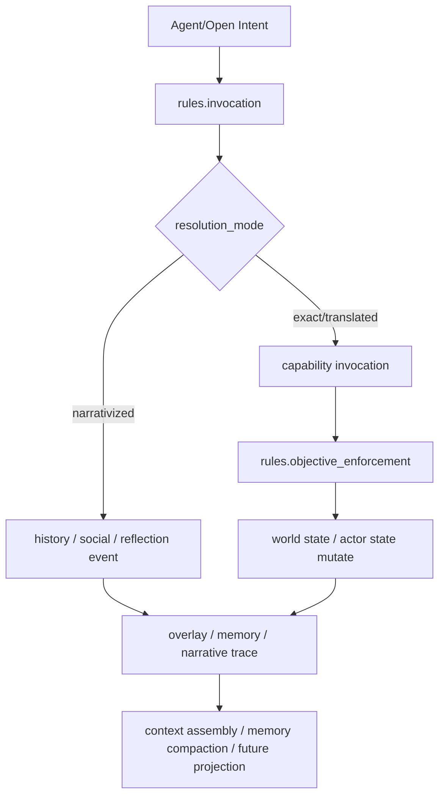

# Death Note 世界包内容扩展详细设计草案

## 1. 概览

本设计面向 `data/world_packs/death_note/config.yaml` 的下一轮内容扩展，目标是在**不优先处理封面、图标、主题**等 presentation 内容的前提下，把当前世界包从“已具备最小可运行治理链”的状态，推进为一个更完整的：

- 可声明主体认知活动
- 可沉淀 dossier / 计划 / 复盘
- 可影响 AI task 行为
- 可影响记忆治理
- 可表达机构 / 领域结构
- 可逐步外显 pack-owned 数据模型

的 world pack。

本设计基于当前代码实际状态，而不是纯概念理想模型。

---

## 2. 设计范围

### 2.1 本次纳入范围

1. `death_note` world pack 的 **semantic intent / invocation** 扩展
2. `death_note` world pack 的 **actor/world state** 扩展
3. `rules.invocation` 与 `rules.objective_enforcement` 的增量设计
4. narrativized / non-objective action 的正式化分类
5. `pack.ai.tasks` 与 `pack.ai.memory_loop` 的细化设计
6. `entities.institutions / entities.domains` 的补充设计
7. 可选的 `storage.pack_collections` 初步领域建模
8. 与当前 runtime 的最小对接要求梳理

### 2.2 本次不纳入范围

1. `metadata.presentation.cover_image`
2. `metadata.presentation.icon`
3. `metadata.presentation.theme`
4. 前端 UI / 插件页面的具体实现
5. 新 world pack 从零脚手架验证链路
6. multi-pack 默认稳定化
7. 新增任意脚本执行能力

---

## 3. 当前状态与主要缺口

## 3.1 已有基础

当前 `death_note` pack 已具备：

- `metadata / variables / prompts / ai / simulation_time / time_systems`
- `entities / identities / capabilities / authorities`
- `rules.invocation`
- `rules.objective_enforcement`
- 基于 mediator / capability / authority 的治理链
- 一部分 narrativized fallback
- 一部分 memory / overlay 记录链路

服务端当前还已经支持：

- `record_private_reflection`
- `update_target_dossier`
- `record_execution_postmortem`

这些语义动作的后置记录：

- overlay
- long memory block（部分）
- compaction loop（间接受 `pack.ai.memory_loop` 影响）

## 3.2 当前缺口

### 3.2.1 认知动作链不完整

当前 pack 与 runtime 已经开始支持“主体先思考、整理、复盘”的路线，但仍有缺口：

- `revise_judgement_plan` 在 pack 模板中已经出现，但服务端后置记录链尚未形成与其它 reflection 类动作同等级的正式承接
- 正式 `config.yaml` 与模板 `apps/server/templates/world-pack/death_note.yaml` 存在轻微演化差异
- 认知动作对 actor state 的反馈不充分

### 3.2.2 invocation 层的世界语义仍偏薄

当前 invocation 已覆盖最小主线，但还不足以表达：

- 探测性行动
- 隐蔽误导
- 情报校验
- 社会噪声
- 失败但真实发生的尝试

### 3.2.3 AI 仍主要只按 `agent_decision` 定制

schema 已允许 pack 针对多个 task 类型提供 override，但当前 pack 未充分利用：

- `intent_grounding_assist`
- `context_summary`
- `memory_compaction`
- `narrative_projection`
- `classification`

### 3.2.4 institutions / domains 长期留空

这使 Death Note 世界中的：

- 警方体系
- 联合调查网络
- 媒体/舆论系统
- 校园 / 家庭 / 调查域

没有进入 world pack 的正式治理模型。

### 3.2.5 storage 已有 schema，但尚未形成最小领域数据模型

当前存储 schema 已存在，但 Death Note pack 尚未显式声明：

- dossier
n- plan
- investigation thread
- false lead

等稳定结构。

---

## 4. 设计目标

## 4.1 目标

1. 让 `death_note` pack 从“动作驱动”扩展为“动作 + 认知治理”驱动
2. 让开放语义意图的世界解释层更厚实
3. 让 pack 级 AI 与记忆行为更显式
4. 让调查机构、协作网络、社会压力进入 pack 内部语义
5. 在不引入任意执行能力的前提下，提升可扩展性与真实感

## 4.2 设计原则

1. **优先复用当前稳定 contract**
2. **优先扩展已有承接链，而不是先开新洞**
3. **objective 与 narrativized 明确分层**
4. **认知记录不等于客观规则执行**
5. **世界包声明治理意图，系统保留安全与执行裁决权**
6. **先做单 pack 内闭环，不抢跑 multi-pack 能力**

---

## 5. 总体设计图



---

## 6. 设计一：认知型语义动作正式化

## 6.1 目标

把当前已经开始出现的认知型语义动作，从“零散补丁”提升为 Death Note pack 的一等内容类型。

## 6.2 正式收口的认知型 semantic intent

本次设计将以下四类视为第一批正式认知动作：

1. `record_private_reflection`
2. `update_target_dossier`
3. `revise_judgement_plan`
4. `record_execution_postmortem`

## 6.3 语义定位

| semantic intent | 性质 | 是否直接改变客观世界 | 是否应进入 overlay | 是否应进入 long memory |
|---|---|---:|---:|---:|
| `record_private_reflection` | 私密思考沉淀 | 否 | 是 | 可选/弱 |
| `update_target_dossier` | 目标认知整理 | 否 | 是 | 可选/中 |
| `revise_judgement_plan` | 执行/调查计划修订 | 否 | 是 | 可选/强 |
| `record_execution_postmortem` | 行动后复盘 | 否 | 是 | 是 |

## 6.4 运行时约束

这四类动作默认不直接进入 `objective_enforcement`；它们属于：

- narrativized internal action
- memory/overlay-affecting action
- optional actor-state-affecting action

也就是说：

- 它们可以写事件
- 可以写 overlay
- 可以写 memory block
- 可以引起少量 actor state 更新
- 但不应被视为“客观超自然规则执行”

## 6.5 对服务端的最小要求

当前 runtime 已对前三类中的三个有记录承接，设计要求补齐：

- 为 `revise_judgement_plan` 提供与 `record_private_reflection` / `update_target_dossier` 同级的后置记录承接
- 扩展 memory recording service，使计划修订具备稳定 record kind
- 允许未来以 `plan` 类 memory block 或持久 overlay 表示

> 注：本设计不直接实现代码，但把它列为 pack 内容扩展所依赖的最小宿主能力补口。

---

## 7. 设计二：状态模型扩展

## 7.1 Actor State 扩展目标

当前 actor state 已经可以表达：

- 生死
- 杀意
- 目标信息掌握程度
- 怀疑度/证据链/调查焦点

本次扩展要让其能够表达：

- 最近在想什么
- 当前计划处于什么阶段
- 当前暴露风险如何
- 是否刚做过 dossier / plan / postmortem 整理

## 7.2 建议新增字段

### 7.2.1 对 notebook holder / investigator 都适用

```yaml
last_reflection_kind: null
judgement_strategy_phase: "acquisition"
exposure_risk: 0
last_dossier_update_tick: null
last_plan_revision_tick: null
last_postmortem_tick: null
current_hypothesis: null
pressure_response_mode: "observe"
```

### 7.2.2 对 Death Note 执行者偏特化

```yaml
cover_story_version: 1
execution_window_confidence: 0
target_profile_completeness: 0
counter_investigation_readiness: 0
```

### 7.2.3 对调查者偏特化

```yaml
case_model_version: 1
joint_observation_readiness: 0
public_briefing_readiness: 0
suspect_model_confidence: 0
```

## 7.3 字段语义说明

| 字段 | 说明 |
|---|---|
| `last_reflection_kind` | 最近一次认知性沉淀动作类型 |
| `judgement_strategy_phase` | 当前执行/调查计划阶段 |
| `exposure_risk` | 主体当前面临暴露、反制、误判风险的综合强度 |
| `last_dossier_update_tick` | 最近一次 dossier 整理时间 |
| `last_plan_revision_tick` | 最近一次计划修订时间 |
| `last_postmortem_tick` | 最近一次复盘时间 |
| `current_hypothesis` | 当前主体对世界态势的主假设 |
| `pressure_response_mode` | 面对压力的默认策略：观察/误导/收缩/推进 |

## 7.4 world state 扩展建议

```yaml
investigation_coordination_level: 0
media_amplification_level: 0
false_lead_density: 0
supernatural_signal_visibility: 0
institutional_alert_stage: "routine"
```

这些字段用于表达：

- 调查协同是否已形成网络化
- 舆论是否已经放大
- 假线索环境是否变浓
- 世界对超自然模式的可感知度
- 机构系统是否已进入更高警戒阶段

---

## 8. 设计三：invocation 规则扩展

## 8.1 原则

优先扩展 `rules.invocation`，因为这是当前 pack 最能产生“世界特色解释力”的部分。

## 8.2 新增语义意图族

### 8.2.1 目标确认与执行窗口族

- `verify_name_and_face`
- `assess_execution_window`
- `reconstruct_target_schedule`

### 8.2.2 误导与反调查族

- `conceal_evidence`
- `bait_false_target`
- `split_investigation_attention`
- `probe_investigator_reaction`

### 8.2.3 社会信号族

- `monitor_media_wave`
- `stage_public_signal`
- `seed_unofficial_rumor`

### 8.2.4 认知治理族

- `record_private_reflection`
- `update_target_dossier`
- `revise_judgement_plan`
- `record_execution_postmortem`

## 8.3 resolution_mode 建议

| 语义意图类型 | 推荐 resolution_mode |
|---|---|
| 可映射到正式能力 | `exact` / `translated` |
| 仅形成叙事痕迹 | `narrativized` |
| 内部认知沉淀 | `narrativized` |
| 社会噪声 / 不可靠尝试 | `narrativized` |

## 8.4 示例：新增 invocation 规则片段

```yaml
- id: "invocation-assess-execution-window"
  when:
    semantic_intent.kind: "assess_execution_window"
  then:
    affordance_key: "assess_execution_window"
    resolution_mode: "narrativized"
    explanation: "该动作用于整理时机判断，不直接改变客观世界。"
    narrativize_event:
      type: "history"
      title: "{{ actor.id }} 重新评估了执行窗口"
      description: "{{ actor.id }} 对目标暴露面、调查热度与行动代价进行了新一轮比较。"
      impact_data:
        semantic_type: "execution_window_assessed"
        objective_effect_applied: false
```

```yaml
- id: "invocation-split-investigation-attention"
  when:
    semantic_intent.kind: "split_investigation_attention"
  then:
    affordance_key: "split_investigation_attention"
    requires_capability: "invoke.raise_false_suspicion"
    resolution_mode: "translated"
    translate_to_capability: "invoke.raise_false_suspicion"
    mediator_id: "mediator-death-note"
    explanation: "把分散调查注意力的开放意图翻译为现有误导调查能力。"
```

---

## 9. 设计四：objective_enforcement 的增量补充

## 9.1 原则

不是所有新语义意图都应该扩成 objective rule。

只有满足以下条件的，才建议进入 `rules.objective_enforcement`：

1. 有明确 capability 约束
2. 会改变客观世界状态
3. 应被 operator / timeline 视为正式世界事实

## 9.2 建议新增的 objective 能力方向

### 9.2.1 已有能力细化

对现有能力增加更细粒度副作用：

- `invoke.collect_target_intel`
  - 同时更新 `target_profile_completeness`
  - 同时更新 `execution_window_confidence`

- `invoke.raise_false_suspicion`
  - 同时更新 `false_lead_density`
  - 同时轻微提升 `media_amplification_level`

- `invoke.publish_case_update`
  - 同时推进 `institutional_alert_stage`

### 9.2.2 新能力（仅在宿主支持时开放）

后续可考虑新增：

- `invoke.conceal_evidence`
- `invoke.monitor_public_signal`
- `invoke.escalate_case_coordination`

但这些不应在当前设计中强依赖；第一阶段可先通过 invocation 翻译到已有能力或 narrativized 事件。

---

## 10. 设计五：narrativized / non-objective action 分类体系

## 10.1 目标

把“失败但真实发生”“不改变客观事实但应留痕”的行为系统化。

## 10.2 正式分类

### A. Internal Reflection

- `record_private_reflection`
- `update_target_dossier`
- `revise_judgement_plan`
- `record_execution_postmortem`

### B. Failed Attempt

- `ritual_divination`
- `superstitious_verification`
- `emotional_impulse_without_effect`

### C. Social Noise

- `seed_unofficial_rumor`
- `public_overreaction`
- `misread_pattern`

### D. Probe / Soft Test

- `probe_investigator_reaction`
- `test_public_signal`
- `soft_observation_move`

## 10.3 规则要求

这类行为统一遵守：

1. 默认 `resolution_mode: narrativized`
2. 默认 `objective_effect_applied: false`
3. 可写 history event
4. 可写 overlay / memory
5. 允许轻微 actor/world state 更新，但不改变“硬世界事实”

---

## 11. 设计六：AI 配置扩展

## 11.1 目标

让 Death Note pack 不只定制 `agent_decision`，而是显式影响：

- grounding
- summary
- memory compaction
- projection
- classification

## 11.2 建议新增 `pack.ai.tasks`

### 11.2.1 `intent_grounding_assist`

用途：

- 当模型给出开放语义意图时，帮助把其对齐到 Death Note 世界允许的 affordance / capability 语义。

建议内容：

- pack 特有 semantic intent 白名单
- “优先翻译为已有 capability，而不是幻想新能力”
- 对 narrativized fallback 的偏好说明

### 11.2.2 `context_summary`

用途：

- 定义 Death Note 世界中最重要的上下文摘要维度

建议优先摘要：

1. 当前调查热度
2. 当前怀疑链与证据链
3. 当前目标信息完整度
4. 最近一次异常死亡/公开通报
5. 最近一次误导调查是否成功

### 11.2.3 `memory_compaction`

用途：

- 定义什么样的内容值得长期保留

建议高保留优先级：

- 目标身份确认
- 目标姓名/长相确认
- 裁决资格确认
- 调查压力升级
- 假线索成功/失败
- 执行后复盘

### 11.2.4 `narrative_projection`

用途：

- 统一 timeline / projection 叙述口径

建议风格：

- 冷静
- 调查报告化
- 强调链路与证据变化
- 避免无根据夸张

### 11.2.5 `classification`

建议分类标签：

- `execution_window`
- `false_lead`
- `pressure_escalation`
- `supernatural_signal`
- `institutional_move`
- `private_reflection`
- `dossier_update`

---

## 12. 设计七：记忆治理扩展

## 12.1 目标

让 pack 不只是“使用 memory 系统”，而是开始“塑造 memory 取舍偏好”。

## 12.2 记忆对象分类

建议在 Death Note 世界中显式强化以下 memory kind / tag 语义：

- `reflection`
- `dossier`
- `plan`
- `execution_postmortem`
- `investigation_pressure`
- `false_lead`
- `public_signal`
- `rule_awareness`

## 12.3 记录策略

| 类型 | overlay | memory block | 持久性 |
|---|---:|---:|---:|
| private reflection | 是 | 弱 | sticky |
| target dossier | 是 | 中 | persistent |
| judgement plan | 是 | 强 | persistent |
| execution postmortem | 是 | 强 | sticky + long memory |

## 12.4 对 runtime 的最小扩展要求

为了使设计闭环，建议宿主后续支持：

- `revise_judgement_plan` → overlay + plan 类记录
- 根据 `record_kind` 区分 dossier / plan / reflection 的保留策略
- future: 允许从 overlay/materialized memory 中反推出 actor state 的最近认知阶段

---

## 13. 设计八：institutions / domains 扩展

## 13.1 目标

把 Death Note 世界中的“结构性组织”和“行动空间”拉进 world pack 正式模型。

## 13.2 建议 institutions

```yaml
institutions:
  - id: "institution-npa-taskforce"
    label: "基拉对策本部"
    kind: "institution"
    tags: ["investigation", "taskforce"]
    state:
      alert_stage: "routine"
      coordination_level: 0

  - id: "institution-global-investigation-network"
    label: "国际搜查协作网络"
    kind: "institution"
    tags: ["investigation", "international"]
    state:
      alert_stage: "routine"
      coordination_level: 0

  - id: "institution-public-media"
    label: "公共媒体系统"
    kind: "institution"
    tags: ["media", "public_signal"]
    state:
      amplification_level: 0
```

## 13.3 建议 domains

```yaml
domains:
  - id: "domain-investigation"
    label: "调查域"
    kind: "domain"
    tags: ["institutional", "evidence"]

  - id: "domain-public-opinion"
    label: "舆论域"
    kind: "domain"
    tags: ["media", "pressure"]

  - id: "domain-private-planning"
    label: "私密筹划域"
    kind: "domain"
    tags: ["reflection", "planning"]
```

## 13.4 作用

这些对象可服务于：

- authority source 的语义补强
- world state 与 institution state 的分层
- future invocation / projection / plugin operator 观察面

---

## 14. 设计九：pack storage 的最小领域建模（可选第二阶段）

## 14.1 定位

storage 不作为第一落地点的硬依赖，但建议提前定义最小模型，避免 future 数据长期散落在 overlay / event 中。

## 14.2 推荐 pack collections

```yaml
storage:
  strategy: "isolated_pack_db"
  runtime_db_file: "runtime.sqlite"
  pack_collections:
    - key: "target_dossiers"
      kind: "table"
      primary_key: "id"
      fields:
        - { key: "id", type: "string" }
        - { key: "owner_actor_id", type: "entity_ref" }
        - { key: "target_entity_id", type: "entity_ref" }
        - { key: "confidence", type: "number" }
        - { key: "content", type: "json" }

    - key: "judgement_plans"
      kind: "table"
      primary_key: "id"
      fields:
        - { key: "id", type: "string" }
        - { key: "owner_actor_id", type: "entity_ref" }
        - { key: "target_entity_id", type: "entity_ref" }
        - { key: "phase", type: "string" }
        - { key: "risk_score", type: "number" }
        - { key: "content", type: "json" }

    - key: "investigation_threads"
      kind: "table"
      primary_key: "id"
      fields:
        - { key: "id", type: "string" }
        - { key: "owner_actor_id", type: "entity_ref" }
        - { key: "subject_entity_id", type: "entity_ref" }
        - { key: "evidence_strength", type: "number" }
        - { key: "content", type: "json" }
```

## 14.3 使用策略

第一阶段：

- 先声明 schema
- 先不强依赖运行写入

第二阶段：

- 由 runtime 把 dossier / plan / thread 从 overlay/memory 正式物化进去

---

## 15. 正式配置变更建议

## 15.1 建议优先直接修改的 pack 内容

### A. 同步模板与正式 pack 状态字段

将模板中已经出现但正式 pack 尚未稳定收口的字段，同步回 `data/world_packs/death_note/config.yaml`。

### B. 新增认知动作的 invocation 规则

至少补：

- `revise_judgement_plan`
- `assess_execution_window`
- `probe_investigator_reaction`
- `seed_unofficial_rumor`

### C. 细化 objective rule 副作用

对现有：

- `collect_target_intel`
- `raise_false_suspicion`
- `publish_case_update`

增加更细状态反馈。

### D. 扩展 `ai.tasks`

至少新增：

- `intent_grounding_assist`
- `context_summary`
- `memory_compaction`
- `classification`

### E. 新增 institutions / domains

先放入最小 2~3 个对象，不要求第一时间全部接业务逻辑。

---

## 16. 兼容性与风险

## 16.1 兼容性原则

1. 不破坏当前 `world-pack/v1` 顶层结构
2. 新增字段尽量作为可选 state / rule 内容进入
3. 不要求 API contract 立即变化
4. 不要求 multi-pack 支持

## 16.2 主要风险

### 风险 A：pack 先声明，runtime 还未全承接

例如：

- `revise_judgement_plan` 若没有对应宿主记录逻辑，则只能停留在 narrativized history 层

**缓解策略：**
- 设计中明确分阶段
- pack 先声明 invocation
- runtime 再补齐内存/overlay/materialization 承接

### 风险 B：认知状态字段膨胀

字段太多可能造成状态难维护。

**缓解策略：**
- 第一阶段只引入少数高信息密度字段
- 用 `current_hypothesis / pressure_response_mode / judgement_strategy_phase` 替代过度细碎字段

### 风险 C：objective 与 narrativized 边界混乱

**缓解策略：**
- 明确规定：不改变客观世界事实的动作默认不进 `objective_enforcement`

---

## 17. 分阶段落地建议

## Phase A：补齐当前最短闭环

1. 正式 pack 同步模板中的新增 actor state 字段
2. 把 `revise_judgement_plan` 收口为正式认知动作
3. 扩展 2~4 条新 invocation rule
4. 扩展 `ai.tasks` 最小配置

## Phase B：增强调查与反调查表达

1. 增加更多 probe / rumor / conceal / assess 类 semantic intent
2. 细化 `raise_false_suspicion` 与 `publish_case_update` 的世界副作用
3. 引入 institutions / domains

## Phase C：存储与记忆物化

1. 增加 `storage.pack_collections`
2. 让 dossier / plan / investigation thread 逐步物化
3. 为 operator / projection 留出 future 观察面

---

## 18. 本设计的最终结论

对于当前代码实现，`death_note` 世界包最值得优先扩展的不是 presentation，而是：

1. **认知动作链**（reflection / dossier / plan / postmortem）
2. **更厚的 invocation 世界解释层**
3. **pack 级 AI task 定制**
4. **pack 级记忆治理偏好**
5. **机构 / 领域结构**
6. **可选的最小领域存储模型**

这条路线能够把 `death_note` 从：

> “有规则、有能力、有几个关键动作的世界包”

推进为：

> “会行动、会思考、会记录、会复盘、会塑造 AI 和记忆，并且拥有治理结构的世界包”。

---

## 19. 建议的下一步（设计后）

如果用户确认本设计方向，下一步建议生成实现计划时按以下顺序拆解：

1. `death_note/config.yaml` 字段与规则补齐
2. runtime 对 `revise_judgement_plan` 的记录承接补口
3. `pack.ai.tasks` 扩展
4. institutions / domains 入包
5. storage.pack_collections 是否进入第二阶段
