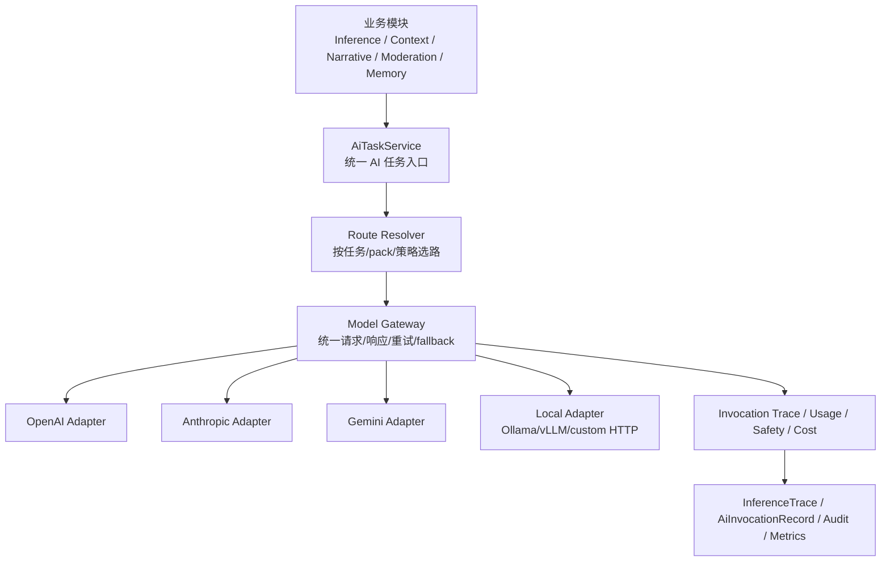

# 多模型网关与统一 AI 任务合同设计

## 1. 背景与问题判断

结合当前仓库现状，可以明确看到：

- 项目已经有一套 **最小推理抽象**：
  - `apps/server/src/inference/provider.ts`
  - `apps/server/src/inference/service.ts`
  - 当前接口为：`InferenceProvider { name, strategies, run(context, prompt) }`
- 当前实际可用的 `InferenceStrategy` 只有：
  - `mock`
  - `rule_based`
- 当前 `packages/contracts/src/inference.ts` 覆盖的是：
  - `/api/inference/*` 这一层 **应用对外接口**
  - 但**不是**“服务端如何与真实 LLM/多模型后端交互”的统一合同
- 当前 prompt 侧已有：
  - `ContextRun`
  - `PromptBundle`
  - `InferenceTrace`
  - `DecisionJob / ActionIntent / WorkflowSnapshot`
- 这说明：
  - 项目已经有 **任务上下文、工作流、trace、回放、审计** 的宿主
  - 但还没有真正形成 **多模型接入层 / 模型网关层 / 路由层 / 能力合同层**

所以你的判断是对的：

> 当前项目有“推理工作流骨架”，但还没有正式建立“后端 ↔ 多模型系统”的统一 API 规范与治理边界。

这会在未来产生几个明显问题：

1. **策略与供应商概念混在一起**
   - 当前 `strategy` 更像“业务决策方式”
   - 未来真实 LLM 需要区分：
     - 业务任务类型
     - 路由策略
     - 供应商
     - 模型
     - 能力（结构化输出、tool call、embedding、vision 等）
2. **每个功能若直接接模型，会导致重复造轮子**
   - agent decision、memory summary、moderation、embedding、rerank、projection 等都会各自写一套调用逻辑
3. **缺少统一观测**
   - 无法稳定记录：
     - 选了哪个模型
     - 为什么选它
     - token/cost/latency
     - fallback 是否发生
     - 结构化解析是否失败
4. **缺少统一治理**
   - 无法在 pack / task / actor / operator 级别定义：
     - 哪些任务可以走云模型
     - 哪些必须走本地模型
     - 哪些必须结构化输出
     - 哪些允许工具调用

因此，建议不要把“接不同模型”零散塞进各模块，而是正式引入一层：

> **Unified AI Task Layer + Model Gateway Layer + Provider Adapter Layer**

---

## 2. 设计目标

## 2.1 核心目标

本设计希望建立一套统一模型通信规范，使系统未来可以稳定支持：

1. 多供应商接入
   - OpenAI
   - Anthropic
   - Gemini
   - Ollama / vLLM / LM Studio / 本地 HTTP 网关
   - 未来自定义 provider
2. 多任务类型接入
   - agent 决策
   - 结构化意图生成
   - memory / context summary
   - narrative projection
   - extraction / classification
   - moderation
   - embedding / rerank
3. 多行为场景共用一套治理边界
   - route
   - fallback
   - timeout
   - retry
   - safety
   - observability
4. 与当前 inference/workflow 架构兼容
   - 不推翻 `InferenceTrace / DecisionJob / ActionIntent`
   - 不要求立刻把所有模块都改成 LLM 驱动
5. 允许渐进演进
   - 第一阶段可作为 server 内部模块
   - 后续可平滑外抽为独立 AI gateway service

## 2.2 非目标

本设计当前**不直接要求**：

- 立刻实现所有 provider 的真实代码
- 立刻开放前端直接配置所有模型
- 立刻把系统拆成微服务
- 立刻把所有行为改成 LLM 驱动
- 立刻引入复杂 agent tool execution runtime

这是一个 **统一合同与架构边界设计**，不是一次性全量实现计划。

---

## 3. 设计原则

## 3.1 不让业务模块直接依赖供应商 SDK

任何模块——包括：

- inference
- context
- scheduler assistant
- narrative
- moderation
- projection
- memory compaction

都不应直接写：

- `openai.responses.create(...)`
- `anthropic.messages.create(...)`
- `gemini.generateContent(...)`

而是统一经过：

> `AiTaskService` / `ModelGateway`

## 3.2 区分“业务任务”与“模型选择”

必须拆开三个概念：

### A. Task（业务任务）
系统想完成什么事：

- `agent_decision`
- `context_summary`
- `embedding`
- `moderation`

### B. Route（路由策略）
这类任务应该怎么选模型：

- 优先本地
- 优先低延迟
- 必须结构化 JSON
- 失败后回退到便宜模型/稳定模型

### C. Provider / Model（供应商 / 具体模型）
真实调用目标：

- `openai:gpt-4.1-mini`
- `anthropic:claude-3-5-sonnet`
- `ollama:qwen2.5:14b`

## 3.3 统一输出合同优先于统一 prompt 形态

不同供应商输入格式不同，但系统内最重要的是：

- 统一请求语义
- 统一输出语义
- 统一 trace/usage/safety 记录

也就是说：

- provider adapter 负责“翻译输入格式”
- gateway 层负责“统一结果格式”

## 3.4 先做任务网关，再做 agent autonomy 扩展

Agent 将来可能参与很多行为，但前提是：

- 模型合同稳定
- 输出可验证
- trace 可复盘
- fallback 可治理

否则系统会很快失控。

## 3.5 结构化输出必须作为一等能力

Yidhras 不是纯聊天项目，而是一个：

- 叙事模拟
- 工作流驱动
- 审计可回放
- 决策可落库

的系统。

因此模型层必须优先支持：

- JSON object
- JSON Schema constrained output
- tool call
- typed extraction

而不是只把 LLM 当字符串生成器。

---

## 4. 总体架构



推荐形成三层：

## 4.1 业务任务层（Task Layer）

回答：

- 系统想让 AI 做什么
- 输入是什么
- 输出要长什么样

例如：

- agent 决策任务
- context summary 任务
- moderation 任务
- embedding 任务

## 4.2 模型网关层（Gateway Layer）

回答：

- 这次任务该选哪个模型
- 如何统一 timeout / retry / fallback
- 如何统一 structured output / tool calling / safety / usage

## 4.3 Provider Adapter 层

回答：

- 如何把统一合同转换成各供应商自己的 HTTP / SDK 调用
- 如何把供应商响应还原成统一响应

---

## 5. 概念模型：任务、路由、调用三分离

## 5.1 AiTask：系统语义入口

建议引入统一任务类型：

```ts
export type AiTaskType =
  | 'agent_decision'
  | 'intent_grounding_assist'
  | 'context_summary'
  | 'memory_compaction'
  | 'narrative_projection'
  | 'entity_extraction'
  | 'classification'
  | 'moderation'
  | 'embedding'
  | 'rerank';
```

它描述的是：

- 为什么要调用 AI
- 业务希望拿到什么结果

而不是：

- 调 OpenAI 还是 Anthropic

## 5.2 AiRoute：模型选择策略

建议引入：

```ts
export interface AiRoutePolicy {
  route_id: string;
  task_type: AiTaskType;
  pack_id?: string | null;
  preferred_models: AiModelSelector[];
  fallback_models: AiModelSelector[];
  constraints: {
    require_structured_output?: boolean;
    require_tool_calling?: boolean;
    require_local_only?: boolean;
    max_latency_ms?: number;
    max_cost_usd?: number;
    privacy_tier?: 'local_only' | 'trusted_cloud' | 'any';
  };
}
```

它描述的是：

- 某类任务如何选模型
- 什么条件下 fallback
- 哪些能力是硬约束

## 5.3 AiInvocation：一次真实模型调用

建议把每次模型调用视为独立 invocation，并可被 trace：

```ts
export interface AiInvocationRecord {
  invocation_id: string;
  task_id: string;
  task_type: AiTaskType;
  provider: string;
  model: string;
  route_id: string | null;
  started_at: string;
  completed_at: string | null;
  status: 'completed' | 'failed' | 'blocked' | 'timeout' | 'fallback_completed';
  finish_reason: string | null;
  latency_ms: number | null;
  usage: {
    input_tokens?: number;
    output_tokens?: number;
    total_tokens?: number;
    cached_input_tokens?: number;
    estimated_cost_usd?: number;
  } | null;
  error_code?: string | null;
  error_message?: string | null;
}
```

这样做的价值是：

- 模型调用不再隐身在 `InferenceProvider.run(...)` 里面
- 可以跨模块统一观测

---

## 6. 统一内部请求合同

建议统一建立 **Model Gateway Request / Response**，不直接把供应商 SDK 类型暴露给业务层。

## 6.1 消息模型

```ts
export type AiMessageRole = 'system' | 'developer' | 'user' | 'tool';

export type AiContentPart =
  | { type: 'text'; text: string }
  | { type: 'json'; json: Record<string, unknown> }
  | { type: 'image_url'; url: string }
  | { type: 'file_ref'; file_id: string; mime_type?: string };

export interface AiMessage {
  role: AiMessageRole;
  parts: AiContentPart[];
  name?: string;
  metadata?: Record<string, unknown>;
}
```

说明：

- 第一阶段项目可以只用 `text`
- 但合同应预留：
  - json input
  - multimodal
  - file reference

## 6.2 输出模式

```ts
export type AiResponseMode =
  | 'free_text'
  | 'json_object'
  | 'json_schema'
  | 'tool_call'
  | 'embedding';
```

## 6.3 工具定义

```ts
export interface AiToolSpec {
  name: string;
  description: string;
  input_schema: Record<string, unknown>;
  strict?: boolean;
}

export interface AiToolPolicy {
  mode: 'disabled' | 'allowed' | 'required';
  allowed_tool_names?: string[];
  max_tool_calls?: number;
}
```

## 6.4 结构化输出定义

```ts
export interface AiStructuredOutputSpec {
  schema_name: string;
  json_schema: Record<string, unknown>;
  strict?: boolean;
}
```

## 6.5 统一请求对象

```ts
export interface ModelGatewayRequest {
  invocation_id: string;
  task_id: string;
  task_type: AiTaskType;

  provider_hint?: string | null;
  model_hint?: string | null;
  route_id?: string | null;

  messages: AiMessage[];
  response_mode: AiResponseMode;
  structured_output?: AiStructuredOutputSpec | null;
  tools?: AiToolSpec[];
  tool_policy?: AiToolPolicy | null;

  sampling?: {
    temperature?: number;
    top_p?: number;
    max_output_tokens?: number;
    stop?: string[];
    seed?: number;
  };

  execution?: {
    timeout_ms: number;
    retry_limit: number;
    allow_fallback: boolean;
    idempotency_key?: string | null;
  };

  governance?: {
    privacy_tier?: 'local_only' | 'trusted_cloud' | 'any';
    safety_profile?: string | null;
    audit_level?: 'minimal' | 'standard' | 'full';
  };

  metadata?: Record<string, unknown>;
}
```

---

## 7. 统一内部响应合同

```ts
export interface ModelGatewayResponse {
  invocation_id: string;
  task_id: string;
  task_type: AiTaskType;

  provider: string;
  model: string;
  route_id: string | null;
  fallback_used: boolean;
  attempted_models: string[];

  status: 'completed' | 'failed' | 'blocked' | 'timeout';
  finish_reason: 'stop' | 'length' | 'tool_call' | 'safety' | 'error' | 'unknown';

  output: {
    mode: AiResponseMode;
    text?: string;
    json?: Record<string, unknown> | null;
    tool_calls?: Array<{
      name: string;
      arguments: Record<string, unknown>;
      call_id?: string;
    }>;
    embedding?: number[];
  };

  usage?: {
    input_tokens?: number;
    output_tokens?: number;
    total_tokens?: number;
    cached_input_tokens?: number;
    estimated_cost_usd?: number;
    latency_ms?: number;
  };

  safety?: {
    blocked: boolean;
    reason_code?: string | null;
    provider_signal?: Record<string, unknown> | null;
  };

  raw_ref?: {
    provider_request_id?: string | null;
    provider_response_id?: string | null;
  };

  error?: {
    code: string;
    message: string;
    retryable: boolean;
    stage: 'route' | 'provider' | 'decode' | 'validate' | 'safety' | 'unknown';
  } | null;
}
```

说明：

- 业务层不应该自己解析 provider-specific response
- 统一响应里必须有：
  - 选路信息
  - token 使用
  - 安全结果
  - 错误阶段
  - fallback 是否发生

---

## 8. 模型注册表（Model Registry）

为支持多模型，必须有正式模型注册表，而不是散落在 env 里硬编码。

## 8.1 注册表对象

```ts
export interface AiModelCapabilities {
  text_generation: boolean;
  structured_output: 'none' | 'json_object' | 'json_schema';
  tool_calling: boolean;
  vision_input: boolean;
  embeddings: boolean;
  rerank: boolean;
  max_context_tokens?: number;
  max_output_tokens?: number;
}

export interface AiModelRegistryEntry {
  provider: string;
  model: string;
  endpoint_kind: 'responses' | 'messages' | 'chat_completions' | 'embeddings' | 'custom_http';
  base_url?: string | null;
  api_version?: string | null;
  capabilities: AiModelCapabilities;
  tags: string[];
  availability: 'active' | 'degraded' | 'disabled';
  pricing?: {
    input_per_1m_usd?: number;
    output_per_1m_usd?: number;
  };
  defaults?: {
    timeout_ms?: number;
    temperature?: number;
    max_output_tokens?: number;
  };
}
```

## 8.2 注册表用途

注册表至少解决：

- 哪些模型可用
- 哪些能力可用
- 哪些任务可匹配
- 哪些模型当前降级/禁用
- cost/latency 的选路依据

## 8.3 推荐配置来源

建议第一阶段使用：

- server 本地配置文件 + env secrets

例如：

- `apps/server/config/ai_models.yaml`
- env 存真实 key

后续如需 operator 可动态管理，再考虑迁移到 DB。

---

## 9. 路由层（Route Resolver）

这层是未来最关键的治理点。

## 9.1 路由维度

建议至少按以下维度路由：

1. `task_type`
2. `pack_id`
3. `actor role`
4. latency / cost / privacy 约束
5. structured_output / tool_call 等能力要求

## 9.2 示例路由策略

### 例 1：Agent 决策

- `task_type = agent_decision`
- 对实时交互任务：
  - 优先低延迟模型
  - 必须支持 JSON Schema 输出
  - fallback 到稳定模型

### 例 2：Context Summary

- `task_type = context_summary`
- 背景任务，允许慢一点
- 可以优先便宜模型
- 必须支持长上下文

### 例 3：Moderation

- `task_type = moderation`
- 优先本地/受控模型
- 必须有安全 profile
- 不应与 creative generation 走同一路由

### 例 4：Embedding

- `task_type = embedding`
- 只匹配 `capabilities.embeddings = true`

## 9.3 路由优先级

建议优先级顺序：

1. 硬约束过滤
   - 能力是否满足
   - privacy 是否满足
   - availability 是否 active/degraded
2. pack/task override
3. 默认路由
4. fallback 链

## 9.4 不建议把 model 写死在业务代码里

不建议这样：

```ts
if (taskType === 'agent_decision') {
  use('gpt-4.1-mini')
}
```

而应改为：

```ts
const route = resolveAiRoute(taskRequest)
```

因为未来会频繁变化：

- 成本变化
- provider 不稳定
- pack 需要特殊模型
- 本地/云切换

---

## 10. 任务层设计：统一 AI Task Service

建议在网关之上再加一层对业务更友好的封装。

## 10.1 统一任务入口

```ts
export interface AiTaskService {
  runTask<TOutput = unknown>(request: AiTaskRequest): Promise<AiTaskResult<TOutput>>;
}
```

## 10.2 任务请求对象

```ts
export interface AiTaskRequest {
  task_id: string;
  task_type: AiTaskType;
  pack_id?: string | null;
  actor_ref?: Record<string, unknown> | null;

  input: Record<string, unknown>;
  prompt_context: {
    messages?: AiMessage[];
    prompt_bundle?: {
      system_prompt: string;
      role_prompt: string;
      world_prompt: string;
      context_prompt: string;
      output_contract_prompt: string;
      combined_prompt: string;
    } | null;
  };

  output_contract?: {
    mode: AiResponseMode;
    json_schema?: Record<string, unknown>;
  };

  route_hints?: {
    route_id?: string;
    provider?: string;
    model?: string;
    latency_tier?: 'interactive' | 'background' | 'offline';
    determinism_tier?: 'strict' | 'balanced' | 'creative';
  };

  metadata?: Record<string, unknown>;
}
```

## 10.3 任务结果对象

```ts
export interface AiTaskResult<TOutput = unknown> {
  task_id: string;
  task_type: AiTaskType;
  invocation: ModelGatewayResponse;
  output: TOutput;
}
```

这样业务模块只关心：

- 发什么任务
- 要什么输出

而不是关心：

- 这个供应商接口怎么调
- 失败怎么回退
- schema 怎么校验

---

## 11. 与当前 Yidhras inference 的兼容方式

## 11.1 当前问题

当前：

- `InferenceStrategy = 'mock' | 'rule_based'`
- `InferenceProvider.run(context, prompt)` 直接返回 `ProviderDecisionRaw`

这更像：

- “决策引擎策略”

而不是：

- “多模型网关”

## 11.2 建议拆分后的语义

建议未来把概念拆成：

### A. Decision Engine / Execution Mode

例如：

```ts
type DecisionEngineMode =
  | 'mock'
  | 'rule_based'
  | 'model_routed'
  | 'hybrid';
```

这描述的是：

- 这个 agent 决策总体由哪种引擎完成

### B. Model Provider / Model

这描述的是：

- 若使用 `model_routed` / `hybrid`，具体调用哪个模型

## 11.3 兼容迁移建议

### 第一阶段

保持现有 public API 不变：

- `/api/inference/preview`
- `/api/inference/run`
- `/api/inference/jobs`

仍保留：

- `strategy: 'mock' | 'rule_based'`

同时新增内部能力：

- `model_routed` 先只在服务内部保留
- 不立即暴露给外部 API

### 第二阶段

再将 public inference strategy 扩为：

- `mock`
- `rule_based`
- `model_routed`
- 可选 `hybrid`

### 第三阶段

逐步把当前某些环节迁到 AI task 层：

- decision generation
- summary compaction
- extraction
- moderation

## 11.4 PromptBundle 的过渡策略

当前系统已经有 `PromptBundle`，这是优势。

建议不要立刻推翻它，而是：

- 在 `AiTaskService` 中支持两种上游输入：
  - `messages`
  - `prompt_bundle`
- 对当前 inference 任务：
  - 先把 `PromptBundle` 转换为标准 `AiMessage[]`

例如：

```ts
system: system_prompt + role_prompt + world_prompt
user: context_prompt + output_contract_prompt
```

后续再逐步把 prompt 生成演进为更结构化的 messages。

---

## 12. 结构化输出策略

Yidhras 非常依赖结构化产物，因此建议采用：

## 12.1 业务侧永远声明输出合同

例如 agent decision：

```ts
const decisionSchema = {
  type: 'object',
  properties: {
    action_type: { type: 'string' },
    target_ref: { type: ['object', 'null'] },
    payload: { type: 'object' },
    confidence: { type: 'number' }
  },
  required: ['action_type', 'payload']
}
```

## 12.2 网关侧负责三步

1. 要求 provider 生成结构化结果
2. provider 不支持严格 schema 时，做兼容解析
3. 最终统一用本地 schema 再校验一次

## 12.3 不要把 provider 的“JSON mode 成功”当成业务正确

必须区分：

- provider 输出格式正确
- 业务语义正确

因此建议保留两级校验：

1. transport/schema decode
2. domain normalization

这与当前 `normalizeDecision(...)` 的思想是一致的，可以延续。

---

## 13. Tool Calling 设计边界

Yidhras 未来很可能需要 tool calling，但要控制边界。

## 13.1 建议的工具分类

建议先区分：

### A. Read-only tools

- query_entity_overview
- query_recent_events
- query_relationships
- query_pack_state

### B. Write-intent tools

- create_overlay_note
- submit_context_directive
- propose_action_intent

### C. Restricted execution tools

- 直接改世界状态
- 直接触发高权限动作

默认不对模型开放。

## 13.2 重要原则

模型不应直接拥有世界写权限。

更安全的路径应为：

1. 模型输出 tool call / write intent
2. 服务端校验
3. 转成系统内 `ActionIntent` / directive / pending mutation
4. 再进入已有工作流

也就是说：

> 模型可以提议，系统负责裁决与落地。

这与当前项目已有的：

- `Intent Grounder`
- `ActionIntent`
- `DecisionJob`

方向是一致的。

---

## 14. 观测与审计设计

这是这套设计里非常重要的一层。

## 14.1 建议新增独立 AI Invocation 证据面

虽然当前已有 `InferenceTrace`，但未来 AI 不只服务 inference。

因此建议新增一个更通用的证据对象：

- `AiInvocationRecord`

它服务于：

- inference
- summary
- moderation
- embeddings
- rerank
- projection

## 14.2 与现有 InferenceTrace 的关系

建议关系为：

- `InferenceTrace`：业务工作流级证据
- `AiInvocationRecord`：底层模型调用级证据

一个 `InferenceTrace` 可以关联：

- 1 次或多次 `AiInvocationRecord`

例如：

- 主 decision 一次调用
- fallback 第二次调用
- summary repair 第三次调用

## 14.3 必须记录的字段

至少包括：

- task_type
- route_id
- provider / model
- attempted_models
- latency
- token usage
- estimated cost
- finish_reason
- error stage
- fallback used
- safety blocked
- schema validation passed/failed

## 14.4 审计边界

建议 raw prompt / raw response 不默认全量落库。

而是按 `audit_level` 区分：

- `minimal`
- `standard`
- `full`

原因：

- 成本
- 隐私
- 体积
- 调试需要分级控制

---

## 15. 安全与治理

## 15.1 安全配置应进入网关而非散落业务层

建议在 gateway 层统一处理：

- 输入脱敏
- 敏感任务路由到本地模型
- provider safety settings
- blocked result normalization

## 15.2 隐私分级

建议至少支持：

- `local_only`
- `trusted_cloud`
- `any`

这样 future task route 才能明确：

- 世界核心情报能否出云
- 用户输入能否出云
- 某些 pack 的敏感材料是否必须本地执行

## 15.3 预算治理

建议 route policy 可加：

- 单任务成本上限
- 单 pack 成本预算
- 单周期预算
- provider 降级策略

否则未来多 agent 并发会很容易失控。

---

## 16. 推荐模块边界

建议新增模块（命名可调整）：

```text
apps/server/src/ai/
  types.ts
  task_service.ts
  gateway.ts
  registry.ts
  route_resolver.ts
  observability.ts
  providers/
    openai.ts
    anthropic.ts
    gemini.ts
    ollama.ts
    custom_http.ts
  schemas/
    decision.ts
    summary.ts
    moderation.ts
    embedding.ts
```

## 16.1 与现有 inference 模块关系

推荐关系：

- `inference/` 继续承担：
  - actor context
  - prompt assembly
  - intent grounding
  - workflow
- `ai/` 统一承担：
  - provider adapter
  - model routing
  - invocation contract
  - structured output handling
  - usage/safety/fallback

也就是说：

> `inference` 是业务编排层，`ai` 是模型执行层。

---

## 17. 推荐合同落点（packages/contracts vs server 内部）

## 17.1 不建议一开始把所有内部合同暴露为公共 API

因为：

- 当前用户面对的是应用 API
- 模型网关合同先是服务内部合同

## 17.2 建议拆分

### A. `packages/contracts`
继续放：

- 前后端公共 transport contracts
- `/api/inference/*` 等 HTTP API 的 schema

### B. `apps/server/src/ai/*`
先放：

- 内部模型网关合同
- provider adapter 合同
- route policy

### C. 若未来需要独立 AI 服务
再把稳定后的网关合同提升为：

- `packages/contracts/ai_gateway.ts`

这样演进更稳。

---

## 18. 演进路线建议（仅设计顺序，不是实现计划）

## Phase 1：统一网关骨架

目标：

- 引入 `AiTaskService`
- 引入 `ModelGatewayRequest/Response`
- 引入 `ModelRegistry` / `RouteResolver`
- 暂时只实现：
  - `mock adapter`
  - 一个真实 provider adapter（建议 OpenAI 或 Ollama）

结果：

- 当前 inference 可以无痛接入真实模型
- 其他模块也有统一入口

## Phase 2：Inference 迁移到 gateway

目标：

- 保持 `/api/inference/*` 不变
- 在内部把 `InferenceProvider.run(...)` 改为经由 `AiTaskService`
- `strategy` 与 `provider/model` 语义开始分离

结果：

- 当前工作流与 trace 继续可用
- 真实模型接入能力形成

## Phase 3：扩展非决策类任务

目标：

- `context_summary`
- `memory_compaction`
- `entity_extraction`
- `moderation`
- `embedding`

结果：

- AI 能参与系统更多方面，而不是只在 agent decision 中使用

## Phase 4：工具调用与多轮任务编排

目标：

- 只开放受控 read tools
- write 类行为继续通过既有 workflow / intent 路径

结果：

- 模型能力增强
- 世界安全边界仍可控

---

## 19. 对当前项目最重要的结论

对于 Yidhras，这里最关键的不是“加一个 OpenAI provider”这么简单，而是要先把下面三件事正式区分开：

### 1）业务任务是什么
如：

- 决策
- 总结
- 提取
- moderation
- embedding

### 2）这类任务怎么路由
如：

- 低延迟
- 低成本
- 本地优先
- 必须结构化输出

### 3）最后实际调用哪个模型
如：

- OpenAI
- Anthropic
- Gemini
- Ollama

如果这三者不分开，后面系统一扩展就会混乱。

---

## 20. 对现有代码的直接建议

基于当前代码结构，建议下一步设计落点是：

### A. 保留当前 `InferenceService` 外部接口
不动：

- `previewInference`
- `runInference`
- `submitInferenceJob`
- `replayInferenceJob`
- `retryInferenceJob`

### B. 在内部新增 `AiTaskService`
让 `runInference(...)` 在需要真实模型时走：

- `buildInferenceContext(...)`
- `buildPromptBundle(...)`
- `AiTaskService.runTask(...)`
- `normalizeDecision(...)`
- `IntentGrounder`
- `ActionIntentDraft`

### C. 把现有 `InferenceProvider` 降级为“兼容层”
短期可以这样：

- `MockInferenceProvider` 保留
- `RuleBasedInferenceProvider` 保留
- 新增 `GatewayBackedInferenceProvider`

长期则可以把 `InferenceProvider` 的概念淡化为：

- inference engine mode adapter

### D. 新增通用 AI 调用 trace
避免未来 summary / moderation / embedding 这些调用都挤进 `InferenceTrace`。

---

## 21. 开放问题

以下问题建议在进入实现前再确认：

1. 第一批真实 provider 优先接谁？
   - OpenAI
   - Anthropic
   - Gemini
   - Ollama / 本地模型
2. 第一阶段是否要求本地模型优先？
3. 哪些任务必须结构化输出？
   - 我建议至少：`agent_decision / extraction / moderation`
4. 是否允许模型 tool call？
   - 我建议第一阶段只读工具，禁直接写世界
5. invocation 原始 prompt/response 是否落库？
   - 我建议默认不全量落库，只保留 audit level 控制

---

## 22. 结论

当前项目**不是完全没有推理架构**，而是：

- 已经有 inference/workflow/context/trace 的宿主
- 但还缺少一层真正可扩展的 **多模型通信规范与网关层**

因此最合理的设计不是“继续给 `InferenceProvider` 多加几个 if/else”，而是正式建立：

> **AiTaskService（任务层） → RouteResolver（路由层） → ModelGateway（统一合同层） → Provider Adapters（供应商适配层）**

并把：

- structured output
- tool calling
- fallback
- usage/cost
- safety
- observability

全部纳入统一合同。

这套设计既兼容当前 Yidhras 的 `InferenceTrace / DecisionJob / ActionIntent / ContextRun` 主线，又能为未来“多个 AI 模型参与系统方方面面的行为”提供稳定底座。