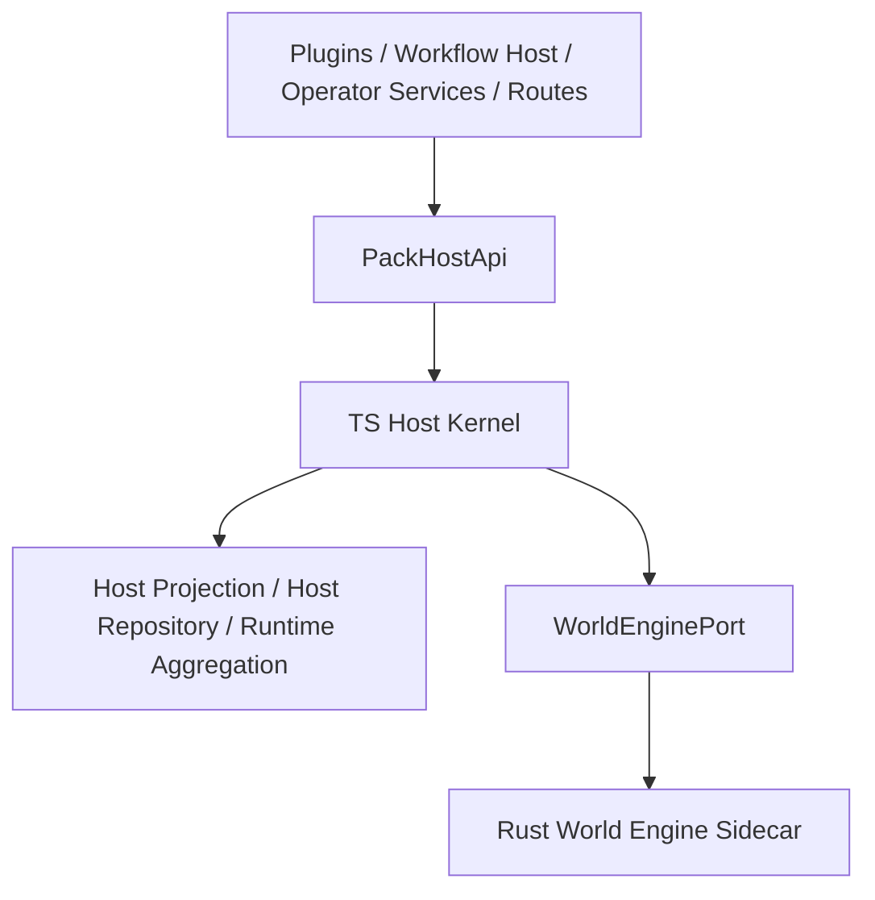

# PackHostApi 作为长期 Host-Mediated Read Contract 设计

## 1. 背景

结合当前 world engine 专题审查结果，项目已经呈现出稳定且应被正式承认的长期分层：

- **Rust sidecar**：承担 pack-scoped session core、受限 query/prepare/commit/objective execution 等内核计算职责
- **TS host kernel**：承担 runtime orchestration、持久化桥、observable projection、插件扩展宿主、外部 API 暴露与 operator-facing read model

此前 `PackHostApi` 常被视为阶段性桥接层，容易被误解为：

1. 未来会被 raw sidecar client 直接替代
2. 只是 world engine 迁移未完成前的兼容接口
3. 插件 / workflow / route 未来可以绕过 host 直接读取 Rust sidecar

如果项目战略已经明确为：

> **world engine 长期保持 Rust core + TS host kernel，控制权始终由 TS host 管理；插件扩展只能由 TS 实现；Rust 主要承担性能、安全、隔离和确定性计算职责。**

那么 `PackHostApi` 就不应再被定义为临时过渡接口，而应被正式定义为：

> **长期的 host-mediated read contract**

---

## 2. 设计目标

### 2.1 主目标

正式把 `PackHostApi` 定义为 world engine 相关上层消费者的**唯一受控读面**之一，用于承接：

- plugin runtime
- workflow host
- operator-facing services / routes
- 受控的 pack runtime 读路径

并明确其 owner 为 **TS host kernel**，而不是 Rust sidecar。

### 2.2 次目标

1. 阻止插件、路由、workflow 直接依赖 `WorldEnginePort` 或 raw sidecar client
2. 明确“对外可见真相”必须经 host projection / host repository / host aggregation 输出
3. 把 `PackHostApi` 从“迁移期桥接物”升级为“长期分层契约”
4. 为后续 read surface 扩展提供稳定入口，而不放大 Rust-TS 耦合

### 2.3 非目标

本设计**不**尝试：

- 让 `PackHostApi` 接管写路径或控制路径
- 把 plugin host 迁入 Rust
- 让外部 route 直接暴露 raw sidecar protocol
- 把所有 query 都强制迁入 Rust sidecar

---

## 3. 核心结论

### 3.1 PackHostApi 的长期定位

`PackHostApi` 是：

> **由 TS host kernel 拥有并发布的、面向上层受控消费者的 pack runtime 读合同。**

它不是：

- `WorldEnginePort` 的别名
- raw sidecar protocol 的透传层
- 临时 compatibility shim
- 将来默认会被删除的过渡对象

### 3.2 长期 owner 结论

- **Owner**：TS host kernel
- **职责边界**：只读、受控、可聚合、可投影、可加治理约束
- **扩展原则**：先扩 `PackHostApi`，而不是让更多调用方直接碰 sidecar

### 3.3 关键语义

`PackHostApi` 输出的是：

- **host-mediated truth**
- 而不是 sidecar internal truth

这意味着即使底层部分数据来自 Rust sidecar session，最终被上层看到的仍然是：

- host 已接受的
- host 已聚合的
- host 认为对外可见的

读面结果。

---

## 4. 分层模型

### 解释

#### 上层消费者
包括：

- plugin runtime
- workflow host
- operator services
- route handlers

这些层不应直接依赖 sidecar transport 或 `WorldEnginePort`。

#### PackHostApi
作为长期 host-mediated read contract，负责：

- 定义上层可读的受控 read surface
- 隔离底层数据来源差异
- 统一 host projection / repo / sidecar session 的读取规则

#### TS Host Kernel
负责：

- 选择读路径
- 聚合与投影
- 维持 observable truth
- 承担权限、作用域、治理、错误语义

#### Rust Sidecar
只承担：

- bounded core compute
- session-level internal state
- deterministic world step / query / objective execution core

---

## 5. 与其他接口的关系

## 5.1 `WorldEnginePort`

`WorldEnginePort` 是 **kernel-facing control/compute contract**。

典型能力：

- `loadPack`
- `prepareStep`
- `commitPreparedStep`
- `abortPreparedStep`
- `queryState`
- `executeObjectiveRule`

它主要服务于：

- runtime loop
- host orchestration
- host-controlled world engine integration

### 原则

- `WorldEnginePort` 不直接暴露给插件 / route / workflow 层
- `WorldEnginePort` 是 control plane / compute plane contract
- `PackHostApi` 是 read plane contract

## 5.2 Raw sidecar client

`WorldEngineSidecarClient` 是 **transport implementation detail**。

原则上：

- 插件不能依赖它
- workflow host 不能依赖它
- route 不能依赖它
- operator-facing read model 不能依赖它

它存在于 TS host kernel 的实现层，而不属于上层 contract。

## 5.3 Runtime projection services

例如：

- runtime clock projection
- overview projection
- operator projection

这些对象与 `PackHostApi` 的关系是：

- projection service 生产 host-visible truth
- `PackHostApi` 负责对外有选择地暴露这些 truth

---

## 6. PackHostApi 的长期职责范围

当前 `PackHostApi` 已具备：

- `getPackSummary(...)`
- `getCurrentTick(...)`
- `queryWorldState(...)`

本设计建议将其长期职责定义为以下三类。

## 6.1 Host summary read

用于暴露 pack runtime 的 host-level 摘要：

- pack 是否 ready
- 当前 health status
- 当前 tick（以 host projection 为准）
- pack summary / pack folder / mode 等

这类数据本质是：

> **host runtime summary**

而不是 sidecar session dump。

## 6.2 Host-mediated world state read

允许上层按受控 query surface 读取世界态，例如：

- `world_entities`
- `entity_state`
- `authority_grants`
- `mediator_bindings`
- `rule_execution_summary`

但这些 query 不承诺“必须直接来自 Rust sidecar”。

可接受来源包括：

- host repository-backed read
- host projection read
- host 在必要时调用 sidecar query 后再标准化

原则是：

> **来源可变，contract 稳定。**

## 6.3 Host-owned observable truth read

最典型的是时钟：

- `getCurrentTick()`

其长期语义必须是：

- 读的是 host accepted / projected tick
- 不是 sidecar 的私有 session tick
- 不是随机某个 local counter

这类 read contract 的 owner 必须始终是 TS host。

---

## 7. 应明确禁止的使用方式

以下方式应被正式定义为不允许：

### 7.1 插件直接依赖 `WorldEnginePort`

原因：

- 插件应依赖 host capability，而不是 runtime kernel control contract
- 否则插件会越过宿主治理边界

### 7.2 插件直接依赖 `WorldEngineSidecarClient`

原因：

- sidecar transport 是实现细节
- 会把 Rust protocol 变成 plugin ABI
- 会破坏 host 对 read truth 的控制权

### 7.3 路由直接把 sidecar query 当外部 contract

原因：

- 外部 contract 应由 host 稳定承诺
- 不应让 route 成为 raw kernel protocol 的公开镜像

### 7.4 workflow host 直接读取 sidecar session 细节

原因：

- workflow host 依赖的是宿主合同，而非 sidecar 内部实现
- 否则未来任何 kernel 内部变动都会扩散到 workflow 层

---

## 8. 作用域语义

`PackHostApi` 必须保留明确的 pack-scoped 语义。

### 8.1 pack scope 是显式输入

所有读操作都应显式带 `pack_id`，避免：

- 模糊地隐式读取 active pack
- future multi-pack / experimental runtime 时重新返工

### 8.2 stable 与 experimental scope 的区分由 host 负责

如果未来存在：

- stable active-pack mode
- experimental loaded-pack mode

那么 scope resolve 仍由 TS host 负责，`PackHostApi` 只是被调用的受控读面，而不是 scope 自主判断层。

---

## 9. 数据来源策略

本设计明确：

> `PackHostApi` 的长期稳定性优先于其底层数据来源的一致性。

也就是说，不同 query 的真实实现可以是：

### 9.1 纯 host projection
例如：

- current tick
- runtime summary
- overview-facing snapshots

### 9.2 纯 host repository-backed read
例如：

- rule execution summary
- authority grants
- mediator bindings
- entity state projection

### 9.3 host-mediated sidecar-assisted read
只有在明确收益时才采用，例如：

- sidecar session 内某些尚未落库但需要受控读取的调试信息

但即便如此，也应经过 host 规范化后再输出。

---

## 10. 与插件系统的长期关系

## 10.1 插件系统是 TS host capability

在当前长期战略下，应明确承认：

- plugin contributor lifecycle
- plugin route registration
- plugin workflow step registration
- plugin query/step/rule contribution registration

都属于 **TS host capability**。

### 推论

插件若需要读 world engine 相关状态，应：

- 通过 `PackHostApi`
- 或通过更上层由 TS host 定义的 pack/runtime read surface

而不能期望直接消费 Rust sidecar protocol。

## 10.2 不默认设计 Rust plugin bridge

在没有明确性能或安全收益证明之前，不应把：

- plugin rule contributor
- plugin query contributor
- plugin step contributor

设计为 Rust sidecar 可消费协议。

当前默认架构结论应是：

> **plugin extension model is TS-host-only by default**

---

## 11. 与 objective execution 的关系

当前 objective enforcement 的现实模型是：

- Rust：规划 / 匹配 / 模板渲染 / mutation plan / emitted event plan
- TS：apply mutation / emit event / record execution

在该模型下，`PackHostApi` 的角色是：

- 为上层消费者暴露受控读面
- 而不是直接承担 side-effect apply contract

因此应明确区分：

- `PackHostApi` = read contract
- enforcement engine = side-effect apply orchestration

不要把二者混合成一个“大而全的 host API”。

---

## 12. 建议的 contract 语言

后续文档、评审、注释应尽量统一使用以下措辞：

### 推荐用语

- **host-mediated read contract**
- **TS-host-owned read surface**
- **observable truth published by host**
- **bounded Rust core**
- **transport is implementation detail**

### 避免用语

- “临时桥接层”
- “未来默认会删”
- “只是迁移中兼容壳”
- “查询最终一定会直接走 Rust”

---

## 13. 对现有实现的解释性结论

基于当前代码现实，本设计对现状给出如下解释：

### 13.1 `createPackHostApi(...)` 不是过渡物，而是长期 contract 雏形

它已经体现了长期设计方向：

- `getPackSummary(...)`
- `getCurrentTick(...)`
- `queryWorldState(...)`

这些都属于 host-mediated read surface，而不是 raw sidecar passthrough。

### 13.2 `getCurrentTick()` 应永久认 host projection

这已经不是修 bug 的补丁，而应视为正式架构原则：

- world engine commit 返回结果
- host projection 接受结果
- `PackHostApi.getCurrentTick()` 返回 host truth

### 13.3 repository-backed query 不应默认被视为“未迁移缺口”

如果长期 owner 就是 TS host，那么 repository-backed read 是一种正式实现方式，而不是天然 debt。

---

## 14. 演进规则

未来若要扩展 `PackHostApi`，遵循以下规则：

### 14.1 先问 owner，再加字段

新增读面前先回答：

- 这是 host truth 吗？
- 这是 operator/plugin/workflow 真需要的稳定数据吗？
- 这个字段是否会泄漏 sidecar internal state？

### 14.2 先扩 host contract，不先暴露 sidecar detail

如果上层需要更多世界态读取：

- 优先加 `PackHostApi`
- 或加更上层的 host read service
- 不优先让上层直接调用 sidecar protocol

### 14.3 数据来源可替换，但 contract 不应漂移

未来即使某些读面内部从 repo-backed 改成 projection-backed，或者 sidecar-assisted，也不应影响上层 contract。

---

## 15. 验收标准

当本设计被采纳后，应满足：

1. `PackHostApi` 在架构文档中被明确声明为长期 host-mediated read contract
2. 插件 / workflow / route 不再被鼓励直接依赖 `WorldEnginePort` 或 sidecar client
3. 与时钟相关的对外读取语义被明确锁定为 host projection truth
4. repository-backed / projection-backed / sidecar-assisted 的内部实现差异不再影响外部 contract 叙述
5. 后续 world engine 讨论中，不再把 `PackHostApi` 描述成“临时迁移桥”

---

## 16. 最终结论

在长期接受 **Rust core + TS host kernel** 的战略下，`PackHostApi` 必须被正式定义为：

> **长期存在、由 TS host kernel 拥有的 host-mediated read contract。**

它的价值不是“帮项目熬过迁移期”，而是：

- 保证 TS host 持有对外可见 truth 的控制权
- 保证插件与上层能力只依赖 host contract
- 把 Rust sidecar 约束在 bounded core / performance / safety / isolation 的职责内
- 防止 raw sidecar protocol 变成全系统无边界蔓延的隐性 ABI

因此，后续对 world engine 的治理不应继续把 `PackHostApi` 视作待删除对象，而应将其视作：

- **长期 contract**
- **host-owned seam**
- **TS control plane 的正式组成部分**
