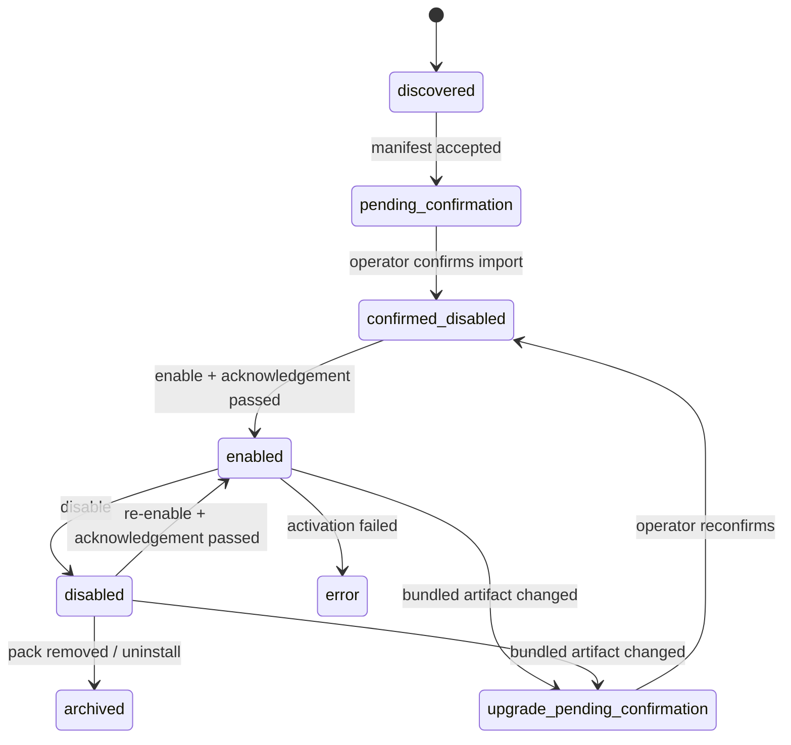
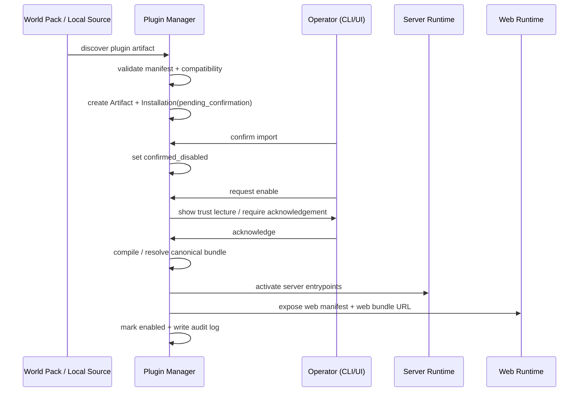

# Pack-Local 插件统一管理与启用确认设计

## 1. 背景

当前工程已经明确了一个重要边界：

- **world pack 是世界治理与内容声明的 canonical contract**
- world pack **不能直接绕过平台注入任意可执行代码**
- 更复杂的行为扩展，应通过 **server-side registered extension** 进入系统

现在需要把这条边界正式产品化为统一插件系统，并满足以下已确认决策：

1. **当前阶段只做 `pack-local`**
2. **允许插件执行 TS/JS 代码**
3. **需要支持 web UI 插件**
4. **插件导入需要人工确认**
5. **每一次显式启用插件时，都要显示责任提醒；除非部署者明确用配置关闭**

这意味着本设计的重点不是“让 pack 直接带特权代码运行”，而是：

> 允许 world pack 携带插件工件，但插件仍必须进入统一的插件注册、确认、启用、审计流程；来源开放，责任显式，作用域清晰。

---

## 2. 设计目标

### 2.1 核心目标

1. 允许 world pack 携带插件，并与独立导入插件走同一套管理流程
2. 当前阶段只支持 **pack-local** 作用域，但模型预留未来 `global` 扩展位
3. 插件支持：
   - server-side TS/JS 扩展
   - web UI TS/JS 扩展
4. 任何插件都必须经历：
   - 发现 / 导入
   - 人工确认
   - 显式启用
   - 审计记录
5. 插件启用时必须触发责任提醒（默认开启）
6. 不过度限制作者与部署者表达能力，但把责任链做成显式制度

### 2.2 设计哲学

本设计遵循以下原则：

- **来源开放**：插件可以来自 pack 携带，也可以来自独立导入
- **安装统一**：不论来源，最终都进入同一个插件管理器
- **作用域清晰**：当前只允许 `pack-local`，避免影响面模糊
- **能力显式**：插件声明它要做什么，部署者确认是否接受
- **责任可追溯**：每次导入、确认、启用、更新、失败都有审计证据
- **能力越大，责任越大**：平台不替部署者做道德判断，但会强制把风险展示到台面上

---

## 3. 非目标

当前阶段**不追求**：

1. 正式 `global` 插件运行面落地
2. 插件市场 / 远程仓库信任链
3. 强安全沙箱 / OS 级隔离保证
4. 任意脚本 DSL / VM
5. 完整 npm 风格依赖解析生态
6. 无命名空间的任意 API / UI 污染
7. 让 world pack 的 `config.yaml` 直接变成可执行代码入口

当前阶段优先建立：

- **统一管理模型**
- **pack-local 清晰边界**
- **server/web 双侧扩展入口**
- **导入确认 + 启用提醒 + 审计机制**

---

## 4. 核心原则

### 4.1 pack 可以携带插件，但不能绕过插件管理器

world pack 可以分发插件工件，但这些工件只表示：

- 这是一个可被发现的插件候选项
- 它可能适用于当前 pack

它**不代表**：

- 已自动被信任
- 已自动被安装
- 已自动被启用
- 已自动获得更高权限

### 4.2 来源不等于特权

同一个插件无论来自：

- pack `plugins/` 目录
- 本地单独导入
- 未来的 registry / git 来源

都必须进入统一流程：

- manifest 校验
- 兼容性校验
- 导入确认
- 启用确认
- 审计记录

### 4.3 当前只做 pack-local，但模型预留 global

虽然当前阶段只支持 `pack-local`，但内部领域模型保留：

- `scope_type = 'pack_local' | 'global'`

其中：

- phase 1 只允许 `pack_local`
- `global` 仅作为未来扩展预留，不开放实际安装路径

这样后续需要全局/局部双层时，不必重写安装模型。

### 4.4 允许 JS/TS 代码执行，但必须正视“信任”问题

当前阶段允许插件执行 TS/JS 代码，这意味着：

- **平台不提供强安全隔离承诺**
- 当前的 capability / permission 更偏向 **host API 治理与审计治理**
- 只要是 trusted JS 插件，本质上就是部署者对该代码作出主动信任决策

因此，“启用前提醒”不是装饰，而是制度的一部分。

### 4.5 通过明确 hook 点扩展，而不是任意 patch 内核

插件可以扩展系统，但不应直接成为随意 patch 内核的入口。

phase 1 的正式扩展点应限定为：

- server context source
- prompt workflow step / transform
- intent grounder
- pack projection builder
- pack-local API route
- operator / pack / entity web panel
- pack-local web route

也就是说：

> 插件扩展的是宿主暴露的 contract，而不是隐式劫持宿主内部实现。

---

## 5. 领域模型

## 5.1 PluginArtifact

表示“这是什么插件工件”。

```ts
interface PluginArtifact {
  artifact_id: string;
  plugin_id: string;
  version: string;
  manifest_version: string;
  source_type: 'bundled_by_pack' | 'standalone_local';
  source_pack_id?: string;
  source_path: string;
  checksum: string;
  manifest_json: Record<string, unknown>;
  imported_at: string;
}
```

说明：

- `source_type` 记录来源
- `source_pack_id` 用于区分“这个工件来自哪个 pack”
- 一个插件升级版本时，应表现为新的 artifact，而不是静默覆盖旧 artifact

## 5.2 PluginInstallation

表示“这个插件被安装到哪里，以何种方式进入运行态”。

```ts
interface PluginInstallation {
  installation_id: string;
  plugin_id: string;
  artifact_id: string;
  version: string;
  scope_type: 'pack_local' | 'global';
  scope_ref?: string; // pack_local 时为 pack_id
  lifecycle_state:
    | 'discovered'
    | 'pending_confirmation'
    | 'confirmed_disabled'
    | 'enabled'
    | 'disabled'
    | 'upgrade_pending_confirmation'
    | 'error'
    | 'archived';
  requested_capabilities: string[];
  granted_capabilities: string[];
  trust_mode: 'trusted';
  confirmed_at?: string;
  enabled_at?: string;
  disabled_at?: string;
  last_error?: string;
}
```

phase 1 约束：

- `scope_type` 只能是 `pack_local`
- `trust_mode` 只开放 `trusted`
- `scope_ref` 必须等于绑定的 `pack_id`

## 5.3 PluginActivationSession

表示“本次实际运行激活结果”。

```ts
interface PluginActivationSession {
  activation_id: string;
  installation_id: string;
  pack_id: string;
  channel: 'startup_restore' | 'cli_enable' | 'ui_enable' | 'api_enable';
  result: 'success' | 'failed';
  started_at: string;
  finished_at?: string;
  loaded_server: boolean;
  loaded_web_manifest: boolean;
  error_message?: string;
}
```

## 5.4 PluginEnableAcknowledgement

表示“启用动作前是否完成了提醒确认”。

```ts
interface PluginEnableAcknowledgement {
  acknowledgement_id: string;
  installation_id: string;
  pack_id: string;
  channel: 'cli' | 'ui' | 'api';
  reminder_text_hash: string;
  acknowledged: boolean;
  actor_id?: string;
  actor_label?: string;
  created_at: string;
}
```

---

## 6. 插件工件与目录结构

## 6.1 pack 内的推荐目录

```text
<data/world_packs>/<pack-dir>/
├─ config.yaml
├─ README.md
├─ plugins/
│  ├─ <plugin-dir>/
│  │  ├─ plugin.manifest.yaml
│  │  ├─ src/
│  │  │  ├─ server.ts
│  │  │  └─ web.ts
│  │  ├─ dist/                 # 可选；若提供则优先使用
│  │  │  ├─ server/index.mjs
│  │  │  └─ web/index.mjs
│  │  └─ assets/
│  └─ ...
└─ docs/
```

说明：

- `plugins/` 是 **pack 项目级附属目录**，不是世界宪法本体
- `plugin.manifest.yaml` 是插件声明入口
- `src/` 支持 TS/JS 源码输入
- `dist/` 是推荐的可分发运行产物

## 6.2 独立导入插件的工件布局

独立导入插件可复用相同布局：

```text
<plugin-package>/
├─ plugin.manifest.yaml
├─ src/
├─ dist/
└─ assets/
```

这样 pack 携带插件与单独插件共享同一种 artifact contract。

## 6.3 运行时编译产物位置

建议使用当前已有的 `plugins_dir`（配置默认 `data/plugins`）承载编译产物与缓存，例如：

```text
data/plugins/
├─ compiled/
│  └─ <installation-id>/
│     ├─ server/index.mjs
│     ├─ web/index.mjs
│     └─ manifest.lock.json
└─ cache/
```

规则：

- 运行时只加载经过管理器确认后的 canonical 编译产物
- 原始 pack 文件仅作为 source artifact
- 插件升级后生成新的编译产物目录

---

## 7. 插件 Manifest 合同

## 7.1 示例

```yaml
manifest_version: plugin/v1
id: pack.world-death-note.investigation-console
name: Investigation Console
version: 0.1.0
kind: pack_local_extension
entrypoints:
  server:
    source: ./src/server.ts
    dist: ./dist/server/index.mjs
    runtime: node_esm
  web:
    source: ./src/web.ts
    dist: ./dist/web/index.mjs
    runtime: browser_esm
compatibility:
  yidhras: '>=0.6.0'
  pack_id: world-death-note
requested_capabilities:
  - server.context_source.register
  - server.intent_grounder.register
  - server.pack_projection.register
  - server.api_route.register
  - web.panel.register
  - web.route.register
contributions:
  server:
    context_sources:
      - death_note_case_board
    intent_grounders:
      - dn_investigation_grounder
    api_routes:
      - /api/packs/:packId/plugins/:pluginId/case-board
  web:
    panels:
      - target: operator.pack_overview
        panel_id: investigation_console
    routes:
      - /packs/:packId/plugins/:pluginId/investigation-console
metadata:
  author: Example Author
  homepage: https://example.com
  description: 为 Death Note pack 提供调查控制台与辅助推理面板。
```

## 7.2 核心字段

插件 manifest 至少应包含：

- `manifest_version`
- `id`
- `name`
- `version`
- `entrypoints.server` / `entrypoints.web`（二者至少其一）
- `compatibility`
- `requested_capabilities`
- `contributions`

## 7.3 依赖处理策略

phase 1 建议采用如下现实策略：

1. **推荐分发 `dist/` 产物**
2. 若只提供 `src/`，则由平台编译为 canonical bundle
3. phase 1 不承诺完整 npm 生态依赖安装流程
4. 若插件依赖第三方库，推荐在分发工件阶段预打包

也就是说：

- 作者可以用 TS/JS 开发
- 但可分发工件应尽量自包含或接近自包含

---

## 8. 生命周期设计

## 8.1 生命周期总览



## 8.2 关键流程

### A. 发现 / 导入

来源包括：

- pack `plugins/` 目录扫描
- 独立本地导入

处理流程：

1. 读取 `plugin.manifest.yaml`
2. 校验 schema 与兼容性
3. 生成 `PluginArtifact`
4. 创建 `PluginInstallation(lifecycle_state='pending_confirmation')`
5. 不自动启用

### B. 导入确认

operator 需要确认：

- 插件名称 / 版本 / 来源
- 来源 pack（若有）
- 请求能力列表
- server/web entrypoints
- checksum
- 兼容性信息

确认后：

- `pending_confirmation -> confirmed_disabled`
- 仍默认保持禁用状态

### C. 启用

启用前必须：

- 检查 installation 已确认
- 检查 compatibility 仍成立
- 检查提醒策略是否要求 acknowledgement
- 通过后才允许进入 `enabled`

### D. 升级

若 pack 内 bundled plugin 的版本号、checksum 或 entrypoint 发生变化：

- 原 installation 不应静默沿用旧确认结果
- 应进入 `upgrade_pending_confirmation`
- 必须重新确认后才能再次启用

这体现的是：

> 信任对象改变了，确认就必须重做。

---

## 9. 启用提醒（Trust Lecture）机制

## 9.1 规范目标

不论插件通过：

- CLI
- GUI
- API

进行**显式启用**，都应在启用动作发生前显示责任提醒；除非部署者明确用配置关闭。

这里的“显式启用”定义为：

- `confirmed_disabled -> enabled`
- `disabled -> enabled`

phase 1 设计中，**普通进程重启后的状态恢复不重复弹提醒**；提醒绑定在“显式 enable 操作”上，而不是“每次宿主进程启动”。

## 9.2 Canonical Reminder Text

系统应内置并默认显示以下文本，内容保持原样：

```text
We trust you have received the usual lecture from the local System
Administrator. It usually boils down to these three things:

#1) Respect the privacy of others.
#2) Think before you type.
#3) With great power comes great responsibility.
```

## 9.3 默认策略

默认配置应等价于：

```yaml
plugins:
  enable_warning:
    enabled: true
    require_acknowledgement: true
```

只有部署者显式关闭时，才允许跳过该提醒。

## 9.4 CLI 行为

### 交互式 CLI

当用户执行类似：

```bash
yidhras plugin enable --pack <packId> <pluginId>
```

CLI 应：

1. 输出 canonical reminder text
2. 要求输入确认（如 `yes` / 明确确认短语）
3. 记录 acknowledgement 审计
4. 再进入启用流程

### 非交互 / 自动化 CLI

如果：

- 当前终端非交互
- 且提醒策略未关闭
- 且没有显式 acknowledgement 参数

则命令应失败，并返回明确错误，例如：

- `PLUGIN_ENABLE_ACK_REQUIRED`

只有当用户显式提供类似 `--acknowledge-plugin-risk` 一类参数时，才允许继续启用。

## 9.5 GUI 行为

GUI 启用插件时必须弹出确认对话框，至少包含：

- canonical reminder text
- 插件名 / 版本 / 来源 / pack 归属
- 请求能力
- 确认按钮
- 取消按钮

确认后：

- 记录 acknowledgement
- 发起 enable API

## 9.6 API 行为

若通过 API 直接启用，且提醒策略开启，则需要：

- body 中显式提供 acknowledgement 字段或 token
- 否则返回 `PLUGIN_ENABLE_ACK_REQUIRED`

---

## 10. 安装与启用流程图



---

## 11. Server 运行时设计

## 11.1 运行时定位

server plugin runtime 是对现有“server-side registered extension”思路的正式化，不是 world pack contract 的直接放宽。

也就是说：

- world pack 本体仍是声明式 contract
- 插件是独立的扩展工件
- 只是该扩展工件可能由 pack 一起携带分发

## 11.2 Server Host API

phase 1 建议仅通过正式 host API 暴露扩展能力：

```ts
interface ServerPluginHostApi {
  registerContextSource(...): void;
  registerPromptWorkflowStep(...): void;
  registerIntentGrounder(...): void;
  registerPackProjection(...): void;
  registerPackRoute(...): void;
  getPackRuntimeReader(...): unknown;
  getKernelServices(...): unknown;
}
```

所有注册动作都应校验：

- 插件是否已启用
- scope 是否匹配当前 active pack
- capability 是否已被授予

## 11.3 建议开放的 server hook

phase 1 建议开放：

- `server.context_source.register`
- `server.prompt_workflow.register`
- `server.intent_grounder.register`
- `server.pack_projection.register`
- `server.api_route.register`
- `server.pack_runtime.read`
- `server.pack_runtime.write`（高风险）
- `server.external_fetch`（高风险）
- `server.local_file_access`（高风险）

## 11.4 pack-local API 命名空间

所有插件自带 API route 都应被强制限制在 pack-local 命名空间下，例如：

```text
/api/packs/:packId/plugins/:pluginId/*
```

这样可以保证：

- 作用域清晰
- 不污染全局 API 面
- 一眼可见这是 pack-local 扩展

## 11.5 故障策略

phase 1 建议每个 installation 支持：

- `failure_policy = 'fail_open' | 'block_pack_activation'`

默认：

- `fail_open`

含义：

- 插件失败默认不阻断整个 pack 激活
- 但对被 operator 标记为关键插件的安装项，可选择阻断 pack 激活

---

## 12. Web UI 插件设计

## 12.1 基本原则

既然当前要支持 web UI 插件，就不应要求每次安装插件都重新构建宿主前端。

因此 phase 1 建议：

- 插件 web 产物编译为浏览器可加载的 ESM bundle
- 由 server 以同源静态资源形式提供
- 前端在当前 active pack 上按需动态加载

## 12.2 Web Runtime 加载流程

1. operator/web 壳层获取当前 active pack 已启用插件清单
2. 读取每个插件的 web contribution manifest
3. 在需要的扩展点上执行动态加载
4. 仅在 active pack 匹配时渲染对应 UI

## 12.3 推荐 web 扩展点

phase 1 建议开放：

- `operator.pack_overview` panel
- `operator.entity_overview` panel
- `operator.timeline` widget
- pack-local route
- pack-local action button / menu item

## 12.4 Web 路由命名空间

所有插件页面建议限制在：

```text
/packs/:packId/plugins/:pluginId/*
```

意义：

- 与 pack-local 作用域一致
- 不污染全局导航
- 对使用者和 operator 都非常直观

## 12.5 Web 错误隔离

每个插件 web contribution 应被包裹在单独 error boundary 中：

- 某个插件 UI 崩溃，不应拖垮整个 operator UI
- 错误应进入插件审计 / diagnostics

---

## 13. Capability 与 Trust 模型

## 13.1 requested vs granted

插件 manifest 声明：

- `requested_capabilities`

installation 保存：

- `granted_capabilities`

最终运行时以 `granted_capabilities` 为准。

## 13.2 phase 1 的现实边界

由于 phase 1 允许 trusted TS/JS 代码执行，因此必须明确：

- capability 在 phase 1 **不是强安全沙箱**
- 它的主要作用是：
  - 限制 host API 注册面
  - 帮助 operator 理解风险
  - 支撑审计、diff 与 UI 呈现

换言之：

> phase 1 的 trusted plugin 模型是“显式信任 + host API 治理 + 审计治理”，而不是“安全隔离执行”。

## 13.3 能力分层建议

### 低风险

- `server.context_source.register`
- `server.pack_projection.register`
- `web.panel.register`

### 中风险

- `server.intent_grounder.register`
- `server.prompt_workflow.register`
- `web.route.register`
- `server.api_route.register`

### 高风险

- `server.pack_runtime.write`
- `server.external_fetch`
- `server.local_file_access`

### 极高风险（未来预留，不建议 phase 1 默认开放）

- 子进程执行
- 原生模块接入
- 直接数据库底层句柄访问
- 任意覆盖 kernel 内部对象

---

## 14. 持久化与审计

## 14.1 持久化归属

插件管理记录应归属于 **kernel-side 持久化**，而不是 pack-local runtime DB。

原因：

- 这是平台治理/部署侧元数据，不是世界状态
- 需要同时服务 CLI、GUI、API 与 operator
- 插件确认、提醒、启用记录不属于叙事世界的一部分

## 14.2 审计事件

建议至少记录：

- `plugin_discovered`
- `plugin_import_confirmed`
- `plugin_enable_warning_presented`
- `plugin_enable_acknowledged`
- `plugin_enabled`
- `plugin_disabled`
- `plugin_activation_failed`
- `plugin_upgrade_detected`
- `plugin_reconfirmation_required`

每条审计应携带：

- `plugin_id`
- `version`
- `artifact_id`
- `installation_id`
- `pack_id`
- `channel`
- `actor`
- `checksum`
- `timestamp`

---

## 15. 与当前架构的衔接

## 15.1 与当前 world-pack 边界的关系

本设计不改变以下判断：

- world pack 本体仍不应直接注入任意可执行代码
- 更复杂行为仍通过正式扩展机制进入宿主

变化在于：

- 过去是“server-side registered extension”这一抽象存在
- 现在把它演进为可被 pack 携带、可被 operator 管理、可被 CLI/UI 启用的统一插件体系

## 15.2 与当前 `plugins_dir` 的关系

当前已有 `plugins_dir` 配置，可自然用作：

- 编译产物目录
- bundle 缓存目录
- manifest lock / checksum 快照目录

## 15.3 与当前 context/plugin provenance 的关系

当前代码已经存在：

- `ContextNodeScope = 'system' | 'pack' | 'agent' | 'plugin'`
- provenance 中有 `created_by: 'system' | 'agent' | 'plugin'`

因此插件正式接入后，可自然沿用已有 provenance 语义，而不必另起一套来源模型。

## 15.4 与当前 Nuxt 内部 plugin 的关系

当前 `apps/web/plugins/*.ts` 是宿主应用内部实现的一部分，不等于用户可管理插件。

phase 1 新体系应明确区分：

- **宿主内部实现插件**（代码仓库内建）
- **用户/pack 可管理插件**（由插件管理器控制）

---

## 16. 风险与控制

### 风险 1：trusted JS 插件被误解为“安全隔离执行”

**控制：**

- 文档明确写出 phase 1 不提供强隔离保证
- 启用前强制展示 reminder
- UI/CLI 中显式标注 trust mode = trusted

### 风险 2：pack 携带插件被误解为“导入 pack 就自动跑代码”

**控制：**

- 发现 != 导入确认 != 启用
- 默认导入后保持 `confirmed_disabled`
- 任何显式 enable 都必须经过提醒流程

### 风险 3：web 插件污染全局页面与路由

**控制：**

- 所有 route/panel 都做 pack-local 命名空间
- active pack 不匹配时不加载 UI

### 风险 4：bundled plugin 更新后静默沿用旧信任

**控制：**

- checksum/version/entrypoint 变化即进入 `upgrade_pending_confirmation`
- 必须重新确认后才能再次启用

### 风险 5：插件失败拖垮宿主运行态

**控制：**

- server 侧提供 fail-open 默认策略
- web 侧使用 error boundary
- activation / render diagnostics 必须进入审计面

---

## 17. phase 1 验收标准

1. world pack 可以携带插件目录，独立插件也可单独导入
2. 不论来源，插件都统一进入 artifact / installation / activation 管理模型
3. 当前只允许 `pack_local` scope，但领域模型保留 `global` 预留位
4. 插件导入必须人工确认
5. 启用插件时，CLI / GUI / API 都会执行 trust lecture 流程（除非配置关闭）
6. server-side TS/JS 插件可以通过正式 host API 注册扩展点
7. web UI 插件可以以 pack-local 命名空间动态加载并渲染
8. 插件 API route 与 web route 都受 pack-local 命名空间约束
9. 插件更新后会触发重新确认，而不是静默沿用旧信任
10. 审计面可看到导入、确认、提醒、启用、失败、更新等关键证据

---

## 18. 当前结论

本阶段最合理的插件设计结论是：

> **让 world pack 可以携带插件，但插件仍必须作为独立、可确认、可启用、可审计的 pack-local trusted extension 被统一管理。**

更简练地说：

- pack 可以带插件
- 插件不能绕过管理器
- 当前只开放 pack-local
- 允许 server/web TS/JS 扩展
- 导入必须确认
- 启用必须提醒
- 信任是显式的，责任也是显式的

这套设计与“能力越大，责任越大；部署者对自己的内容负责”的平台哲学是一致的。