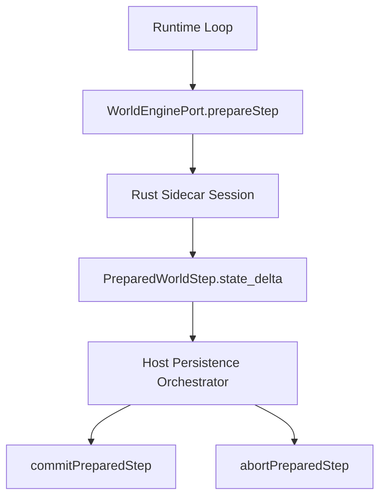

# Rust World Engine / Pack Runtime Core Ownership Deepening Design

## 1. 背景

`TODO.md` 当前把后续 Rust 迁移重点列为：

- World Engine / Pack Runtime Core
- Scheduler Core Decision Kernel
- Memory Block / Context Trigger Engine

结合当前代码与进度，Rust world engine 已完成以下阶段性收口：

- **Phase 1A**：`objective_enforcement` 已成为 Rust-owned 的真实规则执行路径；
- **Phase 1B**：已形成 `Host snapshot hydrate -> Rust session/query -> prepare/commit/abort -> failure recovery` 的正式闭环；
- **Phase 1C**：step semantics / observability 已完成第一轮深化，新增 richer delta/event/diagnostics，并验证与 Host-managed persistence、runtime loop、abort/tainted 兼容。

这意味着当前系统已经回答了“Rust 能否以 sidecar 形式接入 world engine”这个问题；但还没有完全回答另一个更关键的问题：

> Rust 是否已经真正成为 **Pack Runtime Core** 的语义 owner？

目前答案仍然是：**部分成立，但不够厚。**

当前 Rust session 已能承载：

- `world_entities`
- `entity_states`
- `authority_grants`
- `mediator_bindings`
- `rule_execution_records`

但从 `prepareStep(...)`、`state_delta`、Host persistence apply 现状看，Pack Runtime Core 的语义推进仍偏“骨架化”：

- step 仍然主要围绕 clock advance；
- 当前最稳定的 mutation 仍主要是 `__world__/world.runtime_step`；
- Host persistence 仍缺少一层“按 delta op 正式 apply 到 pack runtime storage repo”的落地层；
- query allowlist 已存在，但还不够表达 Pack Runtime Core 的真实调试/验证需求；
- `objective_enforcement` 已 Rust-owned，但与统一的 core session transition model 仍未完全收口。

因此，`World Engine / Pack Runtime Core` 的下一阶段不应理解为“继续多迁一些功能到 Rust”，而应理解为：

> **把 Rust world engine 从“具备协议闭环的 sidecar”推进为“真正拥有 Pack Runtime Core 变更语义的内核”。**

---

## 2. 问题陈述

当前 Pack Runtime Core 主线存在四类未完成问题。

### 2.1 Rust 已拥有 core state snapshot，但还未完全拥有 core mutation algebra

当前 contract 已定义：

- `upsert_world_entity`
- `upsert_entity_state`
- `put_mediator_binding`
- `put_authority_grant`
- `append_rule_execution`
- `set_clock`

但这些 operation 还没有真正成为“Pack Runtime Core 的正式变更代数（mutation algebra）”。

现状更像：

- contract 已有 op 名称；
- sidecar 只部分使用；
- Host 也还未正式按 op 解释与持久化。

### 2.2 Host-managed persistence 仍缺少正式的 delta apply layer

当前 `world_engine_persistence.ts` 已实现：

- prepare -> persist -> commit -> abort 编排；
- single-flight；
- tainted session；
- failure recovery。

但 `persistPreparedStep(...)` 仍未被正式定义为：

> “把 `PreparedWorldStep.state_delta.operations` 解释并应用到 pack runtime storage repo 的受控 apply 层”。

也就是说，目前 Host 是 prepared-step 编排 owner，但还不是一个正式的 core delta applier。

### 2.3 query allowlist 仍偏基础读面

当前 `queryState(...)` 虽已支持：

- `pack_summary`
- `world_entities`
- `entity_state`
- `authority_grants`
- `mediator_bindings`
- `rule_execution_summary`

但仍偏“列出已有内容”的基础能力，尚未形成更适合：

- core state 调试
- before/after 验证
- pack runtime ownership 审计
- parity 归因

的正式调试读面。

### 2.4 `objective_enforcement` 与统一 core transition model 尚未完全对齐

当前 `world.rule.execute_objective` 已能输出：

- `mutations`
- `emitted_events`
- `diagnostics`

但它与 `prepareStep(...)` 的 staged session state、`state_delta`、Host persistence apply 之间还不是同一套统一内核模型。

这意味着系统内部仍存在两种“Rust-owned 变化表达”：

1. objective rule execution result；
2. world step prepared delta。

长期看，需要至少定义两者的边界与衔接方式，避免继续并行膨胀。

---

## 3. 设计目标

本设计目标是：

1. **冻结 Pack Runtime Core ownership matrix**，明确 Rust 真正拥有的数据面；
2. **正式化 Pack Runtime Core delta model**，把 `state_delta.operations` 变成可解释、可持久化、可验证的核心协议；
3. **在 Rust session 中建立更真实的 core mutation semantics**，不再主要停留在 clock-only / runtime_step-only；
4. **为 Host 建立正式的 delta apply layer**，让 Host-managed persistence 成为受控 apply owner，而不是语义 owner；
5. **扩展 core query / observability**，让调试与 parity 验证围绕 core state 展开；
6. **保持现有大边界不变**：scheduler / plugin host / workflow host / AI gateway 继续留在 Node/TS；
7. **为后续是否统一 objective execution 与 world step transaction model 提供前置基础**。

---

## 4. 非目标

以下事项不属于本设计目标：

1. 不把 scheduler / decision kernel 迁入 Rust；
2. 不把 Memory Block / Context Trigger Engine 并入本轮；
3. 不把 plugin host / workflow host / context assembly / AI gateway 迁入 Rust；
4. 不重新打开 FFI / remote RPC / 独立网络服务路线；
5. 不把 Rust 直接接入 Prisma 或直接操作 pack runtime sqlite；
6. 不在本轮把 `Event` 从 kernel-hosted bridge 改造成 pack-owned source-of-truth；
7. 不强制要求本轮完成下一类 rule family 提名；
8. 不在本轮直接把 `objective_enforcement` 并入统一 step transaction，除非其演进是 Pack Runtime Core delta model 的自然副产物。

---

## 5. 当前基线与边界事实

### 5.1 当前已成立的 Pack Runtime Core owned 面

当前 pack runtime 的正式核心模型已基本稳定为：

- `WorldEntity`
- `EntityState`
- `AuthorityGrant`
- `MediatorBinding`
- `RuleExecutionRecord`

当前 Rust snapshot / hydrate / query contract 已与该集合对齐。

### 5.2 当前明确不属于 Pack Runtime Core 的对象

以下对象继续由 kernel-side 持有：

- `Post`
- `Event`（shared evidence bridge）
- `InferenceTrace`
- `ActionIntent`
- `DecisionJob`
- `ContextOverlayEntry`
- `MemoryBlock*`
- Plugin governance records
- AI invocation / audit / host observability 主线

### 5.3 当前世界推进链路

### 5.4 当前设计缺口

主要缺口不是 sidecar transport、prepared commit、query 是否存在，而是：

- sidecar 是否真的表达 Pack Runtime Core 变化；
- Host 是否真的按 core delta 持久化；
- query / diagnostics 是否能稳定验证 core ownership。

---

## 6. 核心设计决策

### ADR-1：下一阶段以“Core Ownership Deepening”为主线，而不是 rule family breadth expansion

下一阶段优先级定义为：

> **内核厚度优先于迁移广度。**

也就是：

- 先把 Pack Runtime Core 的 ownership / delta / apply / query 做实；
- 再决定是否提名 objective 之外的新 rule family。

### ADR-2：Rust 是 Pack Runtime Core 语义 owner，Host 是 persistence/orchestration owner

在本设计中明确：

- **Rust owner**：core state transition semantics、prepared core delta、session mutation、core diagnostics；
- **Host owner**：prepared-step orchestration、事务持久化、失败恢复、稳定 API、read-model bridge；
- **Host 不是 core mutation semantics owner**。

### ADR-3：`state_delta.operations` 是 Pack Runtime Core 的正式变更协议

`PreparedWorldStep.state_delta.operations` 不再只作为“调试附属字段”，而应成为：

- Rust -> Host 的正式变更表达；
- Host apply layer 的正式输入；
- integration/parity 测试的核心对齐对象。

### ADR-4：query allowlist 继续收敛，但允许向 core-debugging 方向扩面

不开放任意 SQL-like query；但允许扩展：

- 受控 selector/filter
- core state before/after 诊断
- delta-related summaries

### ADR-5：`objective_enforcement` 与 unified core transaction model 暂缓强行合并

当前先定义：

- `objective_enforcement` 继续是 Rust-owned rule execution surface；
- 本轮优先确保 Pack Runtime Core delta model 稳定；
- 等 delta/apply/query 稳定后，再决定 objective result 是否进入统一 prepared-step transaction model。

---

## 7. Ownership Matrix

### 7.1 Rust world engine owned

Rust session 在本阶段正式拥有：

- pack-scoped `world_entities`
- pack-scoped `entity_states`
- pack-scoped `authority_grants`
- pack-scoped `mediator_bindings`
- pack-scoped `rule_execution_records`
- world clock / revision transition semantics
- prepared core delta
- step/core observability

### 7.2 Host owned

Host 在本阶段继续拥有：

- pack runtime sqlite transaction boundary
- repo-level persistence implementation
- scheduler / runtime loop orchestration
- plugin host / workflow host / context/memory
- `Event` bridge / audit / projection / operator read model
- failure policy / tainted recovery
- HTTP / CLI / operator API surface

### 7.3 Shared boundary through contracts only

Rust 与 Host 之间共享但不能越界的边界对象：

- `WorldPackSnapshot`
- `PreparedWorldStep`
- `WorldStateDeltaOperation[]`
- `WorldStateQuery*`
- `WorldEngineObservationRecord[]`
- `WorldEngineCommitResult`

---

## 8. Pack Runtime Core Delta Model

### 8.1 设计原则

Pack Runtime Core delta model 应满足：

1. **只表达 Rust 当前真正拥有的数据面**；
2. **足够细，能被 Host 安全持久化**；
3. **足够稳定，能作为 parity/diagnostics 基线**；
4. **JSON-safe**；
5. **不暴露底层 DB implementation detail**。

### 8.2 正式 op taxonomy

本轮正式收口以下 op：

- `upsert_world_entity`
- `upsert_entity_state`
- `put_mediator_binding`
- `put_authority_grant`
- `append_rule_execution`
- `set_clock`

其中约束如下：

#### A. `upsert_world_entity`
用于：

- 新建或更新 world entity 元数据
- entity kind/type/label/tags/schema ref/payload 更新

#### B. `upsert_entity_state`
用于：

- entity namespace state 的 upsert
- 是当前最核心的 world mutation 表达之一

#### C. `put_mediator_binding`
用于：

- mediator <-> subject binding 建立/更新/状态改变

#### D. `put_authority_grant`
用于：

- authority grant 新增/状态变化/优先级变化

#### E. `append_rule_execution`
用于：

- Pack Runtime Core 内部 rule execution evidence 的追加
- 只追加 pack runtime owned execution record，不直接替代 kernel `Event`

#### F. `set_clock`
用于：

- tick / revision 变化
- 仍然保留，但不应再成为唯一主 mutation

### 8.3 op payload 约束

每个 op 的 payload 必须：

- 可被 Host 直接解释
- 不包含宿主内部 class/object handle
- 不依赖 sidecar 内部状态结构
- 尽量显式携带 before/after 需要的最小信息

建议统一携带以下类型字段：

- `target_ref`
- `namespace`
- `payload.next`
- `payload.previous`（如必要）
- `payload.reason`（如必要）

### 8.4 metadata 约束

`state_delta.metadata` 建议正式收口至少包括：

- `pack_id`
- `reason`
- `base_tick`
- `next_tick`
- `base_revision`
- `next_revision`
- `mutated_entity_ids`
- `mutated_namespace_refs`
- `delta_operation_count`

---

## 9. Rust Session Mutation Model

### 9.1 目标

Rust sidecar 不再只在 `prepareStep(...)` 中：

- 生成一个 clock step；
- 顺手 upsert `__world__/world.runtime_step`。

而要逐步进入：

> 对 Pack Runtime Core staged state 进行真实 session mutation，并把结果表达为 prepared delta。

### 9.2 Session 中的 staged 变更

在 `prepareStep(...)` 时，Rust session 应至少具备：

- `base_*`：当前 committed session state
- `prepared_*`：本轮 staged session state
- `prepared_summary`
- `prepared_delta`
- `prepared_observability`

### 9.3 before/after 语义

Prepared state 应显式支持：

- before entity state
- after entity state
- before authority/binding summary
- after authority/binding summary
- affected entity ids / namespace refs

不要求每条 query 都暴露完整 before dump，但内部至少要能形成稳定 summary。

### 9.4 对现有 `main.rs` 的结构性影响

当前 `apps/server/rust/world_engine_sidecar/src/main.rs` 已承载：

- transport
- session
- query
- objective execution
- step prepare/commit/abort

本设计不强制要求立即拆模块，但实现阶段应预期：

- `session_state`
- `step_prepare`
- `query`
- `objective_execution`
- `protocol`

最终应拆为独立 Rust 模块，以避免继续把所有内核语义堆积在单文件中。

---

## 10. Host Persistence Apply Layer

### 10.1 核心目标

Host persistence 不再只是：

- 记录 `persisted_revision`
- 然后 commit。

而要进化为：

> **受控解释 `PreparedWorldStep.state_delta.operations` 并将其 apply 到 pack runtime storage repo 的正式层。**

### 10.2 新增角色

建议新增一个正式概念：

- `PackRuntimeCoreDeltaPersistencePort`
- 或 `applyPreparedWorldStateDelta(...)`

职责：

- 按 op 解释 prepared delta
- 调对应 pack storage repo
- 在一个 Host-controlled transaction 内完成 apply
- 最终返回 `persisted_revision`

### 10.3 推荐映射

| Delta op | Host apply target |
| --- | --- |
| `upsert_world_entity` | `entity_repo` |
| `upsert_entity_state` | `entity_state_repo` |
| `put_authority_grant` | `authority_repo` |
| `put_mediator_binding` | `mediator_repo` |
| `append_rule_execution` | `rule_execution_repo` |
| `set_clock` | active pack runtime / pack runtime clock persistence facade |

### 10.4 事务要求

Host apply layer 必须保持：

1. 对单个 prepared step 的 apply 是原子事务；
2. 若 apply 失败，则必须走 abort；
3. abort 失败则 pack session 进入 tainted；
4. Host 不得在 apply 层绕开 delta contract，直接发明新的隐式 mutation。

### 10.5 与现有 orchestrator 的关系

现有 `executeWorldEnginePreparedStep(...)` 保持：

- single-flight owner
- abort/tainted owner
- prepare/persist/commit orchestration owner

新增 apply layer 只是把 `persistPreparedStep(...)` 从“占位回 revision”升级为“真实 apply prepared delta”。

---

## 11. Query 与 Observability 扩展

### 11.1 Query 原则

query 仍坚持 allowlist，但允许向 Pack Runtime Core 调试读面扩展。

### 11.2 建议扩展方向

#### A. `world_entities`
可增加：

- `selector.entity_kind`
- `selector.entity_type`
- `selector.ids`
- limit/cursor

#### B. `entity_state`
可增加：

- 多 namespace summary
- state existence / last_updated summary
- runtime_step / world state 调试摘要

#### C. `authority_grants`
可增加：

- `selector.source_entity_id`
- `selector.capability_key`
- `selector.mediated_by_entity_id`
- `selector.status`

#### D. `mediator_bindings`
可增加：

- `selector.mediator_id`
- `selector.subject_entity_id`
- `selector.binding_kind`
- `selector.status`

#### E. `rule_execution_summary`
可增加：

- recent limit
- by rule id
- by subject/target entity
- by execution status

### 11.3 Observability 原则

observability 应优先帮助回答：

- 本轮 step 改了哪些 core object？
- 哪些 op 被 staged？
- Host apply 到哪一步失败？
- prepare/commit/abort 哪一段出了问题？

### 11.4 建议新增 core diagnostics

建议逐步补充：

- `WORLD_CORE_DELTA_BUILT`
- `WORLD_CORE_DELTA_APPLIED`
- `WORLD_CORE_DELTA_ABORTED`
- `WORLD_QUERY_ALLOWLIST_FILTERED`
- `WORLD_PREPARED_STATE_SUMMARY`

---

## 12. 与 `objective_enforcement` 的关系

### 12.1 当前结论

本轮先不强制把 objective rule execution 完全并入 step transaction。

### 12.2 约束

当前应保持：

- `world.rule.execute_objective` 继续是 Rust-owned rule execution surface；
- 它输出的 `mutations/emitted_events/diagnostics` 不直接等同于 prepared step delta；
- 但其 mutation shape 应尽量朝 Pack Runtime Core delta model 对齐。

### 12.3 下一轮可能的演进方向

等 Pack Runtime Core delta/apply/query 稳定后，可再评估：

1. objective execution 是否转为构建 prepared delta 的一种输入；
2. objective execution 是否进入统一的 prepared/commit/abort 事务模型；
3. 规则执行记录是否统一进入 `append_rule_execution` 主线。

当前阶段不要求回答最终统一方案，但要求避免继续形成彼此不相容的 mutation 表达。

---

## 13. 实施顺序建议

### Phase D1：冻结 ownership matrix 与 delta contract

目标：

- 明确 Pack Runtime Core owned 数据面
- 明确正式 op taxonomy
- 明确 metadata/query/diagnostics 最小基线

验收：

- design / ARCH / contracts 结论一致
- 不再模糊 Rust/Host owner 边界

### Phase D2：Rust session mutation deepening

目标：

- `prepareStep(...)` 生成更真实的 core staged state
- 不再主要围绕 clock-only mutation

验收：

- 至少两类以上 core object mutation 能通过 prepared delta 表达
- prepared summary/observability 能解释 affected core objects

### Phase D3：Host apply layer 正式化

目标：

- 引入 delta apply layer
- 把 prepared delta 映射到 pack runtime storage repo

验收：

- Host 不再只返回 `persisted_revision`
- integration tests 能覆盖真实 delta apply

### Phase D4：query / observability 扩面

目标：

- 扩 query allowlist 的核心调试能力
- 增加 core-delta-oriented diagnostics

验收：

- before/after / filtered query / delta attribution 有测试支撑

### Phase D5：closeout 与后续决策点

目标：

- 验证 Pack Runtime Core ownership 已成立
- 决定下一阶段是继续 engine semantics 还是提名新 rule family

验收：

- progress / enhancements / ARCH 同步完成

---

## 14. 风险与控制

### 风险 1：实现过程中又把范围扩到 scheduler / memory / workflow

**控制：** 当前计划只允许修改 World Engine / Pack Runtime Core 主线，不把 scheduler kernel 或 memory trigger 混入。

### 风险 2：delta contract 过宽，变成半内部协议 dump

**控制：** 所有 op 都必须围绕 Pack Runtime Core owned 面，不暴露宿主内部实现细节。

### 风险 3：Host apply layer 重新变成语义 owner

**控制：** Host 只解释并持久化 delta，不自行决定 mutation 语义。

### 风险 4：objective execution 与 step delta 继续分叉

**控制：** 本轮先定义 shape alignment 原则，后续再决定统一交易模型，不允许继续任意发明第三套 mutation contract。

### 风险 5：Rust sidecar 单文件继续膨胀

**控制：** 实施阶段允许先保持行为正确，但应把 Rust 模块拆分列为实现中的结构约束，而不是无限追加到 `main.rs`。

---

## 15. Done Definition

当以下条件满足时，可认为 `World Engine / Pack Runtime Core` 这一轮目标完成：

1. Rust/Host 的 Pack Runtime Core ownership matrix 已冻结；
2. `PreparedWorldStep.state_delta.operations` 已成为正式 core mutation protocol；
3. Rust `prepareStep(...)` 能表达超出 clock-only 的真实 Pack Runtime Core mutation；
4. Host 已具备正式 delta apply layer，并通过 repo 持久化 core delta；
5. query allowlist 已能支撑 core debugging / before-after 验证；
6. single-flight / abort / tainted / runtime loop compatibility 未退化；
7. objective execution 与 core delta model 的边界已被明确记录；
8. 下一轮是“继续 engine semantics”还是“提名下一 rule family”的决策前提已经具备。

---

## 16. 下一步建议

本设计确认后，建议下一步进入正式实施计划，按以下里程碑展开：

- **M1**：Pack Runtime Core contract / delta taxonomy 冻结
- **M2**：Rust session mutation deepening
- **M3**：Host delta apply layer
- **M4**：query / observability 扩展与 integration matrix
- **M5**：closeout + 下一阶段路线决策

最终路线判断原则：

- 若 Pack Runtime Core mutation/apply/query 仍不够稳，则继续加深 engine semantics；
- 若 Pack Runtime Core ownership 已稳定，才进入下一类 rule family 提名。

---

## 17. 结论

当前 `World Engine / Pack Runtime Core` 的正确推进方向，不是继续无边界扩大 Rust 覆盖面，而是：

> **先把 Rust world engine 真正做成 Pack Runtime Core 的语义 owner。**

这意味着下一阶段的核心工作应聚焦于：

- ownership matrix 冻结
- delta model 正式化
- Rust session mutation deepening
- Host delta apply layer
- query / observability 对齐

只有当这套基础稳定后，后续无论是继续做 engine semantics，还是提名 objective 之外的新 rule family，才会具备足够稳固的内核地基。