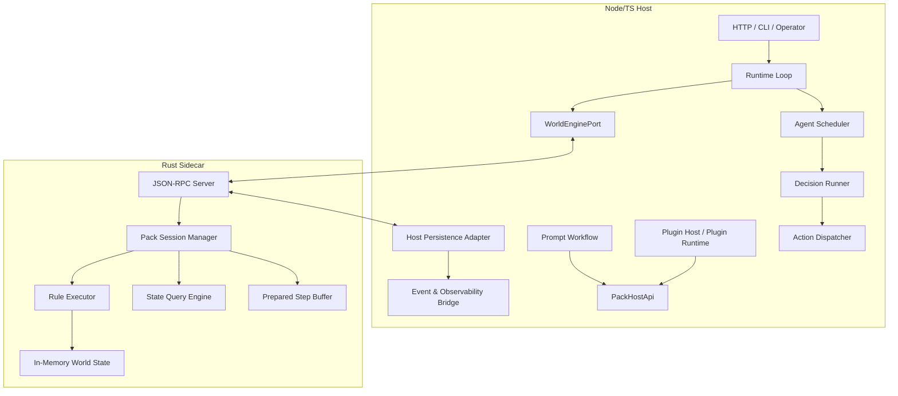

# Rust world engine 第一阶段边界与接入设计

## 1. 背景

`TODO.md` 已将当前阶段的 Rust 架构升级定位为 **P2 / 后置任务**：

- Rust 只承接 **世界规则执行 + 世界状态维护**；
- `scheduler / AI gateway / prompt workflow / plugin runtime` 继续留在 **Node/TS host**；
- 需要先补最小 Host API，再决定 Rust 接入方式；
- 现有插件扩展点继续走 Host API，而不是直接侵入 Rust 内核。

当前代码库中，Node/TS 宿主已经完成了一轮模块边界收口，至少具备以下基础：

- `PackRuntimeLookupPort`
- `RuntimeKernelFacade`
- `ContextAssemblyPort`
- `MemoryRuntimePort`

这说明现在适合进入 **Rust world engine 正式边界设计**，而不是直接开始无边界的 Rust 实现。

本设计基于以下已确认前提：

1. **状态持久化第一阶段继续留在 Host adapter**，而不是让 Rust 直接接管 Prisma / SQLite。
2. **集成方式第一阶段默认选择“本地 sidecar + JSON-RPC”**。
3. **现有 scheduler regression 作为 Rust 升级前置基线问题单独处理**，不与本轮迁移混修。

---

## 2. 当前问题陈述

虽然模块边界已经明显改善，但 Rust world engine 真正接入前，仍有四个关键问题：

### 2.1 runtime loop 仍直接依赖 `context.sim`

当前 `apps/server/src/app/runtime/simulation_loop.ts` 中，世界推进仍通过 `context.sim.step(...)` 完成。只要 runtime loop 继续直接依赖 TS `sim` 内部对象，Rust 就无法只作为“内核实现替换件”接入。

### 2.2 `AppContext.sim` 仍是兼容性超级入口

虽然已有多个 port 被正式化，但 `AppContext` 仍保留了 `sim` 这一兼容性超级入口。如果后续新代码继续通过 `context.sim.*` 读写世界内核能力，未来 Rust 接入时仍会发生 TS 内部对象穿透。

### 2.3 缺少 world engine 正式 contract

当前 `packages/contracts/src/` 尚无明确的 world engine contract。没有稳定契约就会导致：

- Node/TS adapter 与 Rust sidecar 并行开发时难以对齐；
- 测试无法做双实现 parity；
- 插件 / workflow / runtime loop 难以依赖正式边界；
- FFI / sidecar / RPC 的评估缺少同一套比较基线。

### 2.4 scheduler regression 尚未作为 Rust 迁移基线隔离

`.limcode/progress.md` 已记录当前存在独立的 agent scheduler regression。若在此状态下直接推进 Rust world engine，会导致后续无法判断失败来源究竟来自：

- 既有 scheduler 行为问题；
- 还是 Rust world engine 新引入的问题。

因此，scheduler regression 必须被视为 **Rust 升级前置基线问题**，但不纳入本轮 world engine 设计实现范围。

---

## 3. 设计目标

本设计的目标是：

1. **把 Rust 的第一阶段范围严格限定为 world engine**，不扩张到 plugin host / workflow host / scheduler / AI gateway。
2. **在 Node/TS host 内新增正式的 `WorldEnginePort` 边界**，让 runtime loop / host services 不再直接依赖 `context.sim` 内部世界推进能力。
3. **采用本地 sidecar + JSON-RPC 的低耦合集成方式**，优先优化迭代速度、调试成本与协议演进能力。
4. **让状态持久化第一阶段继续留在 Host adapter**，避免立即把 Rust 与 Prisma / SQLite / 宿主数据库基础设施强耦合。
5. **保留 stable single active-pack contract**，不因为 Rust 接入而自动放宽现有 stable surface。
6. **保证插件扩展点继续只消费 Host API**，不直接获得 sidecar client / Rust internal handle。
7. **为后续从 TS adapter 逐步替换到 Rust engine 提供双实现 parity 路径**。

---

## 4. 非目标

以下事项**不在第一阶段设计目标内**：

1. 不在本阶段推进 Rust FFI 方案。
2. 不把 Rust 暴露为远程独立网络服务。
3. 不把 scheduler、decision runner、action dispatcher、AI gateway、prompt workflow orchestration 迁入 Rust。
4. 不把 plugin host、pack-local route、context source、prompt workflow step 迁入 Rust。
5. 不让 Rust 直接访问 Prisma / SQLite 或接管现有宿主数据库 bootstrap。
6. 不在本阶段改变 stable active-pack 的既有外部契约。
7. 不把 scheduler regression 修复混入本轮 Rust world engine 迁移开发。

---

## 5. 核心决策（ADR 摘要）

| ADR | 主题 | 结论 |
| --- | --- | --- |
| ADR-1 | Rust 范围 | Rust 第一阶段只承接 **世界规则执行 + 世界状态维护语义**，不承接 scheduler / plugin host / workflow host / AI gateway |
| ADR-2 | 持久化边界 | **Host-managed persistence**：Rust 负责内核执行语义与内存态会话，Host 负责事务持久化 |
| ADR-3 | 集成方式 | 采用 **本地 sidecar + JSON-RPC** 作为第一阶段默认方案 |
| ADR-4 | 协议模型 | 使用 **正式 contract + 协议版本化 + pack-scoped 单飞行（single-flight）** 约束 sidecar 交互 |
| ADR-5 | 扩展点治理 | 插件扩展点继续只经过 **Host API / PackHostApi**，不得直接持有 Rust transport client |
| ADR-6 | 基线治理 | scheduler regression 作为独立前置基线问题处理，Rust 迁移线不得混修该语义 |

---

## 6. 目标架构

### 6.1 职责边界

#### Node/TS Host 继续负责

- HTTP / CLI / operator surface
- runtime loop orchestration
- scheduler / lease / ownership / rebalance
- decision job runner
- action dispatcher
- AI gateway / observability / audit / retry recovery
- prompt workflow orchestration
- plugin runtime / plugin host / pack-local API route
- context assembly / memory runtime
- 数据库 bootstrap、Prisma、SQLite 事务与持久化
- sidecar 生命周期管理与协议兼容性检查

#### Rust world engine 第一阶段负责

- pack-scoped 世界状态会话
- 世界规则执行
- 世界时钟 / tick 推进
- 世界内核视角下的状态查询
- 规则执行后产生的状态变更、领域事件与内核 observability 输出

### 6.2 进程拓扑



### 6.3 数据归属矩阵

| 数据/能力 | 语义 owner | 第一阶段持久化 owner | 说明 |
| --- | --- | --- | --- |
| 世界时钟 / tick 推进 | Rust world engine | Host adapter | Rust 决定推进语义，Host 负责落库 |
| pack runtime core world state | Rust world engine | Host adapter | Rust 维护会话态并输出 delta，Host 持久化 |
| scheduler jobs / ownership / lease | Node/TS host | Node/TS host | 保持现状，不迁入 Rust |
| prompt workflow state | Node/TS host | Node/TS host | 保持现状 |
| plugin runtime registry / install state | Node/TS host | Node/TS host | 保持现状 |
| inference trace / audit / AI invocation logs | Node/TS host | Node/TS host | Rust 不接管 AI gateway |
| projections / operator read models | Node/TS host | Node/TS host | 继续由 Host 消费事件或读模型更新 |

### 6.4 stable / experimental 兼容策略

- **stable single active-pack contract 保持不变**；
- world engine 的协议方法一律显式携带 `pack_id`，为未来 experimental multi-pack 预留能力；
- 但第一阶段验收仅要求：**active-pack 路径可稳定跑通**；
- `PackRuntimeLookupPort` 继续作为 stable / experimental scope gate，不因 sidecar 存在而自动放宽 stable surface。

---

## 7. 新增边界：`WorldEnginePort` 与 `PackHostApi`

### 7.1 `WorldEnginePort`：宿主内部运行时端口

`WorldEnginePort` 是给 runtime loop 与 runtime/kernel 层使用的正式端口，用于替代直接调用 `context.sim.step(...)` 这类世界内核能力。

建议形态：

```ts
export interface WorldEnginePort {
  loadPack(input: {
    pack_id: string;
    pack_ref?: string;
    mode?: 'active' | 'experimental';
  }): Promise<WorldEngineLoadResult>;

  unloadPack(input: {
    pack_id: string;
  }): Promise<void>;

  prepareStep(input: {
    pack_id: string;
    step_ticks: string;
    reason: 'runtime_loop' | 'manual';
    correlation_id?: string;
  }): Promise<PreparedWorldStep>;

  commitPreparedStep(input: {
    prepared_token: string;
    persisted_revision: string;
    correlation_id?: string;
  }): Promise<WorldEngineCommitResult>;

  abortPreparedStep(input: {
    prepared_token: string;
    reason?: string;
    correlation_id?: string;
  }): Promise<void>;

  queryState(input: WorldStateQuery): Promise<WorldStateQueryResult>;
  getStatus(input: { pack_id: string }): Promise<WorldEnginePackStatus>;
  getHealth(): Promise<WorldEngineHealthSnapshot>;
}
```

### 7.2 `PackHostApi`：上层安全查询面

`PackHostApi` 是给 plugin runtime / workflow host / 其他宿主上层能力使用的 **受控 Host API**。它不暴露 step / load / unload 等内核控制能力。

建议形态：

```ts
export interface PackHostApi {
  getPackSummary(input: { pack_id: string }): Promise<PackRuntimeSummary | null>;
  getCurrentTick(input: { pack_id: string }): Promise<string | null>;
  queryWorldState(input: WorldStateQuery): Promise<WorldStateQueryResult>;
}
```

### 7.3 关键约束

- runtime loop / runtime kernel 使用 `WorldEnginePort`；
- plugin host / workflow host / prompt steps / context source **不得**直接使用 `WorldEnginePort` transport client；
- 插件只允许通过 `PackHostApi` 或既有 host-side service 访问世界态；
- 新代码禁止新增 `context.sim.*` 的 world-engine 相关调用；
- `sim` 在第一阶段仍可作为兼容 fallback 存在，但不再作为新增能力入口。

---

## 8. sidecar 协议设计：本地 JSON-RPC

### 8.1 选择理由

相比 FFI 与远程 RPC，第一阶段选择 **本地 sidecar + JSON-RPC** 的原因：

1. **边界清晰**：Rust 与 Node/TS 通过协议而不是内存对象耦合。
2. **迭代成本低**：contract 先行，协议字段可演进。
3. **崩溃隔离更好**：sidecar crash 不会直接拖垮 Node 进程内存边界。
4. **便于 parity 测试**：TS adapter 与 Rust sidecar 可共用同一套 contract fixture。
5. **更符合当前阶段目标**：先验证 world engine 边界，而不是追求极致性能。

### 8.2 传输要求

- sidecar 作为本地子进程启动；
- 默认不暴露公网监听端口；
- 使用 JSON-RPC 2.0 风格请求/响应；
- 所有消息携带 `protocol_version`；
- 所有大整数 / tick / revision / cursor 一律序列化为 **decimal string**；
- 所有请求应允许携带 `correlation_id` 以便日志与 trace 对齐。

### 8.3 Host -> Engine 命令面

| 方法 | 用途 | 备注 |
| --- | --- | --- |
| `world.protocol.handshake` | 协议版本协商 | sidecar 启动后的第一条请求 |
| `world.pack.load` | 加载/激活 pack session | host 可先确认 active / experimental scope |
| `world.pack.unload` | 卸载 pack session | 释放内存态会话 |
| `world.step.prepare` | 计算一个待提交世界步进结果 | 不直接持久化 |
| `world.step.commit` | 确认 Host 已完成持久化 | sidecar 正式推进会话态 revision |
| `world.step.abort` | 放弃 prepared step | Host 持久化失败或超时后使用 |
| `world.state.query` | 查询世界态 | 受限 query surface |
| `world.status.get` | 获取 pack status | 返回 runtime_ready / current_tick / revision 等 |
| `world.health.get` | 获取 sidecar / engine 健康信息 | 进程级与 pack 级信息 |

### 8.4 Engine -> Host 回调面

为满足 TODO 中“状态读取、事件回传、可观测性回传”的 Host API 诉求，协议保留以下双向方法：

| 方法 | 用途 | 说明 |
| --- | --- | --- |
| `host.pack.load_snapshot` | 读取 pack 初始化快照 | sidecar 加载 pack 时用于 hydrate |
| `host.pack.persist_prepared_step` | 事务化持久化 prepared step 结果 | 推荐作为 Host 侧原子落库接口 |
| `host.events.emit` | 回传领域事件 | 可与持久化合并实现，但 contract 单独保留 |
| `host.observability.emit` | 回传内核 observability | metrics / structured logs / diagnostics |

> 说明：第一阶段实现可以由 Host 主动 orchestrate `prepare -> persist -> commit` 流程，即使底层实际没有独立 engine 主动回调线程，也应保留上述 contract 命名与语义，以确保后续演进一致。

---

## 9. prepared commit 模型

由于第一阶段 **状态持久化留在 Host adapter**，必须解决 sidecar 内存态与 Host 持久态的一致性问题。为此采用 **prepared commit** 模型，而不是简单的“step 后直接在 sidecar 内提交”。

### 9.1 核心原则

1. Rust engine 在内存中基于当前 revision 计算出下一步结果；
2. 该结果先进入 **prepared** 状态，不立即成为最终 committed revision；
3. Host 在本地数据库事务中持久化状态增量、领域事件与必要的 read model/outbox；
4. Host 持久化成功后，再调用 `commitPreparedStep`；
5. 若持久化失败，Host 必须调用 `abortPreparedStep`，让 sidecar 丢弃 staged 结果；
6. 每个 `pack_id` 任一时刻仅允许存在 **一个 in-flight prepared step**。

### 9.2 关键数据结构（建议）

```ts
export interface PreparedWorldStep {
  prepared_token: string;
  pack_id: string;
  base_revision: string;
  next_revision: string;
  next_tick: string;
  state_delta: WorldStateDelta;
  emitted_events: WorldDomainEvent[];
  observability: WorldEngineObservationRecord[];
  summary: {
    applied_rule_count: number;
    event_count: number;
    mutated_entity_count: number;
  };
}
```

### 9.3 时序

```mermaid
sequenceDiagram
  participant LOOP as Runtime Loop
  participant HOST as Host WorldEngine Adapter
  participant SIDE as Rust Sidecar
  participant DB as Host DB / Prisma

  LOOP->>HOST: prepareStep(pack_id, step_ticks)
  HOST->>SIDE: world.step.prepare
  SIDE-->>HOST: PreparedWorldStep(prepared_token, delta, events, observability)
  HOST->>DB: transaction(persist state_delta + events + read model/outbox)
  alt persist success
    HOST->>SIDE: world.step.commit(prepared_token, persisted_revision)
    SIDE-->>HOST: committed
    HOST-->>LOOP: success
  else persist failed
    HOST->>SIDE: world.step.abort(prepared_token)
    SIDE-->>HOST: aborted
    HOST-->>LOOP: throw step error
  end
```

### 9.4 失败恢复策略

#### 场景 A：Host 持久化失败

- Host 调用 `world.step.abort`；
- sidecar 丢弃 staged 结果；
- runtime loop 记录 error 并停止该次推进；
- scheduler / decision / action pipeline 不继续执行该轮后续阶段。

#### 场景 B：sidecar 在 prepare 后 crash

- Host 视本次 prepared token 失效；
- sidecar 重启后必须重新 `loadPack` / hydrate；
- Host 不允许假设 sidecar 仍持有上次 prepared state。

#### 场景 C：Host 成功持久化，但 commit 应答丢失

- Host 将该 pack session 标记为 **tainted**；
- 后续必须执行 `reloadPack` / `loadPack` 重新 hydrate，而不是继续在未知 revision 上推进；
- 第一阶段不追求复杂的两阶段恢复协议，优先保证行为可解释、可恢复。

---

## 10. Host API 最小面

结合 TODO 中的要求，第一阶段最小 Host API 需要覆盖：

### 10.1 状态读取

- `host.pack.load_snapshot`
- 负责 sidecar 初始化 / 重载时所需的 pack-scoped 世界态快照
- snapshot 只包含 world engine 需要的核心世界数据，不包括 scheduler / workflow / plugin 等宿主 read model

### 10.2 规则执行

- 由 Host 通过 `world.step.prepare` 触发 sidecar 执行规则
- sidecar 不主动驱动 runtime loop，保持 runtime orchestration 在 Node/TS host

### 10.3 事件回传

- 通过 `PreparedWorldStep.emitted_events` / `host.events.emit` 回传
- Host 负责：
  - 落库 / outbox
  - 后续 read model 更新
  - 如有必要，触发 scheduler 或其他 host-side follow-up

### 10.4 可观测性回传

- 通过 `PreparedWorldStep.observability` / `host.observability.emit` 回传
- Host 负责：
  - 结构化日志
  - metrics sink
  - 诊断快照
  - 与现有 audit / trace / operator surface 对齐

---

## 11. 查询与状态模型边界

第一阶段不要求把当前所有数据库模型都重写为 Rust 原生 schema，而是只定义 **world engine 真正拥有的核心数据面**。

### 11.1 Rust 第一阶段拥有的核心世界数据

建议至少包含：

- pack runtime clock / current tick
- world entities
- entity states
- mediator bindings
- authority grants
- world rule application state
- 由规则执行直接产生的领域事件

这与现有 `packs/runtime/materializer.ts` 所呈现的 pack runtime core model 方向一致。

### 11.2 暂不迁入 Rust 的宿主附属数据

以下数据继续由 Host 拥有并管理：

- scheduler runs / decision jobs / action dispatch records
- inference traces / AI invocation observability
- plugin registry / installation records / trust lecture state
- prompt workflow persistence
- operator / dashboard read models
- 审计日志、系统通知与 host-side projections

### 11.3 查询面收敛策略

第一阶段 `queryState` 只支持：

1. pack status / current tick / revision
2. pack-scoped core world state 读取
3. Host 明确列入 allowlist 的只读查询

不允许为方便迁移而开放“任意 SQL-like 查询”或“直接暴露 sidecar 内部存储结构”。

---

## 12. 对插件与 workflow 的约束

### 12.1 明确禁止

以下对象**不得**暴露给插件、prompt workflow step、context source：

- raw JSON-RPC client
- sidecar process handle
- Rust internal object handle
- prepared step token
- load / unload / step 控制能力

### 12.2 明确允许

插件与 workflow 只允许通过 Host 提供的受控能力访问世界态，例如：

- `PackHostApi`
- `PackRuntimeLookupPort`
- `ContextAssemblyPort`
- `MemoryRuntimePort`
- 其他显式注册的 host-side service

### 12.3 设计理由

这样可以保证：

1. plugin runtime 继续留在 Node/TS host；
2. 插件不感知底层是 TS adapter、Rust sidecar 还是未来 RPC service；
3. Rust world engine 的替换不会拖动插件 contract。

---

## 13. 与现有模块的衔接

### 13.1 `RuntimeKernelFacade`

- 继续作为宿主层 runtime 启停与健康视图 facade；
- 不直接拥有 world rule execution 逻辑；
- runtime loop 的世界推进应改为依赖 `WorldEnginePort`。

### 13.2 `PackRuntimeLookupPort`

- 继续负责 pack runtime 是否存在、是否可被当前 surface 使用、stable/experimental scope gate；
- 不负责 step / query / commit 语义；
- 与 `WorldEnginePort` 形成互补：lookup 负责“能不能看见”，engine port 负责“怎么推进/查询”。

### 13.3 `ContextAssemblyPort` / `MemoryRuntimePort`

- 保持 Node/TS host 侧能力；
- 不迁入 Rust；
- workflow / plugin / AI gateway 继续消费这些 host-side port；
- world engine 不直接承担 context assembly / memory orchestration。

### 13.4 `AppContext`

- 需要新增 `worldEngine?: WorldEnginePort` 与 `packHostApi?: PackHostApi` 之类的正式入口；
- `sim` 在第一阶段仍可作为兼容 fallback，但禁止新增 world-engine 能力继续挂在 `sim` 下。

### 13.5 runtime loop 当前兼容白名单

第一阶段允许少量 **host-side pre-step housekeeping** 暂时保留在 Node/TS（例如非世界规则语义的兼容逻辑），但必须满足：

1. 不新增新的 world-state mutation bypass；
2. 这类逻辑必须列入兼容白名单；
3. 长期应评估是否迁入 Rust engine 或改为 Host-side adjunct rule。

---

## 14. 协议与错误模型

### 14.1 通用约束

- 所有返回值必须是 JSON-safe；
- bigint / tick / revision / cursor 一律序列化为 string；
- 所有协议对象必须包含 `protocol_version`；
- 所有 pack-scoped mutating 请求必须包含 `pack_id`；
- 所有 mutating 请求建议包含 `correlation_id` 与 `idempotency_key`。

### 14.2 建议错误码

| 错误码 | 含义 | Host 侧处理建议 |
| --- | --- | --- |
| `ENGINE_NOT_READY` | sidecar 尚未完成握手或初始化 | fail fast / 重试启动 |
| `PACK_NOT_LOADED` | 指定 pack session 不存在 | 执行 `loadPack` 或 `reloadPack` |
| `PREPARED_STEP_CONFLICT` | 该 pack 已存在另一个 in-flight prepared step | 标记异常并强制 reload |
| `HOST_PERSIST_FAILED` | Host 事务持久化失败 | `abortPreparedStep` 并停止本轮后续流程 |
| `PROTOCOL_VERSION_MISMATCH` | Host 与 sidecar 协议版本不兼容 | 拒绝启动 |
| `INVALID_QUERY` | queryState 请求超出 allowlist | 直接报错，不兜底穿透 |
| `PACK_SCOPE_DENIED` | stable/experimental scope 不允许 | 继续沿用 Host 侧 scope gate |

---

## 15. 迁移策略（高层）

本设计只给出高层演进顺序，不展开具体 implementation plan。

### 阶段 A：基线冻结

- 将 scheduler regression 作为独立工作流处理；
- 在 Rust 迁移分支上禁止顺手修 scheduler 语义；
- 建立 Rust 迁移线的可比较 baseline。

### 阶段 B：contract 先行

- 在 `packages/contracts/src/` 中新增 world engine 相关 contract；
- 明确 `WorldEnginePort`、`PackHostApi`、prepared step、event envelope、observability record、error code；
- 加入协议版本化字段。

### 阶段 C：先做 TS adapter

- 先在 Node/TS 内实现 `TsWorldEngineAdapter`，底层仍委托当前 `sim`；
- `simulation_loop.ts` 不再直接调用 `context.sim.step(...)`，而改为走 `WorldEnginePort`；
- `AppContext` 正式注入 `worldEngine`。

### 阶段 D：sidecar stub

- 启动 Rust sidecar skeleton；
- 打通 `handshake / health / load / query / prepare / commit / abort` 基本协议；
- 先用 stub / no-op engine 验证 transport 与生命周期。

### 阶段 E：最小闭环替换

- 仅迁移 world step、pack state query、event/observability 输出；
- 保持 scheduler / AI gateway / plugin host / workflow host 完全在 Node/TS；
- 通过双实现 parity 测试验证行为一致性。

---

## 16. 测试与验收思路

### 16.1 测试层次

1. **contract tests**
   - 验证 JSON schema / TypeScript types / 错误码 / 序列化规则。
2. **TS adapter parity tests**
   - 对同一组 fixture，比较当前 TS adapter 与未来 Rust sidecar 的 step / state / event 输出。
3. **prepare/commit failure tests**
   - 验证 Host 持久化失败时 abort 路径与 reload 路径。
4. **host integration tests**
   - 保证 stable active-pack contract 不退化。
5. **scheduler baseline tests**
   - 独立于 Rust world engine 迁移线运行，不混合失败归因。

### 16.2 完成定义

当以下条件满足时，可视为本设计进入可计划实施状态：

1. `WorldEnginePort` / `PackHostApi` / JSON-RPC contract 已正式定义；
2. runtime loop 的世界推进路径已从 `context.sim.step(...)` 迁出到 `WorldEnginePort`；
3. `AppContext` 存在正式 `worldEngine` 注入位，且新代码不再扩张 `sim`；
4. sidecar 方案已经具备握手、健康检查与 prepared commit 基本协议；
5. 插件扩展点没有直接依赖 raw sidecar client；
6. 文档明确 Rust 只替换 world engine / pack runtime 内核，不扩大到 scheduler / plugin host / workflow host；
7. scheduler regression 已作为独立基线项隔离处理。

---

## 17. 风险与缓解

### 风险 1：prepared commit 模型引入实现复杂度

**缓解：**

- 第一阶段强制 pack-scoped single-flight；
- commit 应答不确定时直接 reload，不实现复杂恢复协议；
- 先以 TS adapter 验证 host-side orchestration 逻辑。

### 风险 2：插件或 workflow 绕过 Host API 直接依赖 sidecar

**缓解：**

- 代码评审中明确禁止；
- transport client 只注入 runtime/kernel 层；
- 上层仅拿到 `PackHostApi`。

### 风险 3：为了赶进度继续扩张 `context.sim`

**缓解：**

- 将 `WorldEnginePort` 作为新增世界内核能力唯一入口；
- 在设计与后续计划中显式禁止新增 `sim.*` world-engine 相关能力。

### 风险 4：把 scheduler 问题与 Rust 迁移问题混在一起

**缓解：**

- 单独跟踪 scheduler regression；
- parity 测试在 scheduler baseline 清晰前不作为 Rust 问题归因。

### 风险 5：sidecar 协议过早暴露过宽 query 面

**缓解：**

- `queryState` 采用 allowlist；
- 不开放任意 SQL-like 查询；
- 只暴露 world engine 自己真正拥有的核心读面。

---

## 18. 后续文档联动建议

在本设计确认后，后续计划/实现阶段应同步：

1. 更新 `docs/ARCH.md`
   - 明确 Rust 演进范围仅指向 world engine / pack runtime 内核；
   - 明确持久化第一阶段仍由 Host adapter 承接；
   - 明确 sidecar + JSON-RPC 为第一阶段集成路径。
2. 更新 `docs/capabilities/PLUGIN_RUNTIME.md`
   - 明确 plugin runtime 继续由 Node/TS host 承接；
   - 明确插件只通过 Host API / `PackHostApi` 获取世界态，不直接依赖 sidecar。
3. 如进入计划阶段，在 `.limcode/progress.md` 中单独记录：
   - scheduler baseline 独立问题；
   - world engine contract / sidecar / TS adapter 的里程碑。

---

## 19. 结论

本设计的核心结论是：

- **不直接把 Rust 引入为“整个平台迁移”**；
- **只把 Rust 引入为 world engine**；
- **第一阶段持久化继续留在 Host adapter**；
- **第一阶段集成方式选本地 sidecar + JSON-RPC**；
- **通过 `WorldEnginePort` / `PackHostApi` 正式边界替代 `context.sim` 的直接穿透**；
- **通过 prepared commit 模型解决 sidecar 内存态与 Host 持久态的一致性问题**；
- **通过独立处理 scheduler baseline，保证 Rust 迁移回归可归因**。

这条路线能够在不破坏当前 stable host-side contract 的前提下，为后续 Rust world engine 的渐进替换提供最小但正式的落点。