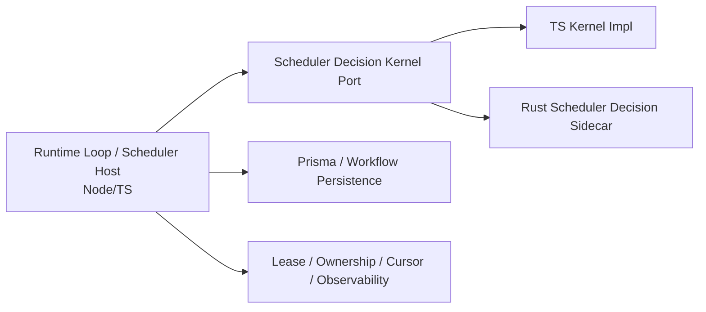

# Scheduler Core Decision Kernel Rust Migration Design

## 1. 背景

当前 Rust 迁移主线中，`World Engine / Pack Runtime Core` 已完成，`TODO.md` 中下一项为：

- `Scheduler Core Decision Kernel`

结合现有代码与架构文档，当前状态如下：

1. `docs/ARCH.md` 已明确：
   - runtime orchestration、scheduler、workflow host、plugin host、AI gateway 仍由 **Node/TS host** 持有；
   - Rust sidecar 当前承担的是 **world engine 内核替换面**，而不是整个平台运行时迁移。
2. `apps/server/src/app/runtime/agent_scheduler.ts` 已包含一套较成熟的 scheduler 候选生成与筛选逻辑，但其“纯决策逻辑”与“宿主编排逻辑”仍混在一起。
3. 当前 Rust 目录下只有 `world_engine_sidecar`，尚无专门承载 scheduler 决策内核的 Rust crate / sidecar。

因此，本阶段不应直接迁移整个 scheduler runtime，而应先收敛出一个清晰的边界：

> **把 Scheduler Core Decision Kernel 定义为一个纯输入 -> 输出的确定性决策内核，先从 TS 宿主逻辑中抽离，再引入独立 Rust sidecar 实现。**

---

## 2. 问题陈述

当前 `agent_scheduler.ts` 同时承担了以下职责：

### 2.1 决策内核职责

- periodic candidates 构造
- event-driven signal merge / coalesce
- candidate sort
- cooldown 判断
- pending workflow 抑制
- replay / retry recovery window suppression
- per-tick activation / limit 判定
- candidate decision snapshot 生成
- scheduler-created job draft 所需字段推导

### 2.2 宿主编排职责

- lease 获取与续租
- partition ownership 校验
- Prisma 读模型查询
- active workflow 查询
- `DecisionJob` 创建
- scheduler observability 落库
- cursor 更新
- runtime loop 节奏控制

这会导致几个问题：

1. **迁移目标不清晰**：如果直接说“迁 scheduler 到 Rust”，很容易把 lease / DB / runtime loop 一起卷入。
2. **难以做 parity**：纯算法逻辑和宿主 IO 混杂，不利于对照测试。
3. **sidecar 边界不清楚**：如果继续把 scheduler 逻辑塞进 `world_engine_sidecar`，会弱化 world engine 与 scheduler 的边界。
4. **失败域不隔离**：调度决策与 world engine sidecar 共进程/共二进制会放大故障影响面。

---

## 3. 设计目标

本阶段目标：

1. 将现有 scheduler 的**纯决策逻辑**从 `agent_scheduler.ts` 中抽离为正式 kernel。
2. 为该 kernel 定义稳定、可序列化、可做 parity 的输入/输出契约。
3. 以**独立 Rust sidecar**实现该 kernel，而不是并入 `world_engine_sidecar`。
4. 保持 Node/TS host 继续拥有：
   - runtime loop orchestration
   - scheduler lease / ownership / rebalance
   - Prisma / workflow persistence
   - `DecisionJob` 创建
   - observability / cursor 更新
5. 支持灰度切换：
   - `ts`
   - `rust_shadow`
   - `rust_primary`
6. 为后续 `Memory Block / Context Trigger Engine` Rust 迁移提供同类边界模式。

---

## 4. 非目标

本阶段明确**不做**：

1. 不迁移整个 scheduler runtime loop 到 Rust。
2. 不迁移以下宿主能力到 Rust：
   - scheduler lease
   - scheduler ownership
   - scheduler rebalance
   - scheduler cursor
   - Prisma/SQLite 持久化
   - `DecisionJob` / `ActionIntent` / `InferenceTrace` 工作流宿主
3. 不把 scheduler kernel 合并进现有 `world_engine_sidecar`。
4. 不在本阶段引入新的数据库枚举或新的 workflow 宿主边界。
5. 不在本阶段改造整个 scheduler observability schema，只允许最小化扩展。

---

## 5. 架构结论

## 5.1 目标边界

引入新的逻辑分层：



### Node/TS host 持有

- `runAgentScheduler()` / `runAgentSchedulerForPartition()` 宿主主流程
- partition lease/ownership/rebalance
- 读 scheduler signals / pending workflow state / active workflow state
- 调用 kernel 做决策
- 根据 kernel 输出创建 `DecisionJob`
- observability / cursor 更新
- failure fallback

### Scheduler Decision Kernel 持有

- candidates 构造
- 优先级排序
- readiness / suppression / cooldown / limit 评估
- decision snapshots 组装
- job draft 推导
- summary counters 计算

---

## 5.2 为什么采用独立 sidecar

建议新增：

- `apps/server/rust/scheduler_decision_sidecar/`

而非扩展：

- `apps/server/rust/world_engine_sidecar/`

原因：

1. **边界清晰**：world engine 与 scheduler decision 是两个不同内核。
2. **故障隔离**：scheduler decision sidecar 可独立重启、独立 fallback。
3. **演进独立**：后续如果 scheduler kernel 需要独立 rollout / 观测 / 压测，不受 world sidecar 生命周期绑定。
4. **代码可维护性**：避免 `world_engine_sidecar/src/main.rs` 继续膨胀为“运行时万能 sidecar”。

---

## 6. 当前代码中应抽离的 kernel 边界

当前 `apps/server/src/app/runtime/agent_scheduler.ts` 中，以下逻辑应视为 kernel 组成部分：

- `buildPeriodicCandidates(...)`
- `mergeEventDrivenSignals(...)`
- `sortSchedulerCandidates(...)`
- `evaluateSchedulerActorReadiness(...)`
- `buildCandidateDecisionSnapshot(...)`
- 与 candidate / readiness / summary / job draft 相关的数据组装逻辑

以下逻辑应继续留在 TS host：

- `acquireSchedulerLease(...)`
- `renewSchedulerLease(...)`
- `isWorkerAllowedToOperateSchedulerPartition(...)`
- `completeActiveSchedulerOwnershipMigration(...)`
- `listActiveSchedulerAgents(...)`
- `listRecent*Signals(...)`
- `listPendingSchedulerDecisionJobs(...)`
- `listPendingSchedulerActionIntents(...)`
- `listRecentScheduledDecisionJobs(...)`
- `listActiveWorkflowActors(...)`
- `createPendingDecisionJob(...)`
- `recordSchedulerRunSnapshot(...)`
- `updateSchedulerCursor(...)`

---

## 7. Kernel 契约设计

## 7.1 输入模型

建议定义一个稳定的 partition-scoped 输入对象：

```ts
interface SchedulerKernelEvaluateInput {
  partition_id: string;
  now_tick: string;
  scheduler_reason: SchedulerReason;
  limit: number;
  cooldown_ticks: string;
  max_candidates: number;
  max_created_jobs_per_tick: number;
  max_entity_activations_per_tick: number;
  entity_single_flight_limit: number;

  agents: Array<{
    id: string;
    partition_id: string;
  }>;

  recent_signals: Array<{
    agent_id: string;
    reason: EventDrivenSchedulerReason;
    created_at: string;
  }>;

  pending_intent_agent_ids: string[];
  pending_job_keys: string[];
  active_workflow_actor_ids: string[];

  recent_scheduled_tick_by_agent: Record<string, string>;
  replay_recovery_actor_ids: string[];
  retry_recovery_actor_ids: string[];
  per_tick_activation_counts: Record<string, number>;

  signal_policy: Record<EventDrivenSchedulerReason, {
    priority_score: number;
    delay_ticks: string;
    coalesce_window_ticks: string;
    suppression_tier: 'high' | 'low';
  }>;

  recovery_suppression: {
    replay: {
      suppress_periodic: boolean;
      suppress_event_tiers: Array<'high' | 'low'>;
    };
    retry: {
      suppress_periodic: boolean;
      suppress_event_tiers: Array<'high' | 'low'>;
    };
  };
}
```

### 设计说明

1. 所有 `bigint` / tick / revision 风格字段统一序列化为 **string**，避免 TS/Rust 数值边界问题。
2. 输入必须是**完整快照**，而不是 sidecar 再去查库。
3. 输入按 **partition** 为作用域，避免让 kernel 感知全局 lease / ownership / rebalance。

---

## 7.2 输出模型

```ts
interface SchedulerKernelEvaluateOutput {
  candidate_decisions: Array<{
    actor_id: string;
    partition_id: string;
    kind: SchedulerKind;
    candidate_reasons: SchedulerReason[];
    chosen_reason: SchedulerReason;
    scheduled_for_tick: string;
    priority_score: number;
    skipped_reason: SchedulerSkipReason | null;
    should_create_job: boolean;
  }>;

  job_drafts: Array<{
    actor_id: string;
    partition_id: string;
    kind: SchedulerKind;
    primary_reason: SchedulerReason;
    secondary_reasons: SchedulerReason[];
    scheduled_for_tick: string;
    priority_score: number;
    intent_class: 'scheduler_periodic' | 'scheduler_event_followup';
    job_source: 'scheduler';
  }>;

  summary: {
    scanned_count: number;
    eligible_count: number;
    created_count: number;
    skipped_pending_count: number;
    skipped_cooldown_count: number;
    created_periodic_count: number;
    created_event_driven_count: number;
    signals_detected_count: number;
    scheduled_for_future_count: number;
    skipped_existing_idempotency_count: number;
    skipped_by_reason: Record<SchedulerSkipReason, number>;
  };
}
```

### 关键约束

1. `candidate_decisions` 是 observability 和 parity 对比的主要载体。
2. `job_drafts` 只表达“建议创建什么 job”，**不直接创建 job**。
3. `skipped_existing_idempotency_count` 是否由 kernel 计算，取决于 `pending_job_keys` 是否覆盖全部等价场景；若 host 仍需在最终 create 前做额外 `idempotency_key` 去重，则允许 host 在结果上再补计数。

---

## 7.3 Host 生成 idempotency key

保持以下逻辑在 TS host：

```ts
sch:${agentId}:${tick}:${kind}:${reason}
```

原因：

1. 当前规则已经稳定存在于 TS workflow host。
2. 它与 `DecisionJob` 创建路径、宿主 observability、问题排查高度耦合。
3. 本阶段迁移的目标是 decision kernel，而不是 workflow submit host。

因此 Rust kernel 输出 `job_draft`，由 host 最终生成：

- `idempotency_key`
- `request_input`
- `createPendingDecisionJob(...)` 参数

---

## 8. 运行模式设计

新增 scheduler kernel mode：

- `ts`
- `rust_shadow`
- `rust_primary`

## 8.1 ts

- 仅调用 TS kernel
- 作为默认模式

## 8.2 rust_shadow

- TS kernel 结果作为主结果
- 同时调用 Rust sidecar
- 对比：
  - `candidate_decisions`
  - `job_drafts`
  - `summary`
- 记录 parity diff，但不影响主流程

## 8.3 rust_primary

- 以 Rust kernel 结果为主
- 若 sidecar 超时 / RPC 错误 / 结果无效：
  - fallback 到 TS kernel
  - 记录 `fallback_reason`

### rollout 顺序

1. `ts`
2. `rust_shadow`
3. `rust_primary`

严禁直接从现状切到 `rust_primary`。

---

## 9. TS 侧结构调整

## 9.1 新增 port

建议新增：

- `apps/server/src/app/runtime/scheduler_decision_kernel_port.ts`

示意：

```ts
export interface SchedulerDecisionKernelPort {
  evaluate(input: SchedulerKernelEvaluateInput): Promise<SchedulerKernelEvaluateOutput>;
}
```

---

## 9.2 新增 TS 内核实现

建议新增：

- `apps/server/src/app/runtime/scheduler_decision_kernel.ts`

职责：

- 以纯函数/纯模块方式承接现有 decision logic
- 不依赖 `AppContext`
- 不直接查库
- 不直接写 observability
- 不直接创建 `DecisionJob`

这一步是 Rust 迁移的前置条件。

---

## 9.3 新增 Rust sidecar client

建议新增：

- `apps/server/src/app/runtime/sidecar/scheduler_decision_sidecar_client.ts`

职责：

- 启动/维护 `scheduler_decision_sidecar`
- 发送 `scheduler.kernel.evaluate`
- 解析响应
- 健康检查
- 超时控制
- 失败恢复/重启

---

## 9.4 对 `agent_scheduler.ts` 的目标重构

重构后 `runAgentSchedulerForPartition()` 应只保留以下流程：

1. 获取 lease / ownership
2. 查询 partition 所需宿主快照
3. 组装 `SchedulerKernelEvaluateInput`
4. 调用 `SchedulerDecisionKernelPort.evaluate(...)`
5. 遍历 `job_drafts`：
   - 生成 idempotency key
   - 构造 `request_input`
   - 调 `createPendingDecisionJob(...)`
6. 根据实际创建结果回填 `created_job_id`
7. 记录 scheduler observability
8. 更新 cursor

即：

> `agent_scheduler.ts` 从“算法 + IO 混合体”，转为“host orchestration shell”。

---

## 10. Rust sidecar 设计

## 10.1 目录结构

建议新增：

```text
apps/server/rust/scheduler_decision_sidecar/
  Cargo.toml
  src/
    main.rs
    protocol.rs
    models.rs
    kernel.rs
    policy.rs
    parity.rs (optional)
```

不建议把全部逻辑继续塞进 `main.rs`。

---

## 10.2 RPC 方法

初版仅需：

### `scheduler.health.get`

返回：

- protocol version
- process uptime
- ready state

### `scheduler.kernel.evaluate`

输入：

- `SchedulerKernelEvaluateInput`

输出：

- `SchedulerKernelEvaluateOutput`

### 约束

1. sidecar 不感知数据库。
2. sidecar 不持久化 session。
3. sidecar 不维持 partition state。
4. sidecar 对每次 `evaluate` 视为纯函数调用。

---

## 10.3 Rust 实现原则

1. 所有 tick 类字段内部可解析为 `u64` / `u128`，但协议上仍用 string。
2. 所有排序逻辑必须保证稳定、确定性。
3. secondary reasons 的 merge 顺序必须与 TS 行为一致。
4. skipped reason 统计必须与 TS 版严格对齐。
5. 结果输出时保留足够语义，以便做结构化 parity diff。

---

## 11. Observability 与 Parity 设计

## 11.1 新增建议的观测字段

在 scheduler observability log / run snapshot 层，可最小化补充：

- `decision_kernel_provider`: `ts` | `rust_shadow` | `rust_primary`
- `decision_kernel_fallback`: boolean
- `decision_kernel_fallback_reason`: string | null
- `decision_kernel_parity_status`: `match` | `diff` | `skipped`
- `decision_kernel_parity_diff_count`: number

不要求立刻改 schema 主干，可先写入现有可扩展 JSON metadata。

---

## 11.2 Shadow 模式下的 diff 维度

至少对比：

1. `candidate_decisions.length`
2. 每条 candidate 的：
   - actor_id
   - kind
   - chosen_reason
   - secondary reasons
   - scheduled_for_tick
   - priority_score
   - skipped_reason
3. `job_drafts`
4. `summary`

必要时对 diff 按以下等级分层：

- **critical diff**：影响创建 job 的差异
- **observability diff**：不影响 job，但影响 counters / snapshot 展示

---

## 12. 测试策略

## 12.1 Phase 1：TS kernel 单元测试

在 Rust 开发前，先为 TS kernel 建立 fixture-based tests。

建议新增：

- `apps/server/tests/unit/runtime/scheduler_decision_kernel.spec.ts`

至少覆盖：

1. periodic candidate 生成
2. event-driven signal merge
3. coalesced secondary reasons
4. cooldown suppression
5. pending workflow suppression
6. replay recovery suppression
7. retry recovery suppression
8. max candidates / max created jobs 限制
9. per-entity activation limit
10. candidate sort 稳定性
11. `scheduler_periodic` / `scheduler_event_followup` intent_class 推导

---

## 12.2 Phase 2：Rust parity fixture 测试

建议复用同一组 fixture：

- TS 读取 fixture -> 得到 expected
- Rust sidecar 读取相同输入 -> 输出结果
- 对比结构化结果

建议新增：

- `apps/server/tests/integration/scheduler_decision_sidecar_parity.spec.ts`

---

## 12.3 Phase 3：故障恢复测试

建议新增：

- `apps/server/tests/integration/scheduler_decision_sidecar_failure_fallback.spec.ts`

至少验证：

1. sidecar 未启动
2. sidecar 超时
3. sidecar 返回非法 JSON / 协议错误
4. sidecar 中途退出

在以上场景中：

- `rust_primary` 能 fallback 到 TS kernel
- runtime loop 不被整体阻断
- scheduler run observability 有清晰记录

---

## 13. 配置设计

建议在 runtime config 中新增：

```yaml
scheduler:
  agent:
    decision_kernel:
      mode: ts # ts | rust_shadow | rust_primary
      timeout_ms: 500
      binary_path: ./apps/server/rust/scheduler_decision_sidecar/target/debug/scheduler_decision_sidecar
      auto_restart: true
```

说明：

- `mode`：控制 provider
- `timeout_ms`：限制单次 evaluate RPC
- `binary_path`：侧车进程路径
- `auto_restart`：故障后自动重启

默认应保持：

- `mode = ts`

以确保迁移前后默认行为不变。

---

## 14. 分阶段实施建议

## Step 1. 抽离 TS kernel

目标：

- 从 `agent_scheduler.ts` 中抽出 `scheduler_decision_kernel.ts`
- 建立纯输入/输出契约
- 保持行为不变

验收：

- scheduler 现有 e2e / integration 测试通过
- 不引入行为回归

---

## Step 2. 固化 TS 行为基线

目标：

- 建立 scheduler kernel fixture/unit tests
- 固定 candidate / summary / skip reason 语义

验收：

- 核心场景均有基线覆盖
- 对排序与 suppression 行为有显式断言

---

## Step 3. 建立 Rust sidecar prototype

目标：

- 新增 `scheduler_decision_sidecar`
- 实现 `scheduler.health.get`
- 实现 `scheduler.kernel.evaluate`

验收：

- 在离线 fixture 上与 TS kernel 对齐

---

## Step 4. 接入 `rust_shadow`

目标：

- Node host 同时调用 TS / Rust
- 记录 parity diff
- 不影响主流程

验收：

- shadow 模式稳定运行
- parity diff 可被清晰观测

---

## Step 5. 灰度切换到 `rust_primary`

目标：

- 小范围启用 Rust 主决策
- sidecar 失败时自动 fallback

验收：

- 业务行为与 TS baseline 一致
- scheduler runtime 稳定

---

## 15. 风险与控制

### 风险 1：把范围扩展成“迁整个 scheduler”

**控制：** 在 port 契约上明确 Rust kernel 只接纯输入快照，不接 lease / DB / loop。

### 风险 2：直接把逻辑塞进 `world_engine_sidecar`

**控制：** 明确新增独立 `scheduler_decision_sidecar`，不复用 world sidecar main 二进制。

### 风险 3：TS / Rust 排序或 big-int 处理不一致

**控制：**

- 协议统一 string 化 tick
- fixture parity tests
- shadow 模式先跑足够长时间

### 风险 4：fallback 不完整导致 scheduler 中断

**控制：** `rust_primary` 仍要求 TS kernel 常驻可用，sidecar 失败必须同步回退。

### 风险 5：observability 无法解释 shadow diff

**控制：** 补充 provider / parity / fallback 相关 metadata。

---

## 16. 验收标准

完成本设计对应实现后，应满足：

1. `agent_scheduler.ts` 中的纯决策逻辑已被正式抽离为 kernel。
2. TS kernel 与 Rust kernel 基于同一输入契约工作。
3. Rust kernel 以独立 `scheduler_decision_sidecar` 形式存在，而不是合并进 `world_engine_sidecar`。
4. Node/TS host 继续持有 lease、ownership、cursor、workflow persistence、observability。
5. 系统支持 `ts` / `rust_shadow` / `rust_primary` 三种模式。
6. shadow 模式下可做结构化 parity 对比。
7. primary 模式下 sidecar 失败可自动 fallback 到 TS kernel。
8. 核心测试覆盖 periodic / event-driven / suppression / cooldown / limit / parity / failure fallback。

---

## 17. 结论

`Scheduler Core Decision Kernel` 的正确迁移方式，不是“把整个 scheduler 搬进 Rust”，而是：

1. **先把 scheduler 的纯决策逻辑从 TS 宿主层抽离出来；**
2. **再用独立 Rust sidecar 实现同一 kernel 契约；**
3. **通过 shadow -> primary 的渐进方式完成切换。**

这样既能保持当前 `ARCH.md` 中已经明确的宿主边界，又能最大化复用现有 Rust sidecar 模式与 TS workflow host，降低迁移风险，并为下一步 Memory / Context Trigger 类能力迁移提供标准模板。