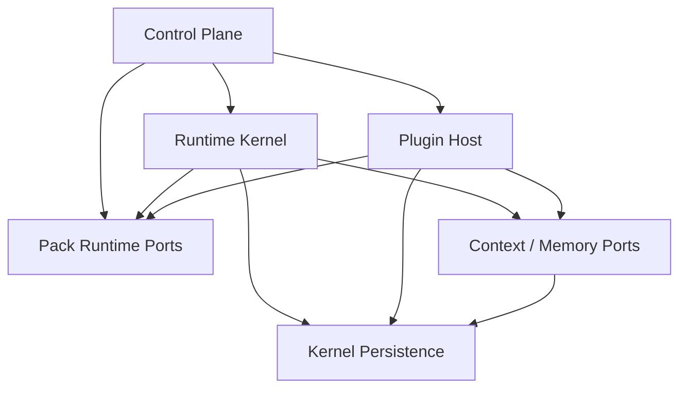

# server runtime 模块化优先边界收口设计

## 1. 背景与目标

`TODO.md` 已将当前阶段的最高优先级明确为 **模块化优先 / Modularization First**。该任务的核心不是立即推进 Rust 架构升级，而是先在 Node/TS 宿主内把 server runtime 的职责边界、组合根、接口层与依赖方向收口清楚，避免后续任何升级继续建立在 TS 内部对象穿透之上。

当前代码库已经具备若干模块化雏形：

- `PackRuntimeRegistry` / `PackRuntimeHost` / `PackRuntimeHandle`
- `app/runtime/*` 下的 scheduler / simulation loop / ownership / lease / rebalance
- `app/services/*` 下的 operator/read-model 风格服务
- `docs/ARCH.md` 中已初步区分 runtime / pack runtime / kernel persistence

但仍存在明显的边界混合：

- `SimulationManager` 同时承担数据库初始化、active pack facade、registry facade、pack 解析、变量解析、graph query 等职责；
- `AppContext.sim` 仍是一个过大的超级入口；
- plugin runtime 对 pack runtime 的访问仍直接建立在 TS 内部对象/句柄上；
- scheduler、pack runtime、context/memory、plugin host 虽已有代码分散，但缺少正式接口层。

因此，本设计目标是：

1. 明确 `control plane / runtime kernel / pack runtime / plugin host / context-memory` 的职责边界；
2. 给出 `SimulationManager` 的拆分方案与过渡兼容策略；
3. 定义 scheduler、pack runtime、context/memory、plugin runtime 的正式接口；
4. 为未来 Rust world engine 预留 Host API 边界，但**不改变当前 plugin host / workflow host 仍驻留 Node/TS** 的决策；
5. 给出低风险、可分阶段实施的演进路径。

---

## 2. 非目标 / Non-goals

本设计**不**包含以下内容：

1. 不直接推进 Rust 实现或 FFI/sidecar/RPC 集成；
2. 不把 stable runtime model 立即切换为默认 multi-pack；
3. 不在本阶段重写 plugin runtime、workflow runtime 或 scheduler 核心算法；
4. 不进行一次性的大规模目录迁移；
5. 不改变现有稳定 HTTP contract 的 canonical 语义。

即：本阶段优先解决 **边界与接口治理**，而不是“换语言”或“整体重构”。

---

## 3. 当前问题诊断

### 3.1 `SimulationManager` 过度聚合

当前 `apps/server/src/core/simulation.ts` 中的 `SimulationManager` 同时负责：

- Prisma 初始化与 SQLite pragma 初始化；
- active pack runtime 初始化；
- active pack 的 clock / runtime speed facade；
- prompt variable resolve；
- graph read access；
- experimental pack runtime registry facade；
- pack catalog 解析（按 pack id / folder 查找）。

这使其同时拥有：

- 组合根辅助职责；
- runtime kernel 协调职责；
- pack runtime 生命周期职责；
- read-model/query 职责。

结果是：任何新功能都容易继续往 `sim` 上叠加，形成新的“大一统宿主对象”。

### 3.2 `AppContext.sim` 暴露面过大

当前 `AppContext` 直接暴露 `sim`，使得：

- route/service 可直接调用大量 runtime 内部能力；
- 应用层依赖很难被限制到窄接口；
- 新模块难以建立正式 port；
- 后续 Rust world engine 接入时，宿主侧无法只暴露 Host API，而会继续依赖 TS 内部对象。

### 3.3 plugin host 仍依赖 TS 内部 runtime 句柄

如 `plugin_runtime_web.ts` 中的 experimental pack scope resolve，当前通过 `context.sim.getPackRuntimeHandle(packId)` 验证 pack runtime 是否存在。该模式虽然保守，但意味着 plugin host 仍直接绑定到当前 TS runtime 表达。

问题不在“有没有句柄”，而在：

- plugin host 应依赖的是 **pack runtime lookup / host API contract**；
- 而不应依赖 `SimulationManager`、`WorldPack`、`ChronosEngine` 或内部 host 结构。

### 3.4 scheduler 与 pack runtime 的 ownership 尚未正式化

当前 scheduler 已在目录上独立，但模块语义仍可能被误解为 pack runtime 的一部分。实际上 scheduler 负责：

- host-level runtime loop；
- partition ownership / lease / cursor；
- runner concurrency / single-flight / tick budget；
- operator 观测与 bootstrap ownership。

这些职责应归属 **runtime kernel**，不是 pack runtime。

---

## 4. 目标架构与模块边界

### 4.1 顶层模块划分

目标上，将 server runtime 划分为以下模块：

1. **Control Plane**
2. **Runtime Kernel**
3. **Pack Runtime**
4. **Plugin Host**
5. **Context / Memory**
6. **Kernel Persistence / Governance**

其中本阶段重点收口前五者的接口边界。

### 4.2 模块职责说明

#### A. Control Plane

负责：

- startup preflight / startup policy / startup health；
- runtime ready / paused / degraded 门控；
- operator-facing load/unload/start/stop/read-model；
- route registration 所调用的应用服务；
- system health 汇总。

不负责：

- 具体 scheduler 执行；
- pack-local world 规则执行；
- 插件内部逻辑执行。

#### B. Runtime Kernel

负责：

- simulation loop；
- scheduler ownership / lease / rebalance；
- decision job / action dispatcher runner；
- runtime diagnostics；
- runtime-level orchestration。

不负责：

- pack manifest 读取与 pack-local world 对象装载细节；
- plugin host lifecycle；
- memory/context 的具体业务建模。

#### C. Pack Runtime

负责：

- pack manifest load / catalog resolution；
- pack-local clock；
- runtime speed policy；
- pack-local world state runtime host；
- pack runtime health/status；
- 未来 Rust world engine 的承接位。

不负责：

- scheduler ownership；
- operator 路由装配；
- plugin host 策略治理。

#### D. Plugin Host

负责：

- plugin artifact/install/activation governance 的宿主侧协调；
- plugin runtime web/runtime 入口；
- plugin 对 pack runtime 的 scope resolve；
- 通过 Host API 调 pack runtime 能力。

不负责：

- 直接持有 pack runtime 内部对象；
- 直接操作 scheduler internal state。

#### E. Context / Memory

负责：

- prompt variable context build；
- overlay / memory block / working memory read model；
- runtime / workflow / plugin 所需上下文聚合。

不负责：

- pack runtime lifecycle；
- plugin governance。

#### F. Kernel Persistence / Governance

继续承载：

- workflow / inference / audit / social / plugin governance / memory 持久化；
- Prisma / SQLite kernel-side 持久化。

本阶段不改变其宿主决策，但要求应用层通过正式服务/port 使用，而非继续穿透。

---

## 5. 目标依赖方向



约束如下：

1. Control Plane 只通过正式 facade/port 调用下层；
2. Runtime Kernel 可以依赖 Pack Runtime 与 Context/Memory port；
3. Plugin Host 只能依赖 Pack Runtime 的 lookup/host API port，不得依赖内部实现对象；
4. Pack Runtime 不反向依赖 Plugin Host；
5. Context/Memory 不依赖 Runtime Kernel 内部实现；
6. 跨模块调用优先经 port/facade，而不是经 `AppContext.sim` 之类超级对象。

---

## 6. `SimulationManager` 拆分设计

### 6.1 拆分原则

`SimulationManager` 不再继续扩张为“runtime everything bucket”。本阶段将其拆为若干更聚焦的对象，并允许保留一个**薄兼容 facade** 作为过渡层。

### 6.2 拟拆分组件

#### 6.2.1 `RuntimeDatabaseBootstrap`

职责：

- Prisma 初始化相关宿主准备；
- SQLite runtime pragma apply / snapshot；
- 数据库 ready/bootstrap 基础能力。

从 `SimulationManager` 中迁出：

- `prepareDatabase()`
- `getSqliteRuntimePragmaSnapshot()`

#### 6.2.2 `ActivePackRuntimeFacade`

职责：

- stable single active-pack runtime facade；
- active pack 的 init / read / step / variable resolve；
- 对 stable canonical routes 保持现有语义。

从 `SimulationManager` 中迁出：

- `init(packFolderName)`
- `getActivePack()`
- `resolvePackVariables()`
- `getStepTicks()` / `getRuntimeSpeedSnapshot()`
- `setRuntimeSpeedOverride()` / `clearRuntimeSpeedOverride()`
- `getCurrentTick()` / `getAllTimes()` / `step()`

#### 6.2.3 `PackCatalogService`

职责：

- list available packs；
- pack id / folder 解析；
- pack catalog 只读能力。

从 `SimulationManager` 中迁出：

- `listAvailablePacks()`
- `getPacksDir()`
- `resolvePackByIdOrFolder()`
- `findFolderNameByPackId()`

#### 6.2.4 `PackRuntimeRegistryService`

职责：

- registry lookup；
- host register / unregister；
- experimental runtime load / unload；
- pack runtime status/read-model。

从 `SimulationManager` 中迁出：

- `getPackRuntimeRegistry()`
- `listLoadedPackRuntimeIds()`
- `getPackRuntimeHandle()`
- `registerPackRuntimeHost()` / `unregisterPackRuntimeHost()`
- `getExperimentalPackRuntimeStatusRecords()`
- `getPackRuntimeStatusSnapshot()`
- `loadExperimentalPackRuntime()`
- `unloadExperimentalPackRuntime()`

#### 6.2.5 `GraphReadService`（可选）

职责：

- graph 数据访问。

从 `SimulationManager` 中迁出：

- `getGraphData()`

说明：graph query 不应继续挂在 runtime core facade 上。

### 6.3 过渡兼容策略

短期内允许保留 `SimulationManager`，但只作为 thin facade：

- 内部组合上述 4~5 个组件；
- 不再新增新职责；
- 新代码禁止继续向 `SimulationManager` 添加方法。

退出条件：

- `AppContext` 中的新代码不再依赖 `sim`；
- route/service 级调用已切到对应窄接口；
- `SimulationManager` 仅剩兼容转发或可删除。

---

## 7. 正式接口设计

### 7.1 Pack Runtime 接口

#### `PackRuntimeRegistry`

保留现有定位：loaded runtime 集合管理。

#### 新增 `PackRuntimeLocator`

用于读取/解析 pack runtime 的存在性与 scope，不暴露内部 host：

- `listLoadedPackIds(): string[]`
- `getHandle(packId: string): PackRuntimeHandle | null`
- `getActivePackId(): string | null`
- `resolveStablePackScope(packId: string, feature: string): string`
- `resolveExperimentalPackScope(packId: string, feature: string): string`

用途：给 plugin host、projection service、operator surface 提供统一 scope resolve。

#### 新增 `PackRuntimeControl`

用于 operator/control plane：

- `load(packRef: string)`
- `unload(packId: string)`
- `start(packId: string)`
- `stop(packId: string)`

说明：当前仅 `load/unload` 必需，`start/stop` 可先留空或仅在接口中预留。

#### 新增 `PackRuntimeObservation`

用于 read-model / health：

- `getStatus(packId: string)`
- `listStatuses()`
- `getClockSnapshot(packId: string)`
- `getRuntimeSpeedSnapshot(packId: string)`

### 7.2 Runtime Kernel 接口

#### `RuntimeKernelFacade`

- `start()`
- `stop()`
- `getLoopDiagnostics()`
- `isRunning()`
- `getHealthSnapshot()`

#### `SchedulerObservationPort`

- ownership snapshot
- partition status
- worker states
- rebalance summary
- operator-facing scheduler diagnostics

#### `SchedulerControlPort`

- bootstrap reconcile
- rebalance trigger
- operator actions（如未来 force release）

说明：scheduler 归属 runtime kernel，而不是 pack runtime。

### 7.3 Context / Memory 接口

#### `ContextAssemblyPort`

- `buildPromptVariableContext(...)`
- `buildRuntimeContext(...)`
- `buildPackScopedContext(...)`

#### `MemoryRuntimePort`

- `queryOverlayEntries(...)`
- `listMemoryBlocks(...)`
- `getMemoryRuntimeSnapshot(...)`

说明：workflow、scheduler、plugin runtime 不应继续各自拼散落的 context/memory 读取逻辑。

### 7.4 Plugin Host 接口

#### `PluginHostPort`

- `syncActivePackRuntime(...)`
- `syncPackRuntime(packId)`
- `getRuntimeWebSnapshot(packId, surface)`
- `resolveRuntimeWebAsset(packId, pluginId, installationId, assetPath, surface)`

#### `PackRuntimeLookupPort`（Plugin Host 依赖）

Plugin host 对 pack runtime 的依赖应收口为：

- `getActivePackId()`
- `hasPackRuntime(packId)`
- `assertPackScope(packId, mode, feature)`
- `getPackRuntimeSummary(packId)`

关键约束：

- plugin host 依赖 lookup port / Host API；
- 不依赖 `SimulationManager` / `WorldPack` / `ChronosEngine` / `PackRuntimeHost` 内部实现对象。

---

## 8. `AppContext` 演进方案

### 8.1 当前问题

`AppContext` 中直接暴露 `sim`，导致所有上层模块都能轻易跨边界访问 runtime 内部。

### 8.2 目标结构

目标上，`AppContext` 应成为**受限依赖注入容器**，而非超级服务定位器。建议逐步引入：

- `runtimeBootstrap`
- `activePackRuntime`
- `packCatalog`
- `packRuntimeRegistry` / `packRuntimeLocator`
- `runtimeKernel`
- `pluginHost`
- `contextAssembly`
- `memoryRuntime`

保留：

- `prisma`
- `notifications`
- `startupHealth`
- runtime ready / paused / diagnostics 状态

### 8.3 过渡策略

分两步：

1. 先在 `AppContext` 中**新增**上述窄接口，同时保留 `sim`；
2. 新代码禁止新增 `context.sim.*` 调用，旧代码逐步迁移；
3. 当引用足够收敛后，再移除/降级 `sim`。

---

## 9. Plugin Runtime 对 Pack Runtime 的依赖收口

### 9.1 目标

把 plugin runtime 对 pack runtime 的依赖从“直接使用 TS 内部对象/句柄”改为“通过稳定 lookup port / Host API 访问”。

### 9.2 原则

1. plugin host 只关心 pack runtime 是否存在、是否可被当前 surface 使用；
2. plugin host 不关心底层是 TS host、Rust sidecar 还是 RPC 代理；
3. plugin runtime web scope resolve、projection scope resolve、pack-local asset resolve 使用统一 pack scope resolver。

### 9.3 拟引入能力

#### `PackScopeResolver`

统一 stable/experimental scope 解析：

- stable: 受 active-pack guard 约束；
- experimental: 受 registry loaded runtime 约束；
- 错误码与 feature 标签由 resolver 统一生成。

#### `PackHostApi`

为未来 Rust world engine 预留的最小宿主接口：

- `readClock(packId)`
- `readRuntimeHealth(packId)`
- `readRuntimeSpeed(packId)`
- `queryProjection(packId, query)`（可预留）
- `emitRuntimeEvent(packId, event)`（可预留）

本阶段要求：

- plugin host 改依赖 `PackRuntimeLookupPort` / `PackScopeResolver`；
- Host API 契约可先定义，不要求全部实现。

---

## 10. 为什么 scheduler 属于 Runtime Kernel，而不是 Pack Runtime

这是本轮设计必须明确的边界点。

### 理由

1. scheduler 管理的是**宿主级执行节奏与 worker coordination**；
2. lease / ownership / rebalance / runner concurrency 是 host runtime policy，而不是 pack 世界规则本身；
3. scheduler 可调度 pack-scoped workload，但不等于它属于某个 pack runtime 内部；
4. 后续即便 world engine Rust 化，scheduler 仍可能继续保留在 Node/TS 宿主。

### 结论

- scheduler、simulation loop、runner coordination -> Runtime Kernel；
- pack-local clock/world state/rule execution host -> Pack Runtime。

---

## 11. Rust 演进预留位

本设计遵循 `TODO.md` 的后置原则：

- Rust 首阶段限定为 **world engine / world state maintenance**；
- plugin host / workflow host / scheduler / AI gateway 暂留 Node/TS。

因此本阶段的模块化边界必须服务于后续“只替换 pack runtime 内核”这一方向。

### 11.1 可替换面

未来 Rust 化时，应只需要替换：

- `PackRuntimeHost` 的具体实现；
- `PackHostApi` 的底层 transport/adapters；
- 必要的 runtime state/projection 查询实现。

### 11.2 不应被拖入 Rust 的模块

- plugin host
- scheduler
- prompt workflow
- AI gateway
- operator control plane

若这些模块继续直接依赖 TS 内部 pack runtime 对象，则未来 Rust 化边界仍会被破坏，因此必须在本阶段先收口。

---

## 12. 分阶段落地计划

### Phase M1：边界冻结与接口定义

目标：

- 补齐本设计文档；
- 明确模块职责、所有权与调用方向；
- 定义新接口名与过渡策略；
- 确认 scheduler/runtime/plugin/context/memory 的归属。

产出：

- 本设计文档；
- 后续实现 plan 文档。

### Phase M2：拆 `SimulationManager`

目标：

- 提取 `RuntimeDatabaseBootstrap`；
- 提取 `ActivePackRuntimeFacade`；
- 提取 `PackCatalogService`；
- 提取 `PackRuntimeRegistryService`；
- 将 `SimulationManager` 收缩为 thin facade。

验收：

- `simulation.ts` 行为不变；
- 新增组件均有最小单测；
- `SimulationManager` 不再新增职责。

### Phase M3：`AppContext` 去超级入口化

目标：

- 在 `AppContext` 中引入新窄接口；
- 新代码禁止继续新增 `context.sim.*`；
- 上层 route/service 逐步切换到对应 port。

验收：

- 新增 lint 约束或 review 约束，避免新增 `context.sim.*` 扩张；
- 至少 operator/plugin/runtime 相关新代码切换完成。

### Phase M4：plugin host 依赖收口

目标：

- 引入 `PackScopeResolver`；
- plugin runtime web / projection / asset resolve 走统一 pack lookup port；
- 不再从 plugin host 直接依赖 runtime internal object。

验收：

- stable/experimental 行为保持不变；
- 错误码与 surface contract 不回退；
- pack runtime 替换实现时 plugin host 不需要理解内部对象。

### Phase M5：runtime kernel / context-memory 正式接口化

目标：

- 补 `RuntimeKernelFacade`、`SchedulerObservationPort`、`SchedulerControlPort`；
- 补 `ContextAssemblyPort`、`MemoryRuntimePort`；
- 收口调度、workflow、plugin 的上下文/内存读取面。

验收：

- scheduler/read-model/operator 接口清晰；
- context/memory 不再散落于多处 ad-hoc helper。

### Phase M6：文档同步

目标：

- 更新 `docs/ARCH.md`：明确 Rust 仅作为 world engine 边界，不是整个平台迁移；
- 更新 `docs/capabilities/PLUGIN_RUNTIME.md`：明确 plugin runtime 继续由 Node/TS host 承接，经 Host API 与 pack runtime 交互。

---

## 13. 目录演进建议（非强制）

本阶段不建议一开始大规模迁目录，但可作为中期演进目标参考：

```text
apps/server/src/
  app/
    control_plane/
    routes/
    services/
      plugin_host/
      context/
      memory/
  runtime/
    kernel/
      scheduler/
      runners/
      diagnostics/
    pack_runtime/
      registry/
      catalog/
      active_pack/
      host_api/
  infrastructure/
    persistence/
    sqlite/
    prisma/
```

原则：

- **先稳定接口，再调整目录**；
- 避免在边界尚未冻结前做纯路径搬运。

---

## 14. 风险与缓解

### 风险 1：一次性重构范围过大

缓解：

- 采用 thin facade 过渡；
- 优先拆接口与职责，不追求一步到位删旧对象。

### 风险 2：稳定 contract 被 experimental 能力拖动

缓解：

- stable active-pack facade 与 experimental registry facade 明确分层；
- stable canonical routes 不因 experimental registry 自动解除 guard。

### 风险 3：plugin host 持续依赖 runtime internal object

缓解：

- 强制引入 `PackRuntimeLookupPort` / `PackScopeResolver`；
- 新增功能禁止直接从 plugin 模块读取 `context.sim` internals。

### 风险 4：scheduler ownership 被误并入 pack runtime

缓解：

- 在 ARCH/design 中明确 scheduler 归属 runtime kernel；
- 相关接口命名避免出现 pack-owned 误导。

### 风险 5：context/memory 继续散落

缓解：

- 明确 `ContextAssemblyPort` / `MemoryRuntimePort` 的 owner；
- 新增 workflow/plugin/scheduler 上下文读取必须走正式接口。

---

## 15. 验收标准

本设计对应的“模块化优先”阶段完成标准如下：

1. `SimulationManager` 不再承担新增组合根与多模块职责；
2. `AppContext` 中已存在正式窄接口，新代码不再扩张 `context.sim`；
3. scheduler、pack runtime、plugin host、context/memory 的边界在代码与文档中一致；
4. plugin host 对 pack runtime 的依赖已收口到 lookup port / scope resolver / Host API 预留面；
5. stable single active-pack contract 保持不变；
6. Rust 后续若引入，仅需要替换 pack runtime host 实现，而不要求 plugin host / scheduler 同步迁移。

---

## 16. 建议的首个实现切入口

首个实现切入口建议为：

> **优先拆分 `SimulationManager`，但不立即删除它，而是先将其收缩为兼容 facade。**

理由：

- 它是当前 runtime 边界混合的集中点；
- 拆分收益最大，且不必立即改动稳定 HTTP contract；
- 为 `AppContext` 去超级入口化提供前置条件；
- 能最快为 plugin host / scheduler / context/memory 的正式 port 提供承载位。

建议实现顺序：

1. 抽 `RuntimeDatabaseBootstrap`；
2. 抽 `PackCatalogService`；
3. 抽 `PackRuntimeRegistryService`；
4. 抽 `ActivePackRuntimeFacade`；
5. 再逐步把 `AppContext.sim` 的调用迁出。

---

## 17. 后续需要生成的计划文档

基于本设计，下一步实施 plan 应至少包含：

1. `SimulationManager` 拆分的文件级任务列表；
2. `AppContext` 新增 port 与迁移顺序；
3. plugin runtime scope resolver 收口任务；
4. runtime kernel / context-memory 接口补齐顺序；
5. 测试与回归策略（unit/integration/e2e）。

在用户确认本设计后，再生成 implementation plan。
