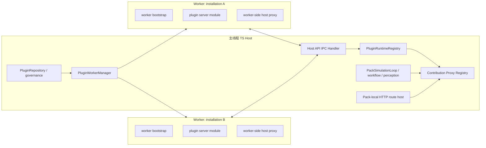
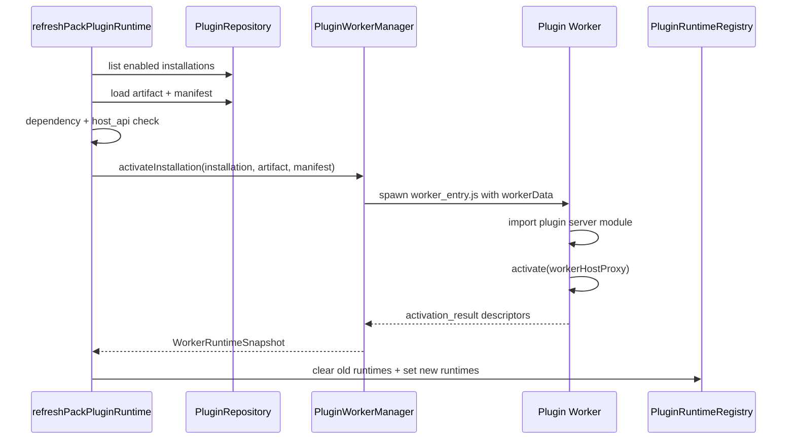

# Worker 线程插件隔离设计草案

## 1. 当前代码事实

`.limcode/plans/generic-capability-p0-p1.md` 中唯一未完成项是 P3 长期基础设施的“Worker 线程插件隔离”。

当前插件运行时位于 `apps/server/src/plugins/runtime.ts`，具备以下特征：

- `refreshPackPluginRuntime(context, packId)` 从 kernel-side plugin repository 读取 enabled installation。
- 每个 enabled plugin 通过 `createRuntimeForManifest(...)` 创建 `RegisteredServerPluginRuntime`。
- manifest 声明贡献由 `registerManifestContributions(runtime)` 预注册占位实现。
- server entrypoint 通过 `await import(entrypointPath)` 直接加载到 Node/TS 宿主进程。
- `activatePluginEntrypoint(entrypointPath, host)` 调用插件导出的 `activate(host)`。
- `ServerPluginHostApi` 直接接收插件传入的函数对象，例如：
  - `ContextSourceAdapter`
  - `PromptWorkflowStepExecutor`
  - Express route registrar
  - `StepContributor`
  - `RuleContributor`
  - `QueryContributor`
  - `DataCleaner`
  - slot condition evaluator / transformer
  - perception resolver
- 当前 `withTimeout(...)` 只对异步 Promise 超时有效，不能中断同步死循环、CPU 占满、`process.exit()`、全局 monkey patch 等进程级破坏。
- `docs/subsystems/PLUGIN_RUNTIME.md` 第 337-355 行已明确把“插件代码直接运行在 Node/TS 宿主进程，无进程级隔离”列为现有限制。

因此，现有插件系统本质是“宿主进程内动态 import + 函数注册表”，不是隔离容器。

## 2. 设计目标

在当前项目未上线、开发数据不重要、不要求向后兼容的前提下，建议做破坏式重构：

1. **禁止插件 server entrypoint 在主线程动态 import 执行**。
2. **所有 server-side 插件代码只能在 `node:worker_threads` Worker 内执行**。
3. **主线程只保留治理、调度、路由、注册表和 Host API 代理**。
4. **插件与宿主之间只能通过结构化 IPC 消息通信**，不能传递函数对象、Express app、PrismaClient、AppContext、PackRuntimePort、WorldEnginePort、sidecar client 或任意 host 内部对象。
5. **插件贡献从“注册函数对象”改为“注册可远程调用的 contribution descriptor”**。
6. **每个插件 installation 至少一个 Worker**，失败、超时、退出只影响该 installation，不拖垮主进程或同 pack 其他插件。
7. **默认 worker isolation 开启，不保留 in-process 兼容路径**。

## 3. 非目标

本设计不解决以下问题：

- 不提供浏览器 web bundle 隔离。web 侧已有 `PluginRenderBoundary.vue` 和动态 import 边界，但浏览器沙箱/CSP/iframe 隔离属于另一项工作。
- 不把 plugin host 迁移到 Rust sidecar。`docs/subsystems/PLUGIN_RUNTIME.md` 已说明 plugin host 长期属于 TS host kernel。
- 不让插件直接访问 `WorldEnginePort`、`WorldEngineSidecarClient`、prepared token 或 raw JSON-RPC。
- 不支持插件注册原生 Express middleware 函数。主线程只提供声明式 pack-local HTTP RPC route。
- 不尝试实现强安全沙箱。Node Worker 是故障隔离和 API 边界，不是对恶意本地代码的完整安全边界。插件如果能运行任意 Node 代码，仍需通过权限、启动参数和进程级策略继续收敛。

## 4. 核心架构



主线程职责：

- 读取 installation/artifact/manifest。
- 校验 lifecycle、capability、host_api version、dependency order。
- 创建和销毁 Worker。
- 维护 `RegisteredServerPluginRuntime` 的主线程只读快照。
- 把 contribution 调用转发到 Worker。
- 执行受控 Host API：推理、pack summary、current tick、world state query 等。
- 执行 route mounting，但不把 Express 对象交给插件。

Worker 职责：

- 动态 import 插件 server entrypoint。
- 调用插件 `activate(hostProxy)`。
- 接收主线程发来的 contribution invocation。
- 返回结构化 JSON 结果或错误。
- 执行 `deactivate()`。

## 5. 破坏式 API 改造

当前 `ServerPluginHostApi` 允许插件注册函数对象。这与 Worker 隔离冲突，因为函数不能跨线程结构化克隆，也不应该让插件持有主线程对象。

建议把 Host API 改成两层：

### 5.1 Worker 内插件 API

插件仍然调用 `activate(host)`，但 `host` 是 Worker 内代理对象：

```ts
interface WorkerPluginHostApi {
  registerContextSource(descriptor: ContextSourceDescriptor): void;
  registerPromptWorkflowStep(descriptor: PromptWorkflowStepDescriptor): void;
  registerPackRoute(descriptor: PackRouteDescriptor): void;
  registerStepContributor(descriptor: StepContributorDescriptor): void;
  registerRuleContributor(descriptor: RuleContributorDescriptor): void;
  registerQueryContributor(descriptor: QueryContributorDescriptor): void;
  registerDataCleaner(descriptor: DataCleanerDescriptor): void;
  registerSlotConditionEvaluator(descriptor: SlotConditionEvaluatorDescriptor): void;
  registerSlotContentTransformer(descriptor: SlotContentTransformerDescriptor): void;
  registerPerceptionResolver(descriptor: PerceptionResolverDescriptor): void;
  requestInference(input: PluginInferenceRequest): Promise<PluginInferenceResult>;
}
```

descriptor 必须是可结构化克隆的纯数据，至少包括：

```ts
interface BaseContributionDescriptor {
  name: string;
  priority?: number;
  capabilityKey?: string;
  invoke: string; // Worker 内导出/注册的 handler 名称
}
```

Worker bootstrap 维护 `invoke -> handler` 映射。主线程只保存 descriptor，不保存插件函数。

### 5.2 Worker 内 handler 注册

插件不能把函数传给主线程，但可以在 Worker 内注册本地 handler：

```ts
host.registerStepContributor({
  name: 'economy_tick',
  priority: 100,
  invoke: 'economy.tick'
});

host.handlers.register('economy.tick', async input => {
  return { patches: [], events: [] };
});
```

也可以把 `handlers.register` 放到独立 API 中，避免 descriptor 混杂函数：

```ts
host.registerHandler('economy.tick', async input => { ... });
host.registerStepContributor({ name: 'economy_tick', invoke: 'economy.tick' });
```

主线程调用 contributor 时发送：

```ts
{
  type: 'invoke',
  requestId,
  installationId,
  contributionType: 'step_contributor',
  invoke: 'economy.tick',
  payload
}
```

Worker 返回：

```ts
{
  type: 'invoke_result',
  requestId,
  ok: true,
  result
}
```

## 6. 新模块划分

建议新增目录：

```text
apps/server/src/plugins/worker/
  protocol.ts              # 主线程 <-> Worker IPC message schema/type
  worker_host_api.ts        # Worker 侧 host proxy，实现给插件用的 API
  worker_entry.ts           # Worker bootstrap，动态 import 插件并处理 invoke/deactivate
  PluginWorkerClient.ts     # 主线程 Worker 包装：start/activate/invoke/deactivate/terminate
  PluginWorkerManager.ts    # 按 packId/installationId 管理 worker 生命周期
  contribution_proxy.ts     # 把 descriptor 包装为主线程现有 contributor 接口
  errors.ts                 # Worker 超时、退出、协议错误
```

同时重构：

- `apps/server/src/plugins/runtime.ts`
  - 移除主线程 `activatePluginEntrypoint()` 的动态 import。
  - `refreshPackPluginRuntime()` 改为通过 `PluginWorkerManager.activateInstallation(...)` 启动 Worker。
  - `RegisteredServerPluginRuntime` 中的函数数组改为 proxy contributor 数组。
- `apps/server/src/plugins/context.ts`
  - `full` sandbox 概念删除或降级为配置错误；Worker 模式下不允许暴露 `AppContext`。
  - `capability_level` 建议收敛为 `readonly | pack_scoped`，或保留 `full` 但只表示“允许更多 Host API”，不再表示直接拿到 AppContext。
- `apps/server/src/config/domains/plugins.ts`
  - 新增 isolation 配置，默认开启。
- `packages/contracts/src/plugins.ts`
  - 提升 `host_api` major version，例如 `2.0.0`。
  - manifest server contribution schema 可增加 `handler` / `invoke` 字段，或者明确 manifest declaration 与 activate-time descriptor 的关联规则。

## 7. 生命周期

### 7.1 refresh / enable / startup



关键顺序：

1. 先成功启动新 Worker 并完成 activation。
2. 再替换 `pluginRuntimeRegistry` 中旧 runtime。
3. 最后 deactivate/terminate 旧 Worker。

这样 refresh 失败不会把现有可用插件全部清空。

### 7.2 disable / unload

- `disablePackPlugin()` 更新 lifecycle 后调用 refresh。
- refresh 发现 installation 不再 enabled：
  1. 从 registry 移除 proxy。
  2. 向 Worker 发送 `deactivate`。
  3. 超时后 `worker.terminate()`。
  4. 清理 manager map。

### 7.3 Worker 崩溃

Worker `exit` 非 0 或 IPC 断开时：

- 标记该 installation runtime 状态为 `crashed`。
- `PluginInstallation.last_error` 写入崩溃原因。
- registry 移除该 installation 的 contributor proxy。
- Prometheus 指标记录 crash count。
- 不自动无限重启。可以提供手动 `/plugins/reload`。

## 8. IPC 协议

### 8.1 主线程到 Worker

```ts
type MainToWorkerMessage =
  | { type: 'activate'; requestId: string; hostApiVersion: string; manifest: PluginManifest; installation: InstallationSnapshot; artifactRoot: string; grantedCapabilities: string[] }
  | { type: 'invoke'; requestId: string; contributionType: string; invoke: string; payload: unknown }
  | { type: 'host_result'; requestId: string; ok: true; result: unknown }
  | { type: 'host_result'; requestId: string; ok: false; error: SerializedPluginError }
  | { type: 'deactivate'; requestId: string };
```

### 8.2 Worker 到主线程

```ts
type WorkerToMainMessage =
  | { type: 'activation_result'; requestId: string; ok: true; descriptors: ContributionDescriptor[] }
  | { type: 'activation_result'; requestId: string; ok: false; error: SerializedPluginError }
  | { type: 'invoke_result'; requestId: string; ok: true; result: unknown }
  | { type: 'invoke_result'; requestId: string; ok: false; error: SerializedPluginError }
  | { type: 'host_call'; requestId: string; method: HostMethodName; payload: unknown }
  | { type: 'log'; level: 'debug' | 'info' | 'warn' | 'error'; message: string; fields?: Record<string, unknown> };
```

所有 payload 进入主线程后必须经过 zod schema 校验。不能信任 Worker 返回。

## 9. Host API 白名单

主线程实现 Host API handler，按 capability gate 放行。

第一阶段只保留当前已有且可控的能力：

| Worker host method | 主线程实现 | capability |
|---|---|---|
| `requestInference` | `context.requestPluginInference` | `server.inference.request` |
| `getPackSummary` | `PackHostApi.getPackSummary` | readonly |
| `getCurrentTick` | `PackHostApi.getCurrentTick` | readonly |
| `queryWorldState` | `PackHostApi.queryWorldState` | readonly / pack_scoped |
| `emitLog` | logger | readonly |

不暴露：

- `context.repos`
- `context.prisma`
- `conversationStore`
- `packStorageAdapter`
- `schedulerStorage`
- `Express app`
- `WorldEngineSidecarClient`
- `PackRuntimePort` 原对象
- `process.env` 的无限读面

## 10. HTTP route 设计

当前 `registerPackRoute(register: (app, context) => void)` 不能跨 Worker，也不应继续存在。

建议改为声明式 route：

```ts
interface PackRouteDescriptor extends BaseContributionDescriptor {
  type: 'api_route';
  method: 'GET' | 'POST' | 'PUT' | 'DELETE';
  path: string;
  invoke: string;
  bodySchema?: unknown;  // 可选，后续再做
  querySchema?: unknown;
}
```

主线程统一挂载到 pack-local plugin route host 下，例如：

```text
/api/packs/:packId/plugins/:pluginId/runtime/server/:installationId/routes/*
```

或保持 manifest 中声明的 `route.path`，但必须由主线程校验：

- path 必须在 `/api/packs/:packId/plugins/:pluginId/...` 或指定 pack-local 前缀下。
- 不允许覆盖平台已有 route。
- 不允许注册 wildcard 顶层路由。
- 请求体大小、超时、返回结构由主线程控制。

请求进入后主线程转发 `invoke` 到对应 Worker，Worker 返回 JSON serializable result。

## 11. Contributor proxy 设计

主线程 registry 对外仍可提供现有接口，降低对 simulation loop、workflow、perception pipeline 的冲击，但对象实际是 proxy。

示例：

```ts
class WorkerStepContributorProxy implements StepContributor {
  constructor(private client: PluginWorkerClient, private descriptor: StepContributorDescriptor) {}

  get priority() { return this.descriptor.priority ?? 0; }

  contributeStep(input, context) {
    return this.client.invoke('step_contributor', this.descriptor.invoke, sanitizeStepInput(input, context));
  }
}
```

注意：传给 Worker 的 `context` 不能是当前 `WorldEngineSessionContext` 原对象引用，必须转换为纯 JSON snapshot。

需要为以下贡献分别定义输入/输出 schema：

- step contributor
- rule contributor
- query contributor
- context source adapter
- prompt workflow step executor
- data cleaner
- slot condition evaluator
- slot content transformer
- perception resolver
- API route handler

## 12. 超时和资源限制

当前 `activate()` 30s、`requestInference()` 60s 是 Promise race，无法中断同步阻塞。Worker 后应改成硬隔离策略：

| 操作 | 超时后行为 |
|---|---|
| activation | terminate Worker，activation failed，写 last_error |
| invocation | reject 当前调用；超过连续失败阈值后 terminate Worker 并移除 runtime |
| deactivate | 超时后 terminate Worker |
| route request | 返回 504 plugin invocation timeout |

建议配置：

```yaml
plugins:
  isolation:
    mode: worker
    activation_timeout_ms: 30000
    invocation_timeout_ms: 5000
    route_timeout_ms: 10000
    deactivate_timeout_ms: 5000
    max_consecutive_failures: 3
    worker_exec_arg_allowlist: []
```

Node Worker 可用 `resourceLimits` 限制 V8 heap：

```ts
new Worker(workerEntry, {
  workerData,
  resourceLimits: {
    maxOldGenerationSizeMb: 128,
    maxYoungGenerationSizeMb: 32,
    stackSizeMb: 4
  }
});
```

这不是完整安全边界，但能限制常见内存失控。

## 13. 数据与持久化

不需要新增业务表即可实现第一版。可复用：

- `PluginInstallation.last_error`
- `PluginActivationSession`

但建议在 activation session 的 details 或未来扩展字段中记录：

- worker pid/threadId
- activation duration
- crash/exit code
- descriptor count
- host_api version

如果当前 schema 没有 details 字段，不为了第一版强行迁移；开发数据不重要时可以在后续破坏式 schema 中补。

## 14. 配置默认值建议

由于项目未上线且不要求兼容：

- 默认 `plugins.isolation.mode = 'worker'`。
- 删除或禁用 `mode = 'in_process'`。
- `plugins.sandbox.capability_level` 默认不应再是 `full`。
- `full` 不再表示直接返回 `AppContext`。
- `warn_on_full_access` 可删除，或改成启动时报错：Worker 模式下 full direct context 不存在。

## 15. 迁移策略

因为允许不兼容，建议直接提升 Host API major：

- `PLUGIN_HOST_API_VERSION = '2.0.0'`
- 旧插件 manifest `compatibility.host_api: 1.x` 一律拒绝激活。
- 旧 `activate(host)` 中注册函数对象的插件需要改写为 descriptor + handler 模式。
- 旧 `registerPackRoute((app, context) => ...)` 删除。
- 旧 `createPluginContext()` 中返回 `AppContext` 的 full 模式删除。

## 16. 实施切片

### Slice 1：协议和 Worker 生命周期

- 新增 `plugins/worker/protocol.ts`。
- 新增 `worker_entry.ts`。
- 新增 `PluginWorkerClient`。
- 支持 activation/deactivate/log/error/timeout。
- 不接入现有 runtime registry。

### Slice 2：runtime.ts 接入 Worker activation

- `refreshPackPluginRuntime()` 改为启动 Worker。
- activation 成功后生成 runtime snapshot。
- activation 失败写入 `last_error`。
- 清理旧 runtime 时 terminate 旧 Worker。

### Slice 3：descriptor + proxy contributor

- 实现 step/rule/query/context/prompt/data cleaner/perception/slot transformer/evaluator 的 proxy。
- 每类输入输出加 zod 校验。
- `pluginRuntimeRegistry` 对 simulation loop 仍返回现有接口类型，但内部是 proxy。

### Slice 4：HTTP route 改造

- 删除函数式 `registerPackRoute`。
- 改成声明式 route descriptor。
- 主线程统一挂载 route 并转发到 Worker。

### Slice 5：配置、指标、文档、测试

- 配置 schema 增加 isolation。
- Prometheus 增加 worker active/crash/invocation duration 指标。
- 更新 `docs/subsystems/PLUGIN_RUNTIME.md` 的限制章节。
- 增加单元测试和集成测试：
  - activation success/failure
  - infinite loop activation timeout terminate
  - Worker crash 不影响主进程
  - capability gate 拒绝 host_call
  - route invocation timeout
  - disable 后 Worker terminate

## 17. 关键取舍

### 为什么不用 `vm` 模块

`vm` 不提供可靠的资源隔离，不能阻止 CPU 占用、部分原型污染或宿主对象泄漏导致的破坏。当前目标是“插件隔离”，不是“同线程上下文隔离”。Worker 至少能把事件循环和 V8 heap 分开。

### 为什么不用 child_process 第一版

`child_process` 的隔离更强，但部署、stdio 协议、进程管理和打包路径更重。当前 Node/TS host 已经运行插件生态，Worker 线程是成本较低的架构级升级。若未来要承载不可信第三方插件，child_process/container 才是下一层。

### 为什么要破坏旧 API

旧 API 的核心是传函数和主线程对象，正好违反 Worker IPC 边界。保留兼容层会导致主线程仍需 import 旧插件，隔离目标失效。因此不应兼容。

## 18. 结论

本项目当前状态适合直接做 Worker-only 插件运行时：

- 主线程保留治理和调度。
- Worker 执行插件代码。
- 所有贡献改成 descriptor + remote invocation。
- Host API 改成白名单 IPC。
- 删除 full AppContext 暴露和函数式 route registration。
- 提升 Host API major version，拒绝旧插件。

这是架构级改造，不是给现有 `withTimeout` 加补丁。只要目标是真正避免插件阻塞/破坏宿主进程，必须切断“主线程 dynamic import + 函数注册”的现有模型。