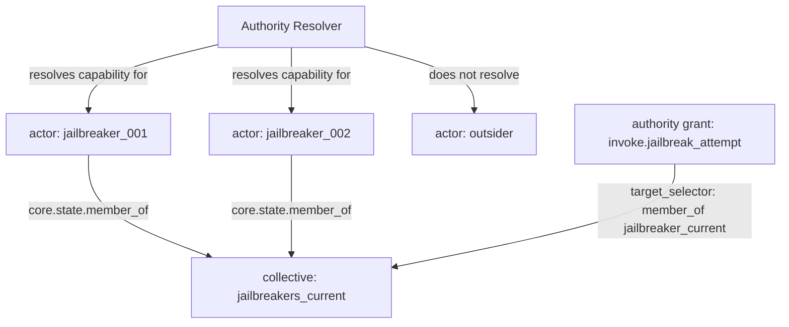

# Group / Collective Entity 机制设计

## 1. 背景

`.limcode/enhancements-backlog.md` 中的“新增 group/collective entity kind”源自赛博朋克世界包草稿中的 `jailbreakers_current`：它需要表达“第 9 届参赛者匿名集合”这类群体概念。

该需求具有两个核心特征：

1. **成员有独立个体差异**  
   例如不同参赛者拥有不同的 `exploit`、`stealth`、`persistence` 数值。

2. **成员共享某种群体身份**  
   例如所有当前届 jailbreakers 都属于 `jailbreakers_current`，并可能共享授权、声誉、热度、组织身份或叙事标签。

当前 workaround 是：每个成员单独定义为 `actor`，通过 `entity_type: jailbreaker` 或 `tags: ["jailbreaker"]` 标记，再用 `entity_type_is` 批量授权。

该 workaround 能解决“批量授权给同类实体”，但不能显式表达：

- 某个 actor 属于哪个具体 group；
- 一个 actor 同时属于多个 group；
- authority grant 指向某个 group 并自动覆盖其成员；
- group 自身拥有可被引用的 entity identity 和 state。

## 2. 项目约束与决策前提

本项目当前没有上线，只有单一使用者，开发数据可以任意重建或迁移。因此本设计明确采用以下前提：

1. **不要求向后兼容**  
   可以修改 schema、contract、world pack 数据格式、测试数据和文档，不需要保留旧写法。

2. **优先选择语义清晰，而不是最小补丁**  
   如果现有命名或 schema 已经不适合，可以直接改成更合理的结构。

3. **允许破坏已有开发数据**  
   不需要为旧 world pack 做自动迁移；必要时可手动重写示例包和草稿包。

4. **但仍应避免过度设计**  
   虽然不需要兼容，但 group/collective 的生命周期、共享 state 继承、群体调度、群体通信仍然属于更大的设计空间，不应一次性全部实现。

## 3. 当前代码观察

当前项目中与该机制相关的主要结构如下。

### 3.1 Entity kind schema

`apps/server/src/packs/schema/common_schema.ts` 中 `packEntityKindSchema` 当前允许：

```ts
'actor',
'artifact',
'mediator',
'domain',
'institution',
'abstract_authority',
'state_transform',
'relay',
'persona'
```

`packages/contracts/src/world_engine.ts` 中 world engine contract 当前允许的 base kind 为：

```ts
['actor', 'artifact', 'domain', 'institution', 'mediator', 'state_transform', 'abstract_authority']
```

两者已经存在不一致：server schema 允许 `relay` 和 `persona`，contract 暂未允许。

### 3.2 Authority target selector

`apps/server/src/packs/schema/common_schema.ts` 中 `packReferenceKindSchema` 当前允许：

```ts
'holder_of',
'binding_of',
'subject_entity',
'direct_entity',
'ritual_participant',
'domain_owner',
'all_actors',
'entity_type_is'
```

但 `apps/server/src/domain/authority/resolver.ts` 当前实际实现的匹配逻辑只有：

- `direct_entity`
- `holder_of`
- `subject_entity`
- `all_actors`
- `entity_type_is`

这意味着文档/schema 中已经出现的 `binding_of`、`domain_owner`、`ritual_participant` 并未真正被 authority resolver 支持。

### 3.3 文档状态

`docs/specs/WORLD_PACK.md` 已记录 `target_selector` 的多种 kind，包括 `binding_of`、`domain_owner`、`ritual_participant`，但 resolver 实现不完整。

因此，本次设计应顺便收敛 target selector 的 schema、contract、文档与 resolver 之间的不一致。

## 4. 设计目标

本设计的目标是引入一个足够明确的 group/collective 机制，使 world pack 可以表达：

1. 群体作为一个独立 entity 存在；
2. actor 可以声明自己属于一个或多个 group；
3. authority 可以授予 group，并在解析 subject capability 时自动覆盖 group 成员；
4. group 可以拥有自己的 state；
5. 成员仍然保留自己的独立 state；
6. 删除或不存在的 group 不应继续产生有效授权；
7. 不依赖向后兼容，可以重写示例和草稿数据。

## 5. 非目标

第一版不实现以下内容：

1. **不实现 group state 自动继承到 member state**  
   成员不会自动获得 group state 字段。若需要读取 group state，应通过上下文构建或查询机制显式获取。

2. **不实现群体生命周期级联**  
   不自动处理 group 解散时成员状态清理、事件广播、历史审计等复杂行为。

3. **不实现群体内通信机制**  
   群体通信应走事件、感知或插件机制，不由 entity kind 本身承担。

4. **不实现 collective 作为可调度主体**  
   第一版 collective/group 不主动参与 NPC 调度或 AI 推理，只作为 entity、state holder 和 authority selector target。

5. **不设计 membership 独立表**  
   第一版使用 entity core state 存储成员关系，避免引入新持久化表。

## 6. 核心决策

### 6.1 新增 entity kind：`collective`

由于项目不要求向后兼容，且 group/collective 是一类与 `institution` 不完全相同的基础实体，本设计选择直接新增：

```yaml
kind: "collective"
```

而不是复用：

```yaml
kind: "institution"
entity_type: "collective"
```

原因：

1. `institution` 更偏制度、组织、规则来源、权威结构；
2. `collective` 更偏成员集合、群体身份、临时群组、蜂群、匿名集合、分布式主体；
3. 赛博朋克世界包中的 `jailbreakers_current` 更像匿名参赛者集合，不一定是制度性组织；
4. 项目当前可以破坏 schema，不需要为了兼容旧数据而复用不完全准确的 kind；
5. 将 `collective` 提升为 base kind，有利于后续 UI、文档、查询、projection、prompt context 明确区分群体实体。

### 6.2 成员关系存储在 member entity 的 core state

成员关系采用从 member 指向 group 的形式：

```yaml
state:
  member_of:
    - "jailbreakers_current"
```

允许简写为字符串：

```yaml
state:
  member_of: "jailbreakers_current"
```

推荐规范写法为数组。

该设计表示：

- membership 是 actor 的状态事实；
- 一个 actor 可以属于多个 group；
- group 不需要维护成员列表副本；
- authority resolver 可以在解析 subject capability 时直接检查 subject 的 core state；
- 删除 group 后，只要 resolver 检查 group entity 是否存在，就不会继续产生有效授权。

### 6.3 新增 target selector：`member_of`

新增：

```yaml
target_selector:
  kind: "member_of"
  entity_id: "jailbreakers_current"
```

匹配逻辑：

> 如果当前 subject entity 的 core state 中 `member_of` 包含 `target_selector.entity_id`，且该 group entity 存在，则匹配成功。

匹配成功时，authority resolver 的 provenance 记录：

```ts
matched_via: 'member_of'
```

## 7. 数据模型

### 7.1 Collective entity 示例

```yaml
entities:
  collectives:
    - id: "jailbreakers_current"
      label: "第 9 届匿名越狱者集合"
      kind: "collective"
      entity_type: "jailbreaker_cohort"
      tags:
        - "jailbreaker_group"
        - "anonymous_collective"
      state:
        cohort: 9
        public_identity: "anonymous_competitors"
        shared_reputation: 0
        heat: 12
```

说明：

- `kind: collective` 表示这是群体实体；
- `entity_type` 表示具体群体类型；
- `state` 可以保存群体级状态；
- 该 state 不自动下发或继承给成员。

### 7.2 Actor membership 示例

```yaml
entities:
  actors:
    - id: "jailbreaker_001"
      label: "匿名参赛者 001"
      kind: "actor"
      entity_type: "jailbreaker"
      tags:
        - "jailbreaker"
      state:
        exploit: 72
        stealth: 81
        persistence: 66
        member_of:
          - "jailbreakers_current"

    - id: "jailbreaker_002"
      label: "匿名参赛者 002"
      kind: "actor"
      entity_type: "jailbreaker"
      tags:
        - "jailbreaker"
      state:
        exploit: 88
        stealth: 54
        persistence: 73
        member_of:
          - "jailbreakers_current"
```

### 7.3 Authority grant 示例

```yaml
authorities:
  - id: "grant-current-jailbreakers-attempt"
    source_entity_id: "ugc"
    target_selector:
      kind: "member_of"
      entity_id: "jailbreakers_current"
    capability_key: "invoke.jailbreak_attempt"
    grant_type: "institutional"
    priority: 100
```

含义：

- grant 目标是 `jailbreakers_current` 的成员；
- resolver 解析 `jailbreaker_001` 时，如果其 `member_of` 包含 `jailbreakers_current`，则获得 `invoke.jailbreak_attempt`；
- 非成员不会获得该 capability；
- 如果 `jailbreakers_current` entity 不存在，则不匹配。

## 8. Authority resolver 语义

### 8.1 匹配规则

`member_of` selector 的匹配规则为：

1. `subjectEntityId` 必须存在；
2. `target_selector.entity_id` 必须存在；
3. `target_selector.entity_id` 对应的 world entity 必须存在；
4. subject 的 core state 必须存在；
5. subject core state 中的 `member_of` 必须满足以下之一：
   - 是字符串，且等于 group entity id；
   - 是字符串数组，且包含 group entity id。

### 8.2 不要求 group kind 必须是 collective

第一版建议只检查 group entity 是否存在，不强制要求 group entity 的 `entity_kind === 'collective'`。

原因：

- 某些世界包可能希望 actor 成为 `institution`、`domain`、`abstract_authority` 的成员；
- `member_of` 本质表示 membership relation，而不是只服务于 `collective` kind；
- 强制 collective 会降低 selector 的通用性。

但文档应推荐：表达群体集合时使用 `kind: collective`。

### 8.3 provenance

新增 matched_via：

```ts
'member_of'
```

用于调试和能力来源追踪。

## 9. Schema 与 contract 修改点

### 9.1 Server pack entity kind schema

文件：`apps/server/src/packs/schema/common_schema.ts`

将 `packEntityKindSchema` 扩展为包含：

```ts
'collective'
```

建议同步整理顺序：

```ts
export const packEntityKindSchema = z.enum([
  'actor',
  'collective',
  'artifact',
  'mediator',
  'domain',
  'institution',
  'abstract_authority',
  'state_transform',
  'relay',
  'persona'
]);
```

### 9.2 World engine contract entity kind schema

文件：`packages/contracts/src/world_engine.ts`

将：

```ts
const WORLD_ENTITY_BASE_KINDS = [
  'actor',
  'artifact',
  'domain',
  'institution',
  'mediator',
  'state_transform',
  'abstract_authority'
] as const;
```

扩展并与 server schema 收敛：

```ts
const WORLD_ENTITY_BASE_KINDS = [
  'actor',
  'collective',
  'artifact',
  'domain',
  'institution',
  'mediator',
  'state_transform',
  'abstract_authority',
  'relay',
  'persona'
] as const;
```

由于项目不要求向后兼容，可以直接统一 contract 与 server schema。

### 9.3 target selector kind schema

文件：`apps/server/src/packs/schema/common_schema.ts`

将 `packReferenceKindSchema` 扩展为包含：

```ts
'member_of'
```

建议同时审视 `binding_of`、`domain_owner`、`ritual_participant` 是否要保留。如果短期不实现，应从 schema 和文档中移除；如果保留，则需要补 resolver。由于本设计聚焦 group/collective，最低要求是新增并实现 `member_of`。

### 9.4 target selector validation

文件：`apps/server/src/packs/schema/constitution_schema.ts`

`member_of` 需要 `entity_id`：

```ts
if (
  value.kind === 'holder_of' ||
  value.kind === 'binding_of' ||
  value.kind === 'direct_entity' ||
  value.kind === 'domain_owner' ||
  value.kind === 'member_of'
) {
  if (!value.entity_id) {
    ctx.addIssue({
      code: z.ZodIssueCode.custom,
      message: `target selector kind=${value.kind} requires entity_id`
    });
  }
}
```

### 9.5 world engine binding kind schema

文件：`packages/contracts/src/world_engine.ts`

当前：

```ts
const worldBindingKindSchema = z.enum([
  'direct_entity',
  'holder_of',
  'subject_entity',
  'all_actors',
  'entity_type_is'
]);
```

新增：

```ts
'member_of'
```

建议同时与 server schema 对齐。如果 contract 的该 schema 实际用于 authority target selector，则命名 `worldBindingKindSchema` 本身也可以在后续重构为更准确的 `worldTargetSelectorKindSchema`。

## 10. Resolver 修改设计

文件：`apps/server/src/domain/authority/resolver.ts`

### 10.1 类型扩展

将 `matched_via` 类型加入：

```ts
'member_of'
```

`resolveTargetSelectorMatch()` 返回类型同样加入。

### 10.2 匹配逻辑草案

建议新增 helper：

```ts
const asStringArray = (value: unknown): string[] => {
  if (typeof value === 'string') return [value];
  if (Array.isArray(value)) {
    return value.filter((item): item is string => typeof item === 'string');
  }
  return [];
};
```

然后在 `resolveTargetSelectorMatch()` 中新增分支：

```ts
if (kind === 'member_of' && typeof targetSelector.entity_id === 'string') {
  const entities = await listPackWorldEntities(context.packStorageAdapter, packId);
  const groupExists = entities.some(e => e.id === targetSelector.entity_id);
  if (!groupExists) return null;

  const states = await listPackEntityStates(context.packStorageAdapter, packId);
  const subjectState = states.find(
    state =>
      candidateEntityIds.includes(state.entity_id) &&
      state.state_namespace === 'core'
  );

  const memberships = asStringArray(subjectState?.state_json?.member_of);
  return memberships.includes(targetSelector.entity_id) ? 'member_of' : null;
}
```

### 10.3 性能说明

当前 resolver 已在多个分支中调用：

- `listPackWorldEntities()`
- `listPackEntityStates()`

第一版可以沿用该模式，避免过早优化。

后续如果 authority grant 数量增加，可将本次 resolve 中的 entities/states 做局部缓存，避免每个 authority grant 重复读取。

## 11. World pack YAML 结构

当前实际 pack loader 是否支持 `entities.collectives` 需要在实现前确认。如果 loader 对 `entities` 下的分类 key 做固定枚举，则需要新增 `collectives` 分类。

推荐 YAML 结构：

```yaml
entities:
  collectives:
    - id: "jailbreakers_current"
      label: "第 9 届匿名越狱者集合"
      kind: "collective"
      entity_type: "jailbreaker_cohort"
      tags: ["jailbreaker_group"]
      state:
        cohort: 9
        shared_reputation: 0

  actors:
    - id: "jailbreaker_001"
      label: "匿名参赛者 001"
      kind: "actor"
      entity_type: "jailbreaker"
      tags: ["jailbreaker"]
      state:
        exploit: 72
        stealth: 81
        persistence: 66
        member_of: ["jailbreakers_current"]
```

如果当前 loader 已经将 `entities` 下所有数组扁平读取，则只需 schema 允许 `kind: collective`。如果 loader 固定识别 `actors`、`artifacts`、`domains` 等 key，则需要加入 `collectives`。

## 12. 与现有 workaround 的关系

现有 workaround：

```yaml
target_selector:
  kind: "entity_type_is"
  entity_type: "jailbreaker"
```

适合表达：

> 所有 entity_type 为 jailbreaker 的实体。

新增 `member_of` 适合表达：

> 属于某个具体 group entity 的成员。

两者不是完全替代关系。

例如：

- 所有 jailbreaker：`entity_type_is: jailbreaker`
- 当前第 9 届 jailbreaker：`member_of: jailbreakers_current`
- 曾经第 8 届 jailbreaker：`member_of: jailbreakers_legacy_8`
- 同时属于地下组织的 jailbreaker：可通过后续 conditions 或多 grant 组合表达。

## 13. 测试建议

### 13.1 Schema 测试

应覆盖：

1. `kind: collective` entity 通过校验；
2. `target_selector.kind: member_of` 且有 `entity_id` 通过校验；
3. `target_selector.kind: member_of` 但缺少 `entity_id` 失败；
4. contract 中 world entity snapshot 接受 `entity_kind: collective`。

### 13.2 Resolver 单元测试

应覆盖：

1. subject `member_of` 为数组且包含 group id → 匹配；
2. subject `member_of` 为字符串且等于 group id → 匹配；
3. subject `member_of` 不包含 group id → 不匹配；
4. subject 没有 core state → 不匹配；
5. group entity 不存在 → 不匹配；
6. 匹配成功的 capability provenance 为 `member_of`；
7. actor 同时属于多个 group 时，各 group grant 分别可解析。

### 13.3 World pack 示例测试

可在 cyberpunk world pack draft 或测试 fixture 中加入：

- `jailbreakers_current` collective；
- 至少两个 member actors；
- 一个 `member_of` authority grant；
- 一个非 member actor；
- 验证 member 与非 member capability 差异。

## 14. 风险与后续扩展

### 14.1 风险：member_of 放在 state 中缺少引用完整性

`member_of` 是普通 state 字段，不是数据库外键。

缓解：resolver 匹配时检查 group entity 是否存在。后续可增加 pack load validation，检查 `member_of` 引用的 entity id 是否存在。

### 14.2 风险：group 成员反查不方便

从 group 找所有 members 需要扫描 entity states。

第一版可接受。后续如有 UI 或性能需求，可引入 projection 或 membership index。

### 14.3 风险：group state 使用方式不明确

第一版只允许 group 拥有 state，不定义继承规则。

后续可扩展：

- prompt context 中显示 subject 所属 group 的 state；
- projection rule 根据 members 聚合 group metrics；
- objective enforcement mutation 支持更新 group state；
- group state 变化触发事件。

### 14.4 后续扩展：pack load validation

后续可在 pack 加载阶段检查：

1. `member_of` 引用必须存在；
2. 被引用 entity 推荐为 `collective`、`institution` 或其他允许 group-like kind；
3. 禁止 group membership 环路，或仅警告。

### 14.5 后续扩展：collective subject

如果未来需要 collective 自身参与调度和 AI 推理，可再设计：

- collective 是否拥有 agent identity；
- collective 的 prompt 如何合成；
- collective action 如何分派给成员；
- collective 与成员 action 冲突如何解决。

这不属于第一版。

## 15. Mermaid 关系图



## 16. 推荐实施顺序

1. 统一 entity kind schema：server schema 与 contract 加入 `collective`；
2. 新增 `member_of` target selector kind；
3. 修改 target selector validation；
4. 修改 authority resolver 类型和匹配逻辑；
5. 补 resolver 单元测试；
6. 补 schema/contract 测试；
7. 更新 `docs/specs/WORLD_PACK.md`；
8. 更新 cyberpunk world pack draft 中的 `jailbreakers_current` 表达；
9. 视 loader 实现决定是否新增 `entities.collectives` 分类支持；
10. 如发现 schema、contract、resolver、文档中其他 selector 不一致，顺手收敛或移除未实现项。

## 17. 最终结论

本项目当前无上线和兼容压力，因此推荐直接引入：

```yaml
kind: "collective"
```

并配套新增：

```yaml
target_selector:
  kind: "member_of"
  entity_id: "..."
```

第一版的核心语义是：

> collective 是群体实体；actor 通过 core state 的 `member_of` 声明成员关系；authority resolver 通过 `member_of` selector 将授予 group 的 capability 解析给其成员。

该方案比仅复用 `institution` 更语义清晰，也比引入独立 membership 表更轻量。它满足 `jailbreakers_current` 的当前需求，同时为后续 group state、群体调度、成员反查和生命周期管理保留扩展空间。