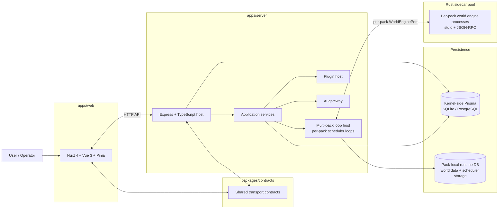
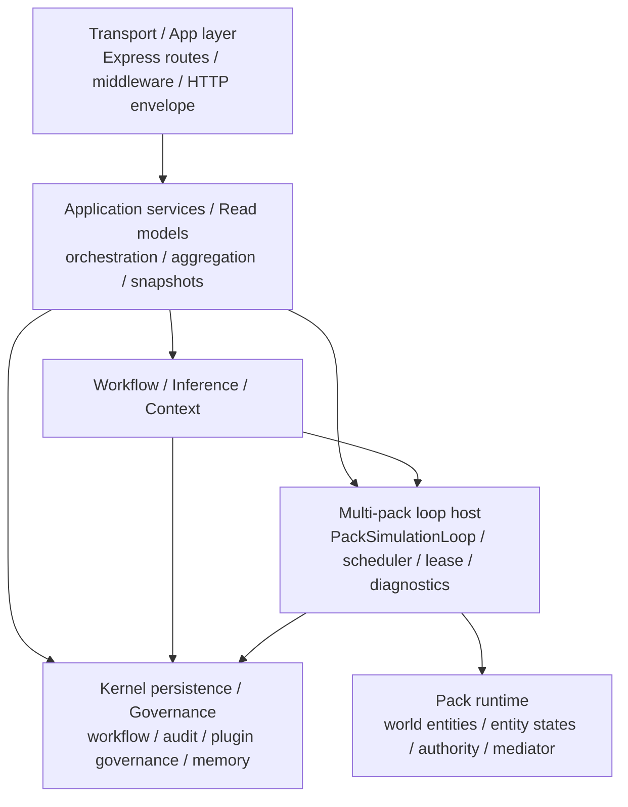
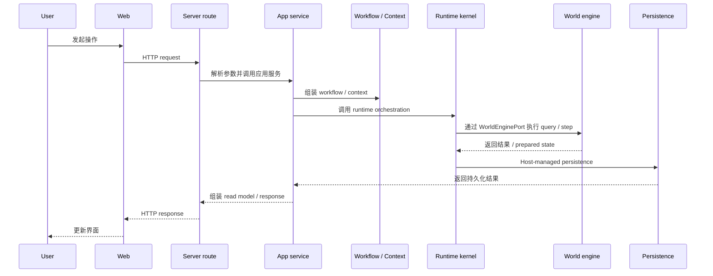
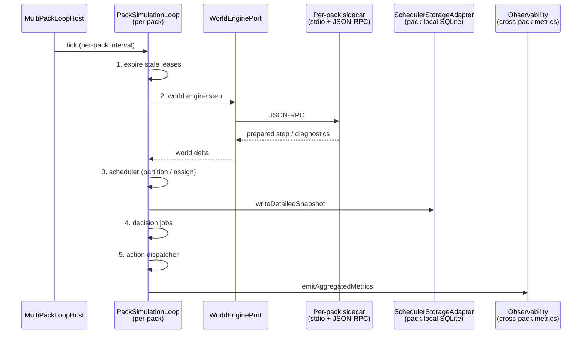
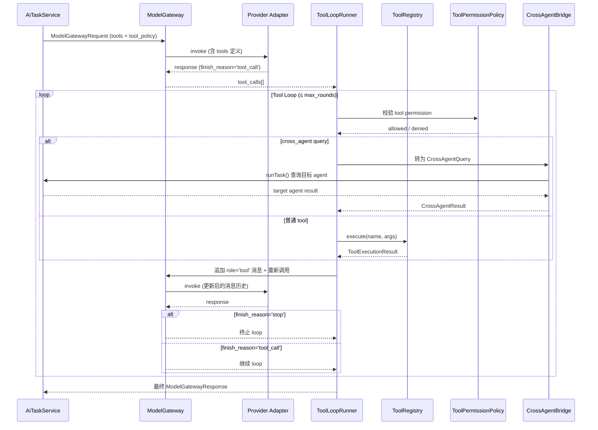
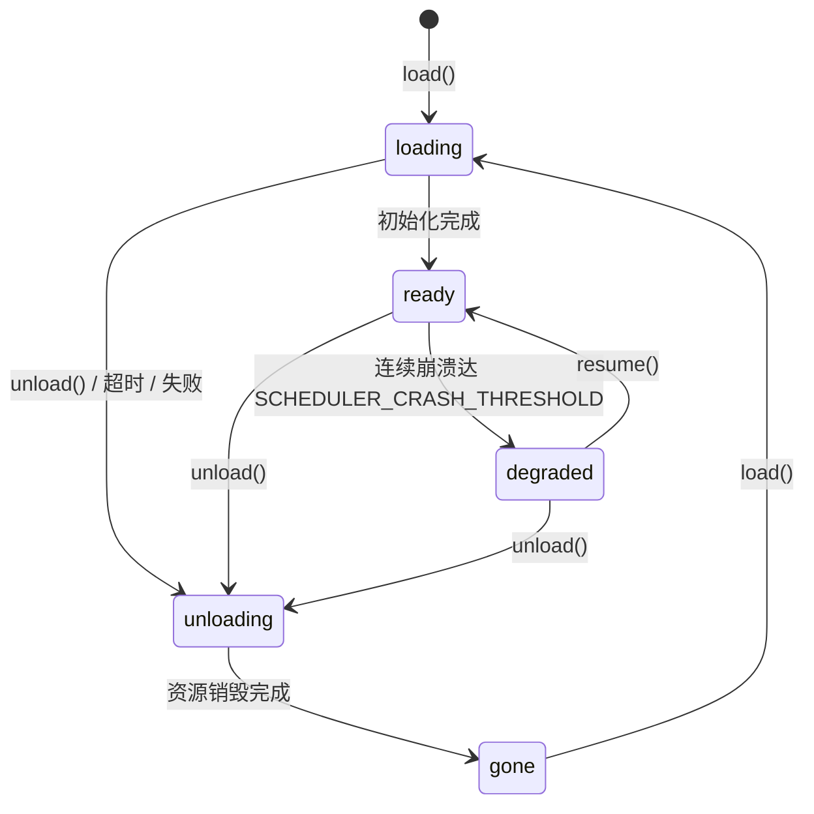

# 系统架构图 / Architecture Diagrams

本文档提供 Yidhras 的图形化架构总览，面向项目内部维护者，用于快速理解：

- 工作区级系统组成
- server 内部分层与依赖方向
- runtime host、world engine 与持久化边界
- 典型请求与运行链路

> 文字版边界定义见 `ARCH.md`
> 
> 公共接口契约见 `API.md`
> 
> 业务执行语义见 `LOGIC.md`

## 1. 工作区级系统总览



### 读图结论

- `apps/web` 与 `apps/server` 通过 HTTP API 交互，共享 transport contract 位于 `packages/contracts`。
- `apps/server` 仍是系统宿主，持有 orchestration、workflow、multi-pack loop host、plugin host、AI gateway 等平台能力。
- `MultiPackLoopHost` 管理多个 `PackSimulationLoop`，每个 pack 拥有独立的 5 步调度循环和独立 sidecar 进程，实现 Docker 式容器隔离。
- Scheduler 数据（lease、cursor、ownership）已从 kernel-side Prisma 迁移至 pack-local runtime SQLite，通过 `SchedulerStorageAdapter` 访问。
- 持久化明确分为 kernel-side（治理、workflow、审计）与 pack-local（世界数据 + scheduler 运营数据）两类宿主边界。

## 2. Server 内部分层与依赖方向



### 读图结论

- route 层必须保持薄层，不承载复杂业务编排。
- 应用服务层负责聚合、读模型与 orchestration，不应穿透到底层 runtime 实现细节。
- `MultiPackLoopHost` 负责 per-pack 调度循环的启停与生命周期管理，每个 pack 拥有独立的 `PackSimulationLoop`（5 步：expire → world engine → scheduler → decision jobs → action dispatcher）。
- workflow / context / memory / plugin governance 等工作层能力仍归 kernel-side 宿主持有。

## 3. Runtime Host / World Engine / Persistence 边界

```mermaid
flowchart TB
    subgraph Host[Node/TS host]
        direction TB
        MultiPackLoopHost[MultiPackLoopHost\npack lifecycle / loop orchestration]
        PackStateMachine[Pack state machine\nloading → ready → degraded → unloading → gone]

        subgraph PackContainer[“Per-pack container (× N loaded packs)”]
            direction LR
            PackLoop[PackSimulationLoop\n5-step cycle]
            SchedAdapter[SchedulerStorageAdapter\nlease / cursor / ownership]
            WEP[WorldEnginePort]
            HostAPI[PackHostApi\ncontrolled read surface]
        end
    end

    subgraph SidecarPool[Rust sidecar pool]
        SidecarProc[Per-pack world engine\nstdio + JSON-RPC]
    end

    PackSQLite[(Pack-local runtime SQLite\nworld data + scheduler storage)]

    MultiPackLoopHost -->|”start/stop/monitor”| PackLoop
    MultiPackLoopHost --> PackStateMachine
    PackLoop --> SchedAdapter
    PackLoop --> WEP
    PackLoop --> HostAPI
    WEP <-->|”per-pack JSON-RPC”| SidecarProc
    HostAPI -.->|”controlled read”| SidecarProc
    SchedAdapter --> PackSQLite
```

### 读图结论

- `MultiPackLoopHost` 是唯一的跨 pack 编排层，负责 pack 生命周期（load/unload）和 loop 启停，不共享任何调度状态。
- 每个 pack 拥有物理上完全独立的运行时：独立的 `PackSimulationLoop`（5 步完整循环）、独立的 `SchedulerStorageAdapter`（lease/cursor/ownership 存 pack-local SQLite）、独立的 sidecar 进程。
- Pack 状态机（`loading → ready → degraded → unloading → gone`）通过 `PackScopeResolver` + `packScopeMiddleware` 在 API 层强制执行：loading/unloading → 503 + Retry-After；gone → 404；degraded → 503 + degraded_reason。
- `PackHostApi` 只暴露受控读面，不暴露 runtime kernel 控制能力。
- Sidecar 进程池（`scheduler_sidecar_pool.ts`）通过 `max_processes` 配置硬上限，超出时排队等待；连续崩溃达 `SCHEDULER_CRASH_THRESHOLD` 时自动熔断，pack 切为 degraded。
- world engine 与数据库之间不存在”sidecar 直接落库即系统真相”的边界设计；持久化仍由 host 编排。

## 4. 典型 HTTP 请求链路



### 读图结论

- HTTP 请求不会直接穿透到 pack runtime 或 raw sidecar client。
- 应用服务是 route 与 runtime 之间的主要编排层。
- 世界态执行结果先回到 host，再由 host 负责 persistence、audit 与 response assembly。

## 5. Scheduler Tick 与世界推进链路



### 读图结论

- `MultiPackLoopHost` 按 per-pack interval 触发每个 `PackSimulationLoop` 的 tick，各 pack loop 完全独立运行。
- 每个 pack 的 5 步循环依次为：expire stale leases → world engine step → scheduler partition/assign → decision jobs → action dispatcher。
- Scheduler 运营数据（lease、cursor、ownership）通过 `SchedulerStorageAdapter` 写入 pack-local SQLite，不经过 kernel-side Prisma。
- 可观测性拆分为两层：单 pack 调试数据通过 `writeDetailedSnapshot` 写入 pack-local SQLite；跨 pack 聚合指标通过 `emitAggregatedMetrics` 走独立通道供运维面板使用。
- 连续 sidecar 调用失败达 `SCHEDULER_CRASH_THRESHOLD`（默认 3）时自动熔断，pack 状态切为 `degraded`，保留数据但停止调度。

## 6. AI Tool Calling 链路



### 读图结论

- Tool loop 在 provider adapter 返回 `tool_call` 后由 `ToolLoopRunner` 接管。
- 每次 tool 执行前必须通过 `ToolPermissionPolicy` 校验（role / pack / capability）。
- Cross-agent query 通过 `CrossAgentBridge` 转为对目标 agent 的 `AiTaskService.runTask()` 调用，不绕过 gateway。
- Loop 受 `max_rounds` 和 `total_timeout_ms` 双重约束，不可能无限循环。
- 回传的 tool result 消息以 `role='tool'` 加入消息历史，保持完整的对话上下文。

## 7. Pack 状态机



### 读图结论

- 五态状态机在 `InMemoryPackRuntimeRegistry` 中实现：`loading → ready → degraded → unloading → gone`。
- API 中间件 `packScopeMiddleware` 在每个 `/:packId/` 请求上检查状态：`loading`/`unloading` → 503 + `Retry-After`；`gone` → 404；`degraded` → 503 + `degraded_reason`。
- `degraded` 状态下 loop 已暂停但 sidecar 和资源未释放，等待外部 `resume()` 指令恢复。
- `gone` 状态的 pack 可被重新 `load()`，回到 `loading`。
- `loading` 和 `unloading` 状态有最大等待时间，超时后强制推进。

## 8. 阅读路径

- 看图理解系统组成：本文件 `ARCH_DIAGRAM.md`
- 看正式边界定义：`ARCH.md`
- 看公共 API contract：`API.md`
- 看业务语义与执行主线：`LOGIC.md`
- 看 Prompt Workflow：`capabilities/PROMPT_WORKFLOW.md`
- 看 AI Gateway：`capabilities/AI_GATEWAY.md`
- 看 Plugin Runtime：`capabilities/PLUGIN_RUNTIME.md`
