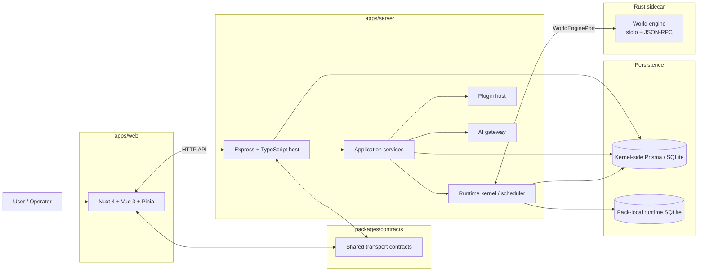
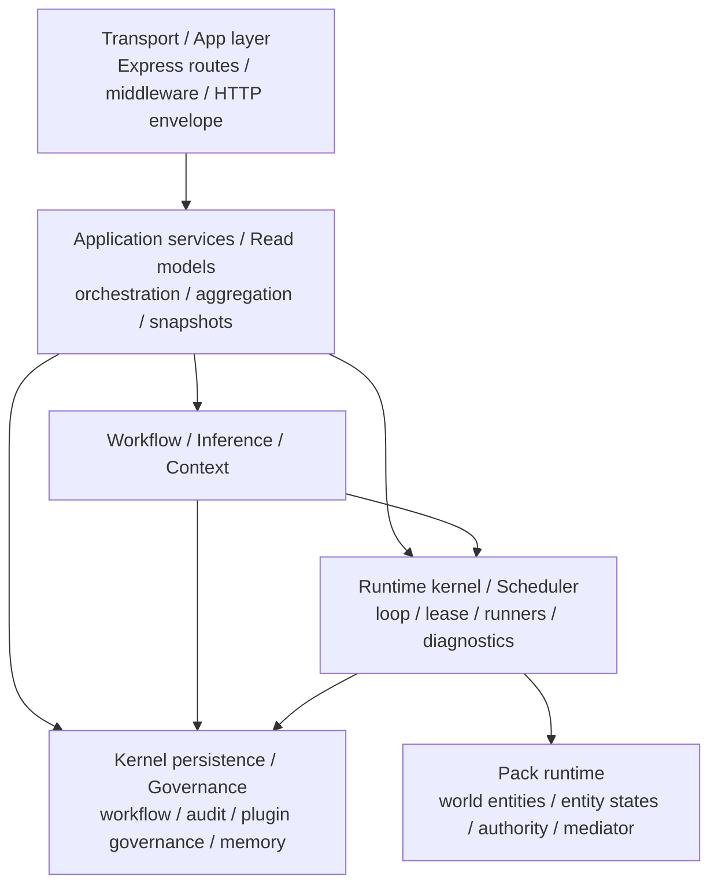
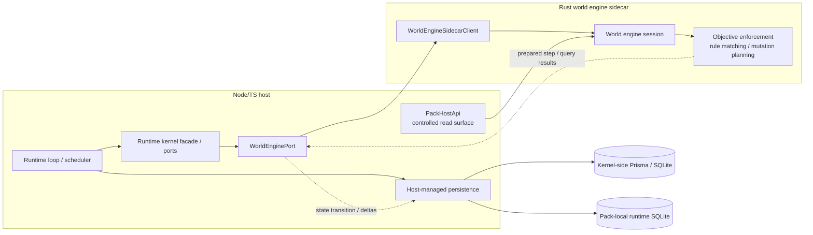
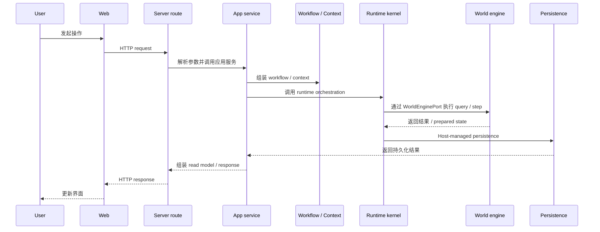
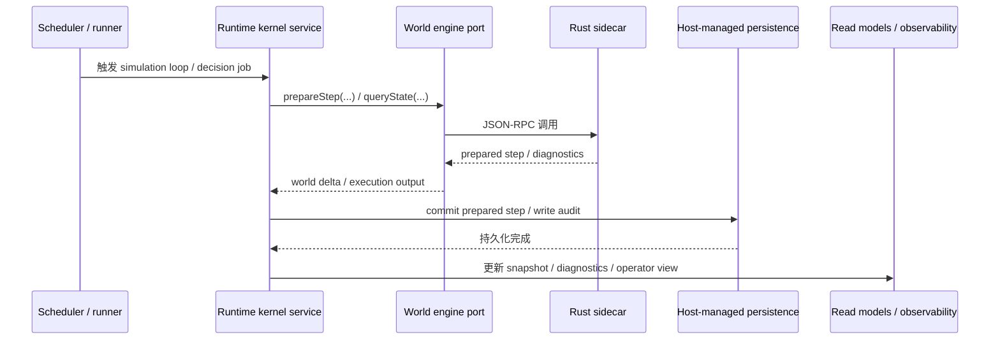
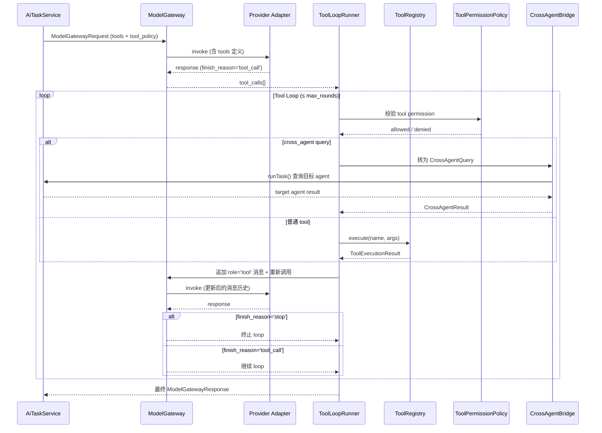

# 系统架构图 / Architecture Diagrams

本文档提供 Yidhras 的图形化架构总览，面向项目内部维护者，用于快速理解：

- 工作区级系统组成
- server 内部分层与依赖方向
- runtime host、world engine 与持久化边界
- 典型请求与运行链路

> 文字版边界定义见 `ARCH.md`
> 
> 公共接口契约见 `API.md`
> 
> 业务执行语义见 `LOGIC.md`

## 1. 工作区级系统总览

### 读图结论

- `apps/web` 与 `apps/server` 通过 HTTP API 交互，共享 transport contract 位于 `packages/contracts`。
- `apps/server` 仍是系统宿主，持有 orchestration、workflow、scheduler、plugin host、AI gateway 等平台能力。
- 世界推进主路径通过 Rust sidecar 暴露的 world engine 进入，但 sidecar 不是整个平台宿主。
- 持久化明确分为 kernel-side 与 pack-local 两类宿主边界。

## 2. Server 内部分层与依赖方向

### 读图结论

- route 层必须保持薄层，不承载复杂业务编排。
- 应用服务层负责聚合、读模型与 orchestration，不应穿透到底层 runtime 实现细节。
- runtime kernel 负责调度与执行编排，pack runtime 负责世界治理数据与规则执行上下文。
- workflow / context / memory / plugin governance 等工作层能力仍归 kernel-side 宿主持有。

## 3. Runtime Host / World Engine / Persistence 边界

### 读图结论

- Node/TS host 持有 runtime orchestration 与持久化编排所有权。
- Rust sidecar 持有 world engine session、query、prepare/commit/abort 与 objective execution 能力。
- `PackHostApi` 只暴露受控读面，不暴露 runtime kernel 控制能力。
- world engine 与数据库之间不存在“sidecar 直接落库即系统真相”的边界设计；持久化仍由 host 编排。

## 4. 典型 HTTP 请求链路

### 读图结论

- HTTP 请求不会直接穿透到 pack runtime 或 raw sidecar client。
- 应用服务是 route 与 runtime 之间的主要编排层。
- 世界态执行结果先回到 host，再由 host 负责 persistence、audit 与 response assembly。

## 5. Scheduler Tick 与世界推进链路

### 读图结论

- scheduler 只负责驱动与预算控制，不直接拥有世界内核实现。
- runtime kernel 统一承接 simulation loop、runner、观测与 world engine 调用。
- 提交后的结果会回流到 projection 与 observability，而不是只停留在 sidecar 内部。

## 6. AI Tool Calling 链路

### 读图结论

- Tool loop 在 provider adapter 返回 `tool_call` 后由 `ToolLoopRunner` 接管。
- 每次 tool 执行前必须通过 `ToolPermissionPolicy` 校验（role / pack / capability）。
- Cross-agent query 通过 `CrossAgentBridge` 转为对目标 agent 的 `AiTaskService.runTask()` 调用，不绕过 gateway。
- Loop 受 `max_rounds` 和 `total_timeout_ms` 双重约束，不可能无限循环。
- 回传的 tool result 消息以 `role='tool'` 加入消息历史，保持完整的对话上下文。

## 7. 阅读路径

- 看图理解系统组成：本文件 `ARCH_DIAGRAM.md`
- 看正式边界定义：`ARCH.md`
- 看公共 API contract：`API.md`
- 看业务语义与执行主线：`LOGIC.md`
- 看 Prompt Workflow：`capabilities/PROMPT_WORKFLOW.md`
- 看 AI Gateway：`capabilities/AI_GATEWAY.md`
- 看 Plugin Runtime：`capabilities/PLUGIN_RUNTIME.md`
