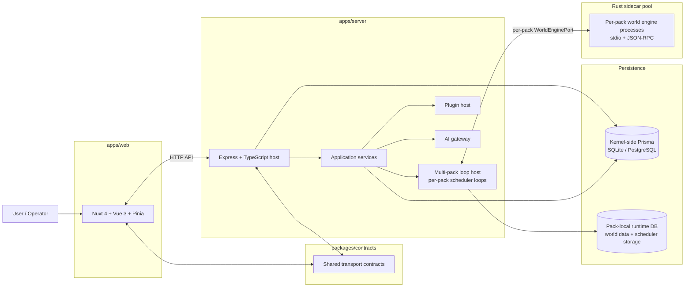
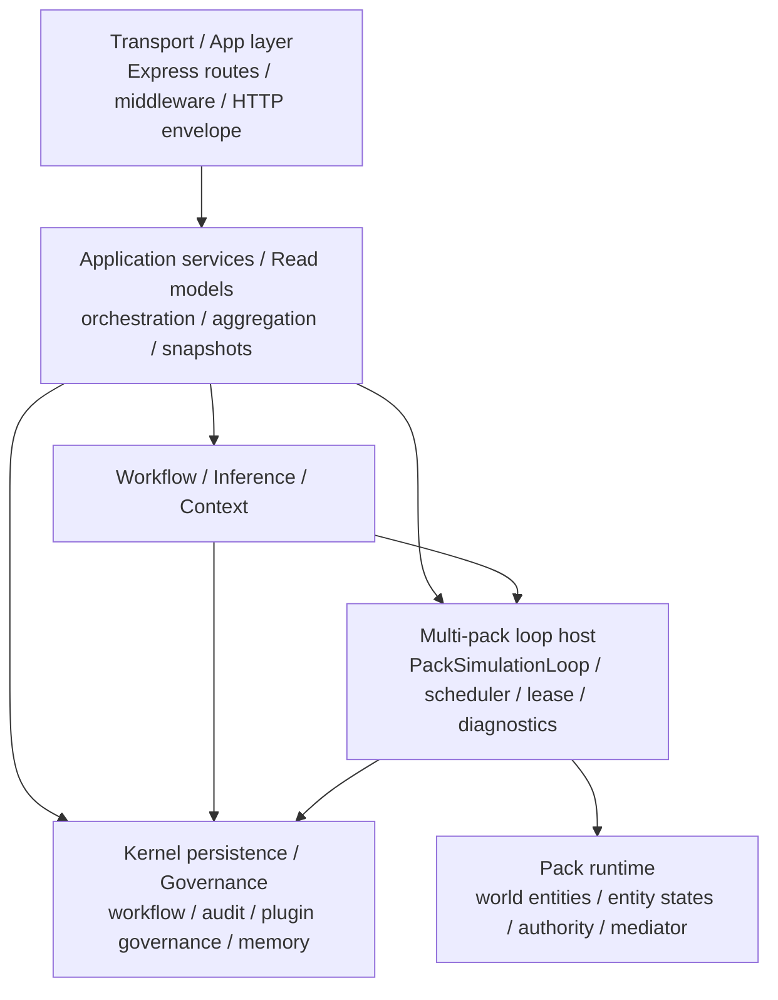
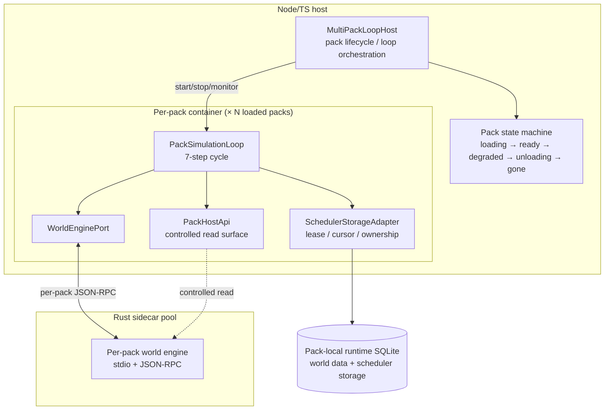
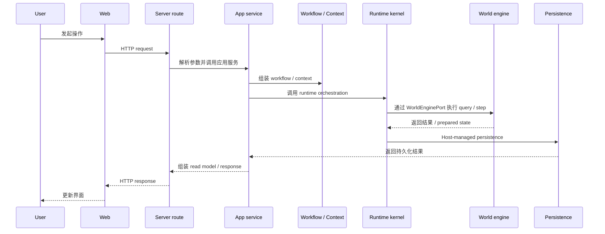
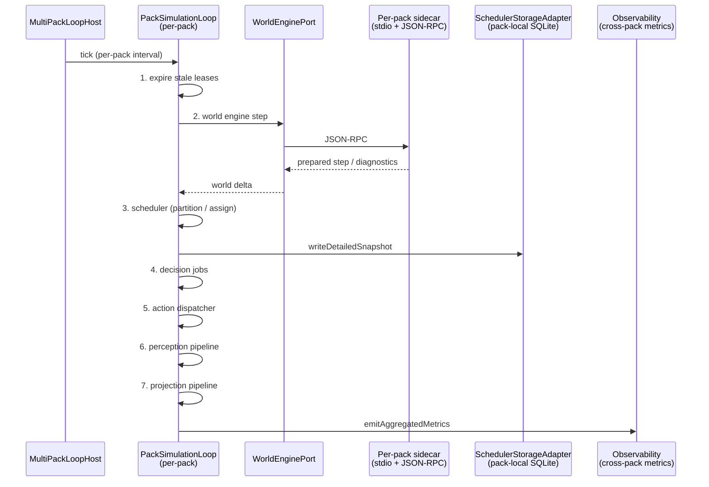
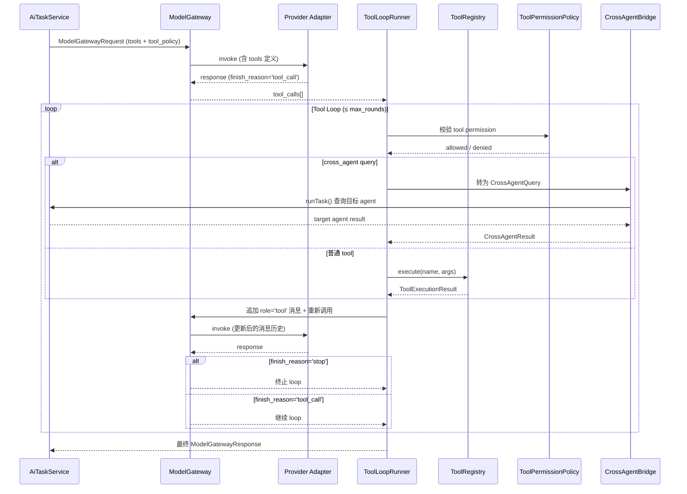
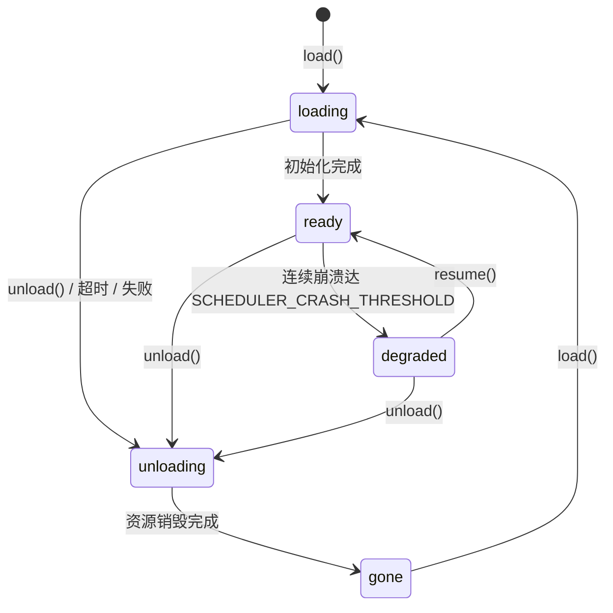

# 系统架构图 / Architecture Diagrams

本文档提供 Yidhras 的图形化架构总览，面向项目内部维护者，用于快速理解：

- 工作区级系统组成
- server 内部分层与依赖方向
- runtime host、world engine 与持久化边界
- 典型请求与运行链路

> 文字版边界定义见 `ARCH.md`
> 
> 公共接口契约见 `specs/API.md`
> 
> 业务执行语义见 `LOGIC.md`

## 1. 工作区级系统总览

> 本图展示工作区级系统组成：Web 前端与 Server 宿主通过 HTTP API 交互，Server 内部包含 MultiPackLoopHost、Plugin Host、AI Gateway 等平台能力，持久化分为 kernel-side Prisma 与 pack-local runtime SQLite 两层，Rust sidecar 通过 stdio JSON-RPC 推进世界状态。

## 2. Server 内部分层与依赖方向

> 本图展示 Server 内部分层与依赖方向：Routes → Services → Workflow/Runtime → PackRuntime/Governance，route 层保持薄层，依赖逐层向下，不反向穿透。

## 3. Runtime Host / World Engine / Persistence 边界

> 本图展示 Runtime Host / World Engine / Persistence 三层边界：MultiPackLoopHost 管理 per-pack 容器，每个 pack 拥有独立的 PackSimulationLoop、SchedulerStorageAdapter、WorldEnginePort 和 sidecar 进程。Pack 状态机在 API 层通过 packScopeMiddleware 强制执行。

## 4. 典型 HTTP 请求链路

> 本图展示典型 HTTP 请求链路：User → Web → Route → App Service → Workflow/Context → Runtime Kernel → World Engine → Persistence → 逐层返回。请求不直接穿透到 pack runtime 或 raw sidecar client。

## 5. Scheduler Tick 与世界推进链路

> 本图展示 per-pack 调度 tick 的 7 步循环：expire stale leases → world engine step → scheduler partition/assign → decision jobs → action dispatcher → perception pipeline → projection pipeline。Scheduler 运营数据通过 SchedulerStorageAdapter 写入 pack-local SQLite，可观测性拆分为单 pack 调试快照与跨 pack 聚合指标两层。Projection 管线读取世界状态、评估 projection 规则、将计算结果持久化为 entity state。

## 6. AI Tool Calling 链路

> 本图展示 AI Tool Calling 链路：AiTaskService → ModelGateway → Provider Adapter → ToolLoopRunner（含 ToolPermissionPolicy 校验）→ 循环至 finish_reason='stop' 或达上限。Cross-agent query 通过 CrossAgentBridge 转调 AiTaskService，不绕过 gateway。

## 7. Pack 状态机

> 本图展示 Pack 五态状态机：loading → ready → degraded → unloading → gone。degraded 由连续崩溃触发（默认阈值 3），gone 状态可重新 load。API 中间件 packScopeMiddleware 在每个请求上校验状态并返回对应的 HTTP 状态码。

## 8. 阅读路径

- 看图理解系统组成：本文件 `ARCH_DIAGRAM.md`
- 看正式边界定义：`ARCH.md`
- 看公共 API contract：`specs/API.md`
- 看业务语义与执行主线：`LOGIC.md`
- 看 Prompt Workflow：`subsystems/PROMPT_WORKFLOW.md`
- 看 AI Gateway：`subsystems/AI_GATEWAY.md`
- 看 Plugin Runtime：`subsystems/PLUGIN_RUNTIME.md`
